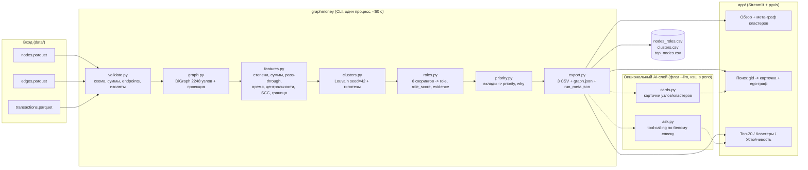

# «Граф денег» — Research & Architecture Blueprint, версия 2 (Влад)

Дата: 23.09.2026, ~14:00 Астана. Команда Jigas, трек «Граф денег: восстановление финансовой структуры организованной группы по транзакционной сети».
Статус: исследовательский blueprint, реализация не начата. Это **параллельная версия** к `HackAlem_AI_Research_Architecture_Blueprint.md` — написана независимо, чтобы сравнить два взгляда и выбрать лучшее из каждого. Раздел 11 в конце — явное сравнение.

Что лежит в основе:

- прочитаны полностью: `Положение_HackAlem_AI.md` [П], ТЗ трека [Т], README датасета [Д], `starter/` (starter.py, README, requirements) [С];
- два прохода разведочного анализа на реальных parquet (`research/eda.py`, `research/eda2.py`, результаты `research/eda_out.txt`, `research/eda2_out.txt`) — все числа ниже с пометкой **[EDA]** измерены на этих данных, а не взяты из ТЗ;
- интернет-исследование по трём направлениям (литература по ролям в транзакционных сетях; инструменты и продукты; казахстанский AML-контекст) — источники приведены в разделе 3.

Обозначения: **Факт** — из документа или измерения; **Гипотеза** — требует проверки; **Рекомендация** — наше проектное решение. Все пороги — стартовые, калиброванные на квантилях реальных данных, а не «правильный ответ».

---

## 0. TL;DR — что строим и что делать в ближайший час

**Продукт.** Локальный детерминированный пайплайн `parquet → метрики → роли → кластеры → приоритет → 3 CSV` плюс интерактивный просмотр (Streamlit + pyvis), плюс *опциональный* AI-слой (карточки узлов и вопрос-ответ по графу через строго ограниченный tool-calling с кэшем и шаблонным fallback). Роли и приоритеты — только явные формулы; LLM ничего не «решает».

**Главная содержательная находка [EDA], которой нет в ТЗ:** в графе есть **сильно связная компонента из 85 узлов** (2 seed, глубины 1–3, средний out_deg 13), которая отдаёт **109,7 млн KZT — 30 % всего оборота сети**, а получает изнутри графа лишь 20,2 млн (из них 19,5 млн — внутри самой компоненты). То есть это самоподпитывающееся «ядро распределения», финансируемое извне выборки. Это готовый сюжет для pitch: сеть — не дерево «курьер → сборщик», а три слоя: (1) 81 курьер, (2) точки сбора (24 узла получают от ≥2 seed), (3) циркулирующее ядро из 85 узлов, из которого деньги веером уходят на 875 получателей.

**Три обязательных дела до 15:00:** (a) сквозной прогон пайплайна с ролями v1 и топ-20 на реальных данных; (b) Streamlit-скелет с поиском gid и ego-графом со стрелками; (c) README-каркас с одной командой запуска. Коммит каждый час — иначе дисквалификация [П 5.4.8, 5.9.2].

**Чего не делать:** GNN, Neo4j, Docker-only, RAG/векторные БД, обучение на seed как метках, «доказанный организатор» в текстах.

---

## 1. Phase 1 — Правила хакатона: что обязательно, что запрещено, как оценивают

### 1.1. Чеклист требований (для финальной самопроверки)

| # | Требование | Источник | Как проверим |
|---|---|---|---|
| R1 | Разработка только в репозитории организатора (`BAITC-Hacks/hack-e3bf6094-jigas`), с проверяемой историей | П 1.10, 5.4.9, 5.4.11 | `git log` с 13:00; никаких внешних репо |
| R2 | **Промежуточный результат каждый час** соревновательной части | П 5.4.8, 5.9.2 | Коммит+push в 14:55, 15:55, 16:55, 17:50 (не пустые) |
| R3 | Итог = состояние репо в **18:00**; позже ничего не учитывается | П 5.4.13–5.4.14 | Заморозка функций в 17:15 |
| R4 | README: назначение, архитектура, технологии, установка, запуск, зависимости, параметры окружения, порядок проверки основного сценария | П 5.4.15, 5.6.4 | Чужой участник запускает по README в чистом venv |
| R5 | Если не запускается по README — команда выбывает, исправления не принимаются | П 5.4.16, 5.6.5 | Чистый прогон в 17:00 на втором ноутбуке |
| R6 | Проверка без личных аккаунтов/подписок; для внешних API — демо-доступ или тестовый ключ | П 5.6.6 | LLM-слой опционален; кэш ответов в репо |
| R7 | Раскрыть все сторонние компоненты (библиотеки, модели, датасеты, стартовый код) | П 5.4.4–5.4.4.1 | Раздел README «Использованные компоненты и лицензии» |
| R8 | Основная функциональность создана в соревновательное время; готовый продукт запрещён | П 5.4.4.2, 5.4.5 | Используем только starter организатора и библиотеки |
| R9 | Любые AI-инструменты разработки разрешены; Codex не обязателен по Положению | П 5.4.12 | Раскрыть использование Claude/Codex в README |
| R10 | Команда 1–3 человека; личное присутствие; отсутствие ≤60 мин | П 1.4, 5.1.7 | План на троих |
| R11 | Пайплайн: один запуск от parquet до 3 CSV, **< 5 минут**, локально, без GPU/облака/платных сервисов | Т §5, §7 п.1, §9 | Таймер в логе запуска; цель < 60 с |
| R12 | `nodes_roles.csv` — ровно 2 248 строк; роль из словаря; `role_score`, `priority_score` ∈ [0,1]; `evidence` непустой, ≤ 200 символов, **с числами** | Т §5, §7 п.2; С | `tests/test_contract.py` |
| R13 | Критерии ролей задокументированы: формула/порог на каждую роль; объяснить 3 любых gid за минуту | Т §7 п.3 | Таблица правил в README + карточка узла в UI |
| R14 | `clusters.csv`: cluster_id, n_nodes, n_seed, sum_kzt_internal, top_gids, hypothesis; cluster_id у каждого узла | Т §5, §7 п.4 | Контрактный тест |
| R15 | `top_nodes.csv` ≥ 20 строк: rank, gid, role, priority_score, why | Т §5, §7 п.5 | Контрактный тест |
| R16 | Экран: схема сети со стрелками, подсветка ролей/кластеров, **поиск по gid**; жюри называет gid — находим и показываем связи | Т §5, §7 п.5 | Репетиция с 5 случайными gid |
| R17 | Нельзя: хардкод gid, чёрный ящик, внешнее обогащение атрибутами, требование облака/GPU/платных сервисов | Т §9 | Ревью кода перед фризом |
| R18 | Формулировки — гипотезы («признаки консолидации»), не обвинения; приватность (без ФИО/ИИН) | Т §9 | Линт текстов evidence/why/hypothesis |
| R19 | README: раздел «что изменится при ~1 млн узлов» (текстом) | Т §9 | Раздел 6.5 ниже |
| R20 | Артефакты: репозиторий, README, 3 CSV, схема решения (1 слайд/диаграмма), демо 5 минут с разбором 2–3 узлов | Т §10 | `docs/schema.md` (Mermaid) + `docs/demo_script.md` |

### 1.2. Как оценивают

Технический отбор (24–28.09) — по критериям ТЗ [Т §Примечание]: соответствие и работоспособность **25**, техническая реализация (включая «использование AI/agentic AI») **25**, README и воспроизводимость **25**, ценность **15**, потенциал и оригинальность **10**. Demo Day (29.09) — отдельная шкала [П 5.7.2]: ценность 25, результат 20, инновационность 15, потенциал 20, презентация 20; коллективное решение жюри важнее арифметики [П 5.7.3]. Возможен AI-судья на предварительном этапе [П 1.17, 4.2] — README должен быть машиночитаемым: явная таблица «критерий → где реализовано».

Следствие для приоритетов: **50 из 100 баллов отбора** — это работоспособность и README. Любая функция, которая ставит под угрозу запуск по README, не стоит своих баллов.

### 1.3. Что не удалось подтвердить

- Первый blueprint указывает, что лендинг hackalem.ai требует использования Codex в разработке; в Положении этого нет [П 5.4.12]. Я не смог перепроверить лендинг (веб-инструменты были недоступны). Рекомендация: капитану уточнить у организатора; в README честно перечислить все AI-инструменты (Claude Code, Codex, если применялся).
- Порядок подачи (форма/ссылка), место Demo Day, ОС машины экспертов — в локальных материалах нет. Рабочее допущение: Windows/macOS/Linux с Python 3.11+, интернет для `pip install` доступен, runtime — офлайн.

---

## 2. Phase 2 — Декомпозиция задачи и факты о данных

### 2.1. Проблема, пользователь, текущий процесс

**Проблема [Т §2].** Аналитику известен нижний слой (81 клиент — получатели денег от наркоторговли). Кто выше — сборщики, транзит, распорядители — восстанавливается вручную, часами на узел; блокируется только нижний слой, инфраструктура сохраняется.

**Пользователь [Т §3].** AML-аналитик / специалист финмониторинга БВУ. Его правовой контекст (см. §3.4): по Закону РК № 191-IV он обязан изучать операции «независимо от суммы» при наличии оснований, отвечать на запросы АФМ в 1–3 рабочих дня, а с 2025 г. — приостанавливать ДБО выявленным дропперам (Постановление АРРФР № 24). Инструмент должен выдавать **готовый перечень на углублённую проверку и запрос в ПО** — это и есть «ценность».

**Текущий процесс (гипотеза, подтверждённая практикой ФМ):** выгрузки по каждому счёту → ручная сборка контрагентов в Excel → поколенный обход → интуитивный выбор, кого смотреть. Наш инструмент заменяет шаги 2–4.

### 2.2. Вход → выход, явные и неявные требования

| Тип | Требование |
|---|---|
| Явное | 3 parquet → 3 CSV фиксированной схемы + экран; роли из словаря (6); role_score; cluster_id; priority_score; evidence ≤200; ≥20 в топе; ≤5 мин; поиск по gid; стрелки |
| Явное | Документированные правила ролей; гипотезы по кластерам; раздел о масштабировании |
| Неявное | Все 2 248 узлов, включая 19 изолированных seed (они не входят в рёбра) |
| Неявное | Детерминизм: фиксированный `seed` Louvain, стабильные cluster_id между прогонами |
| Неявное | Учёт четырёх «ловушек» starter: обрыв на 4-м колене, заниженный вход seed, суммы ≠ количество, направленность |
| Неявное | `gid` > 2⁵³ — в JSON/JS теряют точность; передавать строками (важно для поиска в UI) |
| Неявное | Тексты evidence/why/hypothesis на русском, в терминологии ФМ, без утверждений о виновности |
| Допущение | Один аналитик, один батч; CLI-запуск допустим; веб-загрузка файлов не нужна |
| Неизвестно | Ground truth ролей — отсутствует; оценка «по обоснованности критериев» [Т §6] |

### 2.3. Что показали данные [EDA] — сверх того, что написано в ТЗ

Всё сходится с ТЗ: 2 248 / 3 119 / 4 840; оборот 365 890 012 KZT; глубины 81/472/462/789/444; 16 компонент с рёбрами + 19 изолированных seed (= 35 WCC на полном множестве узлов); ровно 72 узла с pass-through 0,8–1,2; 8 Louvain-сообществ с >1 seed; seed: 50 с исходящими, 12 только получатели, 19 изолированы. Ниже — то, чего в ТЗ нет и что определяет дизайн.

**Структура наблюдения (ключ ко всем правилам).** Рёбра существуют только от узлов глубины 0–3 (edge.depth = src.depth + 1 для всех 3 119 рёбер). Значит:

- у любого узла глубины ≤3 **исходящий профиль полный** (все переводы ≥5 000 KZT внутри банка за июль);
- у узла глубины 4 исходящие **не наблюдались** (444 узла, все с out_deg = 0 — артефакт);
- у **любого** узла входящий профиль неполный: видны только переводы от узлов графа. Отсюда 377 узлов (335 не-seed) отдают больше, чем получили, — это не аномалия, а внешнее финансирование.

**Прямой замер для «ловушки 1».** Среди узлов глубины 1–3 доля имеющих исходящие: 35 % / 42 % / 36 %. Она резко растёт с числом плательщиков: in_deg = 1 → **29 %**, 2 → **57 %**, 3–4 → **73 %**, ≥5 → **82 %**; и с суммой входа: нижний квартиль → 31 %, верхний дециль → 54 %. Узлы глубины 4 почти все с in_deg = 1 (среднее 1,03; лишь 3 узла с in_deg ≥ 3), медианный вход 33 500 KZT. Это даёт **эмпирический, объяснимый прогноз** P(есть исходящие | профиль входа) для узлов границы вместо запрета на роль. 23,5 % оборота сети заканчивается на границе; 13 узлов границы получили ≥1 млн KZT — именно для них имеет смысл запрашивать 5-е колено (раздел «оценка полноты» из optional).

**Слои сети.**

| Слой | Что измерено [EDA] |
|---|---|
| Курьеры (seed) | 81; seed→seed рёбер 27; входящих в seed 125 (сеть не строго «вниз»); seed-хаб `100000003684369100`: 24 плательщика (в т.ч. 6 seed), 62 получателя, вход 3,85 млн / выход 8,59 млн, получает из **6 разных сообществ** |
| Точки сбора | 24 узла получают от ≥2 разных seed, 3 — от ≥3, 1 — от 6 (`100000005382566100`, сам seed). 51 узел с in_deg ≥ 5, 17 с ≥ 8, максимум 24. 66 «узло-дней» с ≥3 разными плательщиками в один день, 9 — с ≥5 (`100000003115284100`: 7 плательщиков 19.07, 1,885 млн за день) |
| Циркулирующее ядро | SCC из 85 узлов: 2 seed, глубины 1/2/3 = 28/28/27; 242 внутренних ребра (19,5 млн), **875 исходящих рёбер на 90,2 млн**, входящих извне всего 7 рёбер (0,7 млн). Крупнейшие хабы ядра: `100000000331309100` (out 99, 23,0 млн), `100000008603629100` (in 19 / out 61), `100000000437046100` (out 42, 7,6 млн) |
| Веер | 64 узла с out_deg ≥ 10, 28 с ≥ 20, 8 с ≥ 60 (макс. 116 — `100000002578405100`); 141 «узло-дня» с ≥5 разными получателями в день |
| Транзит | 72 узла с pass-through 0,8–1,2 (70 не-seed); 477 цепочек A→B→C через них; по датам: **193 узла** отправляют ≥80 % исходящего в течение ≤2 дней после поступления, у 92 быстрый пересыл составляет 0,7–1,3 входа |
| Стоки в наблюдении | 1 091 узел глубины 1–3 с входом и **нулевым выходом** (это настоящие «пришло и осталось» в рамках порога и банка) — но большинство мелкие: медиана входа по сети 50 000 KZT, P75 = 164 528, P90 = 405 790 |
| Возвраты | 177 взаимных пар, 387 простых циклов длиной ≤4 (2: 177, 3: 41, 4: 169) |
| Дробление | 335 транзакций (7 %) в [5 000; 6 000) — сразу над порогом; 33 плательщика с ≥3 такими переводами (лидер — 16); 27 случаев ≥3 одинаковых сумм одним плательщиком в один день; 66 % сумм кратны 1 000 |
| Устойчивость | Удаление топ-10 по betweenness: 35 → 228 компонент, гигант 1 877 → 1 567; топ-10 по исходящему обороту затрагивает 28 % оборота, гигант → 1 502 |
| Сообщества | Louvain (взвешенный, res = 1): 87–91 сообщества, modularity 0,86, **NMI между random seed 0,95–0,98** (стабильно); 43 сообщества без seed; 18 % рёбер (9,4 % оборота) — межкластерные; 274 узла получают из ≥2 сообществ, 87 — из ≥3 |
| Время | pagerank 0,2 с; betweenness 2,2 с; louvain 0,06 с; весь EDA 3,6 с (Python 3.11, networkx 3.2.1, Windows) |

**Мелочи, которые ломают демо:** 97 полностью повторяющихся строк транзакций (без transaction_id — не удалять, суммы сходятся с рёбрами); все 2 248 gid > 2⁵³ (строки в JSON); starter не проверяет равенство сумм/количеств, только наличие пар; `nx.pagerank` требует SciPy, которого нет в `requirements.txt` starter; на этой машине pyarrow пришлось ставить отдельно.

### 2.4. Функциональные и нефункциональные требования

| ID | Требование | Приёмка |
|---|---|---|
| F1 | Загрузка и валидация 3 файлов (схема, согласование сумм и n_tx, endpoints ⊆ nodes) | Ошибка с ненулевым кодом, без частичных CSV |
| F2 | Полный DiGraph на 2 248 узлах; метрики узлов (§5.2) | Все gid сохранены |
| F3 | Роли: 6 правил-скорингов, argmax, role_score, evidence с числами | Таблица правил в README; 3 gid объясняются за минуту |
| F4 | Кластеры: Louvain на взвешенной проекции, seed = 42; гипотеза по шаблону | Покрытие 100 %, сумма n_seed = 81 |
| F5 | Приоритет: формула с вкладами; топ-20+ с `why` | Вклады видны в карточке |
| F6 | Экран: поиск gid, ego-граф r = 1–2 со стрелками, роли цветом, кластер формой/рамкой, карточка, топ-таблица, таблица кластеров, мета-граф кластеров | Жюри называет gid → ≤10 с до карточки |
| F7 | Один запуск CLI → 3 CSV + артефакты для UI + `run_meta.json` | `python -m graphmoney.run --data data --out out` |
| F8 (opt) | Временные признаки, граница, циклы, устойчивость, AI-карточки, NL-вопросы | Каждый — отдельный флаг/вкладка, не ломает F1–F7 |
| N1 | Локально, офлайн, без ключей для обязательной части | Прогон с выключенной сетью |
| N2 | < 300 с (цель < 60 с) | Таймер в `run_meta.json` |
| N3 | Детерминизм: одинаковые CSV при повторном прогоне | Сравнение хешей |
| N4 | Явная неопределённость: флаги `frontier`, `p_outflow_est`, оговорки в текстах | Линт текстов |
| N5 | Приватность: только gid; никаких внешних атрибутов | Ревью |

---

## 3. Phase 3 — Интернет-исследование: что известно и что берём

Веб-инструменты в этой сессии работали нестабильно; часть страниц прочитана по поисковым выдержкам (помечено *(snippet)*), часть — скачана и прочитана целиком. Каждый вывод — со ссылкой.

### 3.1. Типологии и «словарь» ролей

| Источник | Что это | Что берём | Ограничение для нас |
|---|---|---|---|
| IBM AMLSim — https://github.com/IBM/AMLSim, wiki https://github.com/IBM/AMLSim/wiki/Alerts-and-SARs | Мультиагентный симулятор банковских транзакций с 8 типологиями: fan_in, fan_out, cycle (каждый хоп пересылает ~90 %), bipartite, stack, scatter_gather, gather_scatter, random | Словарь мотивов ↔ наши роли: центр fan-in → consolidator, центр fan-out → distributor, центр gather-scatter → coordinator/transit-hub, участники cycle/stack → transit. «90 % пересыла» — ориентир для retention. Синтетические мотивы — для unit-тестов правил | Синтетика, замкнутая система; fan-in/out встречаются и у легитимных клиентов — нужна связка с суммами/временем |
| AMLworld / «IBM Transactions for AML» — https://arxiv.org/abs/2306.16424, https://www.kaggle.com/datasets/ealtman2019/ibm-transactions-for-anti-money-laundering-aml, baseline https://github.com/IBM/Multi-GNN | Датасет NeurIPS 2023 с теми же 8 паттернами, формальные определения, метка laundering транзитивна | Формальные определения паттернов для README; идея «метка распространяется вместе с деньгами» — для описания seed-достижимости | Другие данные и метки; генератор не выложен; лицензия CDLA-Sharing |
| FlowScope (AAAI 2020) — https://ojs.aaai.org/index.php/AAAI/article/view/5906, код https://github.com/csqjxiao/FlowScope, https://github.com/BGT-M/spartan2 | Ищет плотные потоки A→M→C, где посредники M почти не удерживают деньги (вход ≈ выход); жадная оптимизация с гарантиями | Транзитный скор «сохранение потока»: throughput = min(in, out), residual = \|in − out\|; трёхслойная модель A/M/C совпадает с нашими consolidator/transit/terminal. На 3 119 рёбрах можно запустить целиком как доп. проверку кластеров | Предполагает полное наблюдение in/out посредников; узлы границы выглядят как «C» искусственно |
| CubeFlow https://arxiv.org/abs/2103.12411, MonLAD https://arxiv.org/abs/2201.10051, AutoAudit https://arxiv.org/abs/2011.00447 | Расширения: время (согласованные по датам цепочки), потоковый учёт остатка, плотные двудольные блоки (smurfing) с «attention routing» на подозрительное окно | Идея FIFO-сопоставления входов и выходов по датам; окно наибольшей активности как отдельный сигнал | Сложность реализации выше пользы для 5 часов |
| ReFeX/RolX (KDD 2012) — https://dl.acm.org/doi/10.1145/2339530.2339723, PDF https://web.eecs.umich.edu/~dkoutra/papers/12-kdd-recursiverole.pdf, Python https://github.com/dkaslovsky/GraphRole | Рекурсивные структурные признаки + NMF → «мягкие» роли | Набор признаков ReFeX (степени, суммы, рёбра внутри/наружу эгосети, средние по соседям) — объяснимый и достаточный; сами роли RolX безымянны | NMF чувствителен к масштабированию; роли без имён нужно интерпретировать вручную — не для must-have |
| struc2vec https://arxiv.org/abs/1704.03165 | Эмбеддинги структурной эквивалентности | Не берём: не даёт объяснимости, а масштаб не требует | Игнорирует направление/веса в базовой версии |
| Europol EMMA — https://www.europol.europa.eu/media-press/newsroom/news/european-money-mule-action-leads-to-1-803-arrests; MuleTrace (ACM 2025) https://dl.acm.org/doi/10.1145/3766918.3766933; DNB GNN https://arxiv.org/abs/2307.13499 | Таксономия мулов (unwitting/witting/complicit/professional + recruiters/herders); MuleTrace — мулы как посредники, betweenness + двунаправленная трассировка | Соответствие: funnel/entry → consolidator, hop → transit, exit → terminal, herder → coordinator; betweenness как признак посредничества | Требуют больше атрибутов, чем у нас |
| Climaco 2026 «pass-through templates» https://arxiv.org/abs/2609.20737; GARG-AML https://arxiv.org/abs/2506.04292 | Роли pass-through / chain-link / counterparty-only; интерпретируемый скор смурфинга по плотности блоков второй окрестности | Транзит = 1 − \|in − out\|/(in + out) с лагом; «chain-link» — транзитный узел, чей контрагент тоже транзитный → цепочки layering | Одно месячное окно |
| Смещение обхода: Lee et al. https://arxiv.org/abs/cond-mat/0505232; Kurant et al. https://arxiv.org/abs/1004.1729; Gleich (PageRank, dangling) https://arxiv.org/abs/1407.5107; устойчивость центральностей https://arxiv.org/abs/1709.06863 | Последний слой снежного кома теряет большинство связей; хабы переоценены; «висячие» узлы искажают PageRank; degree — самая устойчивая метрика, спектральные — наименее | Узлы глубины 4 помечать `frontier`; для них использовать только локальные признаки входа; на границе не полагаться на betweenness/PageRank | — |
| Elliptic https://arxiv.org/abs/1908.02591, Elliptic2 https://arxiv.org/abs/2404.19109, RevTrack https://arxiv.org/abs/2410.08394 | Bitcoin-датасеты с метками; RevTrack показывает, что природу подграфа определяют его начальные отправители и конечные получатели | Только идея: приоритизировать «концы» потока (сборщиков и конечных получателей) | Другой домен, есть метки — неприменимо напрямую |
| Key players: Borgatti 2006 http://www.analytictech.com/borgatti/papers/cmotkeyplayer.pdf; Duijn et al. 2014 https://www.nature.com/articles/srep04238; Cavallaro et al. https://arxiv.org/abs/2003.05303; «Breaking the Chain» 2026 https://www.mdpi.com/2076-3417/16/12/6270; GND https://arxiv.org/abs/1801.01357 | Выбор *множества* узлов, удаление которых максимально фрагментирует сеть (KPP-Neg); в криминальных сетях betweenness — лучший одиночный прокси, удаление 2–5 % узлов режет связность на 40–70 %; сети адаптируются | Компонент приоритета «прирост фрагментации при удалении узла» (адаптивно для топ-N) и кривая устойчивости для демо (optional «оценка устойчивости сети») | NP-трудно в общем случае (жадный алгоритм на 2 248 узлах — секунды); граница завышает фрагментацию |

### 3.2. Инструменты и библиотеки

| Вопрос | Вывод и источник |
|---|---|
| Сообщества | `networkx.community.louvain_communities(G, weight, resolution, seed)` — с NetworkX 2.8, чистый Python, детерминирован при `seed`; принимает DiGraph (направленная модулярность) — https://networkx.org/documentation/stable/reference/algorithms/generated/networkx.algorithms.community.louvain.louvain_communities.html. Leiden: `pip install leidenalg` (wheels для Windows/macOS/Linux) — https://github.com/vtraag/leidenalg, статья https://www.nature.com/articles/s41598-019-41695-z. Infomap (учитывает направление потока — концептуально лучше для денег): `pip install infomap`, но на Windows нужен C++ toolchain, история сбоев сборки — https://mapequation.github.io/infomap/. **Решение:** Louvain c seed = 42 как основа (NMI 0,95–0,98 [EDA]); Leiden — кросс-проверка, если ставится за минуту; Infomap — только при наличии macOS/WSL и свободного времени |
| Центральности | `pagerank` (SciPy, персонализация → Personalized PageRank от seed; на `G.reverse()` — «кто выше по потоку»), `betweenness_centrality` (вес трактуется как **расстояние**, `sum_kzt` напрямую подставлять нельзя — брать невзвешенную или 1/сумму; на 2 248 узлах 2,2 с [EDA]), `hits` (hubs = раздающие, authorities = собирающие) — https://networkx.org/documentation/stable/reference/algorithms/generated/networkx.algorithms.link_analysis.pagerank_alg.pagerank.html, https://networkx.org/documentation/stable/reference/algorithms/generated/networkx.algorithms.centrality.betweenness_centrality.html, https://networkx.org/documentation/stable/reference/algorithms/generated/networkx.algorithms.link_analysis.hits_alg.hits.html |
| Визуализация (ранжирование для 5 часов) | **pyvis** (vis-network): `Network(directed=True)`, физика выкл. + предрасчитанные x/y, 2–3 тыс. узлов комфортно, встроенный `select_menu`/`filter_menu`, в Streamlit через `components.html(net.generate_html(), height=…)` — https://pyvis.readthedocs.io/en/latest/documentation.html, шаблон https://github.com/kennethleungty/Pyvis-Network-Graph-Streamlit. **st-link-analysis** (Cytoscape.js): клик по узлу возвращается в Python, боковая панель свойств — https://github.com/AlrasheedA/st-link-analysis. Sigma.js/ipysigma — WebGL для 10k+ узлов, но HTML ipysigma не рендерится в iframe Streamlit — https://www.sigmajs.org/, https://github.com/medialab/ipysigma. Dash Cytoscape — стрелки только с `curve-style: bezier` + `target-arrow-shape` — https://dash.plotly.com/cytoscape/styling. Plotly и Bokeh — **нет стрелок** для DiGraph — https://github.com/bokeh/bokeh/issues/8885 |
| Streamlit-ловушки | `components.html` — односторонний sandbox-iframe, нужен явный `height`; `cdn_resources='in_line'` (иначе относительный `lib/` и пустой iframe); не вызывать `net.show()`; шаблон pyvis тянет Bootstrap — при полном офлайне проверить — https://docs.streamlit.io/develop/api-reference/custom-components/st.components.v1.html |
| Безопасный LLM-паттерн | LLM вызывает только белый список детерминированных функций (top-k по метрике, профиль узла, соседи, путь A→B, сводка кластера) через tool use с `strict: true`; никаких `df.query`/`eval` от модели (CVE у LangChain pandas-agent: https://security.snyk.io/vuln/SNYK-PYTHON-LANGCHAIN-5843727); без ключа — regex-роутер на те же функции и шаблоны — https://platform.claude.com/docs/en/agents-and-tools/tool-use/overview, https://cheatsheetseries.owasp.org/cheatsheets/LLM_Prompt_Injection_Prevention_Cheat_Sheet.html |

### 3.3. Коммерческие продукты и похожие проекты

| Решение | Что делает | Что заимствуем | Почему не для хакатона |
|---|---|---|---|
| Neo4j GDS AML — https://neo4j.com/blog/fraud-detection/combating-money-laundering-aml-graph-algorithms/ | WCC → кластер, PageRank → «главные игроки», Louvain → подсети, приоритет = размер кластера × PageRank | Ровно этот рецепт ранжирования, в networkx | Сервер Neo4j + GDS не даёт выигрыша на 2 248 узлах |
| Linkurious — https://linkurious.com/aml-investigation-solution/ | Визуальное расследование, «follow the money», циклы как сигнал | Циклы/возвраты как красный флаг; «досье узла» | Лицензия + графовая БД |
| Quantexa — https://www.quantexa.com/solutions/aml/ | Entity resolution + скоринг «Assess»: типологические scorecard-ы суммируют именованные индикаторы | Аддитивный scorecard именованных индикаторов = наш priority с вкладами | Нужны атрибуты клиентов (запрещено обогащать) |
| SAS AML — https://www.sas.com/en_us/software/anti-money-laundering/features-list.html | Link expansion, агрегация алертов на уровне сущности | «Расширение окрестности» = наш ego-view | Платформа |
| Chainalysis/Elliptic (крипто) — https://www.chainalysis.com/blog/chainalysis-daubert-standard-sterlingov/ | Консервативные объяснимые эвристики (peel chain) выдержали судебную проверку Daubert | «Peel chain» = транзит с небольшим удержанием; принцип «консервативно и объяснимо» — аргумент для жюри | Проприетарные данные |
| Palantir «investigation & cohorting» — https://www.palantir.com/docs/foundry/use-case-patterns/investigation-and-cohorting | Сначала когорта, потом детализация | UX: топ-лист → карточка → окрестность | Платформа |
| GitHub-аналоги: https://github.com/Arashka-DS/streaming-fraud-network-engine (networkx + Louvain + Streamlit + pyvis; правило «паритет in/out» для мулов), https://github.com/vrks5331/Graph-Based-Fraud-Detection-Network (Louvain-кольца, per-cluster объяснение), https://github.com/jithu0703/Mule-tiplier (список признаков счёта: степени, holding time, outflow-after-inflow, PageRank), https://github.com/stelioszach03/aml-graph-investigator (what-if удаление рёбер) | Студенческие/хакатонные прототипы того же класса | Подтверждают стек и набор признаков; ни один не решает обрыв графа и роли из словаря | Не копировать; раскрыть, если что-то возьмём |

### 3.4. Казахстанский AML-контекст — для ценности и правильных формулировок

- **Закон РК № 191-IV о ПОД/ФТ** — https://adilet.zan.kz/rus/docs/Z090000191_: подозрительные операции изучаются «независимо от суммы» (ст. 4 п. 3); основания изучения включают операции, «направленные на обналичивание денег, полученных преступным путём» (ст. 4 п. 4); ответ на запрос АФМ — 3 рабочих дня, по подозрительной — не позднее следующего рабочего дня (ст. 10 п. 3-1); приостановление операций до 3 рабочих дней, заморозка до 15 календарных (ст. 13). Пороги ст. 4 п. 1: 7 млн KZT безвозмездные переводы, 10 млн наличные/FX, 5 млн — цифровые активы.
- **Приказ АФМ № 13** (правила предоставления сведений, новая редакция с 01.04.2026, понятие «подозрительная деятельность клиента») — https://adilet.zan.kz/rus/docs/V2200026924. Коды признаков, которые можно указывать в evidence: **24** «систематические операции ниже пороговых значений» (= дробление), **17** «обналичивание, частое и крупное снятие», **12** «оформление активов на подставных лиц», **27** «профессиональные отмыватели». Приложение 7 — формат ответа банка на запрос АФМ (дата/время, сумма, плательщик, получатель, счёт, КНП, назначение) — фактически схема наших рёбер.
- **Постановление АРРФР № 24 от 25.06.2025** — https://adilet.zan.kz/rus/docs/V2500036392: определение «дроппер — лицо, предоставившее третьему лицу доступ к своему банковскому счёту… в том числе за вознаграждение»; банк обязан приостановить ДБО и передать данные в АФМ/антифрод-центр. Уголовная ответственность по **ст. 232-1 УК РК** с 16.09.2025 (до 7 лет) — https://kapital.kz/gosudarstvo/140639/v-kazahstane-vvedena-ugolovnaya-otvetstvennost-za-dropperstvo.html.
- **Масштаб и типовая схема (АФМ, 2024–2026):** 6,2 тыс. дроп-карт, 24 млрд KZT — https://www.gov.kz/memleket/entities/afm/press/news/details/915000?lang=ru; 33 «дропперские ячейки», 40+ организаторов, 500+ завербованных, 112 млрд KZT за H1 2026 — https://kazpravda.kz/n/33-dropperskie-yacheyki-likvidirovali-s-nachala-goda-v-kazahstane/; каноническая цепочка «транзитные счета → подконтрольные дропперы → USDT → фиктивные займы → обнал» — https://www.inform.kz/ru/afm-preseklo-deyatelnost-seti-dropperov-v16-regionah-kazahstana-42bd230e; налоговый критерий «100+ разных отправителей в каждом из 3 месяцев» — https://tengrinews.kz/kazakhstan_news/proverki-mobilnyih-perevodov-delat-poluchil-pismo-schastya-597328/.
- **Типологии ЕАГ/FATF/Egmont:** ЕАГ 2022 (индикаторы: «дропы», короткий срок жизни карты, некратные суммы, систематичность обналичивания) — https://eurasiangroup.org/files/uploads/files/other_docs/WGTYP_(2022)_12_rev_1_rus.pdf; FATF Professional Money Laundering 2018 (мулы, «account management services», darknet-магазины с картами на подставных лиц) — https://www.fatf-gafi.org/content/dam/fatf-gafi/reports/Professional-Money-Laundering.pdf *(snippet)*; FATF/INTERPOL/Egmont 2023 (быстрые «pass-through» цепочки, smurfing, hopping через счета; Annex A индикаторов) — https://egmontgroup.org/wp-content/uploads/2023/11/Final_Illicit-financial-flows-from-cyber-enabled-fraud.pdf; FinCEN «funnel account» — https://www.fincen.gov/system/files/shared/FIN-2014-A005.pdf.
- **Численные эвристики регуляторов (ориентир для порогов):** ЦБ РФ 16-МР (дроп: >10 контрагентов-физлиц в день или >50 в месяц; >30 операций в день; зачисление→списание ≤1 мин; остаток на конец дня <10 % оборота) — https://base.garant.ru/402781450/; ЦБ РФ 236-Т (транзит: зачисления от многих плательщиков списываются в течение 2 дней) — https://base.garant.ru/70835998/. Наше окно «пришло и ушло за ≤2 дня» — из этой же практики.
- **Терминология для UI и текстов:** подозрительная операция; необычная операция; изучение операции; признак (код) подозрительной операции; дроппер / дроп-карта / дропперская ячейка / дроповод (АРРФР — https://www.nur.kz/society/2281551-blokiruyutsya-scheta-tysyachi-kazahstancev-popali-v-seryy-spisok-kak-droppery/); транзитные счета; обналичивание; дробление; веерная рассылка. Формулировать как закон: «**имеются основания полагать**», «операция имеет признаки …», «требует изучения/дополнительной проверки», «соответствует признаку код 24». Никогда — «является дроппером/организатором».

**Вывод исследования.** Ни один готовый продукт не решает нашу постановку (роли из словаря + объяснимость + обрыв графа) без данных, которых у нас нет. Сильнейший подход — объяснимая графовая аналитика в духе Neo4j GDS/Quantexa-scorecard с явной моделью неполноты наблюдения (литература по BFS-смещению) и терминологией АФМ. LLM уместен только как языковой слой поверх детерминированных чисел.

---

## 4. Phase 4 — Продуктовый подход

### 4.1. Идея

**«Граф денег» — инструмент приоритизации проверки:** за один запуск восстанавливает слоистую структуру сети (курьеры → точки сбора → ядро распределения → стоки/граница), присваивает каждому из 2 248 клиентов роль с числовым обоснованием, разбивает сеть на ячейки и выдаёт ранжированный список «кого изучать первым и почему» в формулировках финмониторинга. Отдельно показывает, где данные обрываются и какой запрос делать следующим.

### 4.2. Пользовательский путь

1. Аналитик кладёт 3 parquet в `data/`, запускает `python -m graphmoney.run --data data --out out` (или `run.bat`/`make run`). Через ~10–30 с — 3 CSV, `graph.json`, `run_meta.json`, `report.md`.
2. `streamlit run app/app.py` → экран «Обзор»: цифры сети, распределение ролей, слои, 3 главных вывода (шаблон), мета-граф кластеров (узел = кластер, стрелка = поток между кластерами).
3. Вкладка «Топ приоритетов»: таблица ≥20 с `why`; клик → карточка узла.
4. Поиск по gid (текстовое поле, точное совпадение строки) → карточка: роль и её правило с подставленными числами, вклады в приоритет, флаги (seed, frontier, p_outflow_est), таблицы плательщиков/получателей, дневной график входа/выхода, ego-граф r = 1 (по кнопке r = 2) со стрелками и толщиной по сумме.
5. Вкладка «Кластеры»: таблица с гипотезами; клик → подграф кластера с подсветкой ролей.
6. (opt) «Спросить граф»: «кто собирает деньги с этих пятерых?» → ответ со ссылками на gid, вычисленный белым списком функций.
7. (opt) «Устойчивость»: слайдер N → удаление топ-N → число компонент/гигант/доля оборота.
8. Аналитик выгружает `top_nodes.csv` и формирует перечень на углублённую проверку. Решение — за человеком.

### 4.3. MVP и расширения

| Уровень | Состав |
|---|---|
| **MUST HAVE** | F1–F7: валидация; метрики; 6 ролей с формулами; role_score; Louvain-кластеры с гипотезами по шаблону; priority с вкладами; 3 CSV; Streamlit с поиском/ego-графом/карточкой/топом/кластерами; README с таблицей правил, порогов, запуском, масштабированием; `test_contract.py`; диаграмма; скрипт демо |
| **MUST HAVE (инженерный минимум)** | Строковые gid в JSON; 19 изолятов; флаг `frontier` и эмпирический `p_outflow_est` вместо ложного terminal; seed: pass-through не используется как признак удержания; фиксированный seed Louvain; физика pyvis выключена на больших подграфах |
| **SHOULD HAVE** (в порядке пользы/часа) | (1) Временные признаки: `fast_fwd_share`, `sync_payers_max`, `fanout_burst_max` — в правила transit/consolidator/distributor и в карточку; (2) мета-граф кластеров; (3) `frontier`-логистическая модель P(outflow) поверх бакетов; (4) оценка устойчивости (удаление топ-N); (5) кэшированные LLM-карточки для топ-50 и гипотезы 91 кластера; (6) экспорт статического `out/network.html` (pyvis) как zero-dependency запасной просмотр |
| **NICE TO HAVE** | NL-ассистент с tool-calling; циклы/повторяющиеся маршруты как вкладка; дробление (код 24) как флаг; Leiden/Infomap кросс-проверка; FlowScope-блоки; «оценка полноты» с автоматическим списком запросов на 5-е колено |

Не строить: GNN/эмбеддинги, Neo4j, Docker как единственный способ запуска, RAG/векторные БД, авторизацию, БД, онлайн-поток, entity resolution, обучение на seed как метках.

---

## 5. Phase 5 — AI/ML-архитектура: где что нужно и почему

### 5.1. Компоненты

| Компонент | Нужен ли AI | Задача, вход → выход | Метод | Задержка / стоимость / железо | Отказы и как проверяем |
|---|---|---|---|---|---|
| Валидация + метрики | Нет | 3 таблицы → признаки узлов | pandas + networkx (детерминизм) | ~3 с, CPU | Несходящиеся суммы → падение с ошибкой; инварианты |
| Роли | Нет (правила) | признаки → 6 скоров ∈ [0,1] → argmax, role_score, evidence | Функции принадлежности с линейными рампами на квантилях [EDA] (§5.3) | мс | Слишком много/мало ролей; проверка распределения и 10 ручных разборов; чувствительность ±20 % |
| Обрыв графа | Традиционная статистика (опц. ML) | профиль входа узла глубины 4 → P(есть исходящие) | Бакеты по in_deg/in_sum с частотами глубин 1–3 (объяснимо); SHOULD: логистическая регрессия sklearn на 1 723 узлах глубин 1–3 (признаки: log in_sum, in_deg, in_tx, доля seed-плательщиков) | мс; CPU | Сдвиг распределения между глубинами; показывать как «оценку», не «вероятность вины» |
| Кластеры | Нет | взвешенная проекция → разбиение | Louvain seed = 42, res = 1; изоляты — singleton-кластеры; несвязные сообщества делить на компоненты | 0,06 с | Нестабильность — NMI 0,95–0,98 [EDA]; сообщества без seed ≠ «неинтересно» |
| Приоритет | Нет | признаки + роль → скор ∈ [0,1] с вкладами | Взвешенная сумма перцентилей (§5.4) | мс | Дублирование сортировки по обороту — сравнить overlap с baseline |
| Тексты evidence/why/hypothesis | Нет для must-have | числа → русский текст ≤200 | Шаблоны с подстановкой (детерминизм, 100 % совпадение с CSV) | мс | Расхождение текста и чисел исключено конструктивно |
| AI-карточки узлов и гипотез (opt) | Да — языковой слой | JSON метрик узла/кластера → 3–5 предложений для аналитика | Anthropic SDK, модель `claude-opus-5` (или `claude-sonnet-5` по бюджету — решение команды); system-prompt с запретом новых фактов; валидатор: все числа в ответе ⊆ числам входа; кэш `out/llm_cache.json` коммитится | ~2–5 с на карточку; топ-50 узлов + 91 кластер ≈ 150 вызовов ≈ $1–3 при ~700 in / 200 out токенов; без GPU | Галлюцинация → валидатор отбрасывает и подставляет шаблон; нет ключа → шаблон; оценка: ручная проверка 10 карточек |
| NL-ассистент (opt) | Да — agentic | вопрос → выбор функции из белого списка → ответ со ссылками на gid | Tool use (`strict: true`), 6–8 функций: `node_profile`, `top_by(metric, role, k)`, `payers/payees(gid)`, `path(a,b)`, `cluster_summary(id)`, `who_collects_from([gids])`; regex-fallback без ключа | 3–8 с | Инъекции в данных (только gid → низкий риск); неверный выбор функции — показывать, какая функция вызвана |
| Аномалии (opt) | Можно без ML | признаки относительно глубины → z-score/квантили | Правила (дробление код 24, всплески, синхронные входы); IsolationForest — только как флаг «необычный профиль» | мс | Ловит артефакты сбора; всегда с объяснением, какие признаки |

Не используем: VLM/OCR/речь (нет входа), RAG/векторные БД (нет корпуса), эмбеддинги узлов (нет объяснимости), fine-tuning (нет меток), агентов в пайплайне (батч детерминирован).

### 5.2. Признаки узла (все считаются за секунды)

| Признак | Определение | Замечание |
|---|---|---|
| `in_deg`, `out_deg` | уникальные плательщики / получатели | контрагенты внутри выборки |
| `in_kzt`, `out_kzt`, `in_tx`, `out_tx` | суммы и число переводов | вход — нижняя оценка для всех узлов |
| `pass_through` = out/in | только при in > 0 | у seed не является признаком удержания |
| `retention` = clip(1 − pass_through, 0, 1) | доля «осевшего» из наблюдаемого входа | |
| `n_seed_payers` | уникальные seed среди плательщиков | «сбор с курьеров» |
| `n_payer_comms` | число разных сообществ среди плательщиков | «мост между ячейками» |
| `observed_out` = depth ≤ 3; `frontier` = depth == 4 | полнота исходящего профиля | ключ к terminal |
| `p_outflow_est` | для frontier: частота has_out в бакете (in_deg, in_sum) глубин 1–3 | 0,29 / 0,57 / 0,73 / 0,82 по in_deg [EDA] |
| `fast_fwd_share` | доля исходящего, отправленного ≤2 дней после поступления (FIFO по датам) | 193 узла ≥0,8 [EDA] |
| `sync_payers_max` | макс. число разных плательщиков за один день | 9 узлов ≥5 [EDA] |
| `fanout_burst_max` | макс. число разных получателей за день | 141 узло-день ≥5 |
| `near_threshold_share` | доля переводов узла в [5 000; 6 000) | код 24 |
| `betweenness` (направленная, невзвешенная), `pagerank_w`, `hub`, `auth`, `rev_ppr` | центральности | на границе не использовать |
| `in_core_scc` | член крупнейшей SCC (85 узлов) | «циркулирующее ядро» |
| `n_cycles_le4`, `reciprocal_deg` | возвратные потоки | optional |
| `cluster_id`, `wcc_id` | принадлежность | |

### 5.3. Правила ролей — формулы, пороги (калибровка [EDA]), ожидаемые объёмы

Обозначение: `ramp(x, a, b) = clip((x − a)/(b − a), 0, 1)`. Каждая роль получает скор ∈ [0,1]; `role = argmax`, `role_score = max`; если все скоры < 0,35 → `peripheral` с `role_score = 1 − max`. При равенстве — порядок `coordinator > consolidator > distributor > transit > terminal`. Вторичные роли (скор ≥ 0,5) пишутся в доп. колонку `secondary_roles` и в карточку.

| Роль | Условие допуска (gate) | Скор (среднее компонентов) | Ожидаемо узлов [EDA] |
|---|---|---|---|
| **consolidator** «признаки аккумулирования» | `in_deg ≥ 3` и `in_kzt ≥ 100 000` | `ramp(in_deg, 3, 10)`, `ramp(in_kzt, 100k, 1M)`, `max(retention, 1 − ramp(out_deg, 1, 6))`, бонус +0,15 если `n_seed_payers ≥ 2` или `sync_payers_max ≥ 3` | 100–150 (in_deg ≥3: ~200; ≥5: 51) |
| **distributor** «признаки веерного распределения» | `out_deg ≥ 8` и `out_deg ≥ 2·in_deg` | `ramp(out_deg, 8, 40)`, `ramp(out_kzt, 500k, 5M)`, `ramp(out_deg/(in_deg+1), 2, 10)`, бонус +0,1 при `fanout_burst_max ≥ 5` | 60–75 (out_deg ≥10: 64) |
| **transit** «признаки транзита» | не seed, `observed_out`, `in_kzt > 0`, `out_kzt > 0`, `pass_through ∈ [0,7; 1,3]`, `out_deg ≤ 5` | `1 − |pass_through − 1|/0,3`, `ramp(fast_fwd_share, 0,3, 0,9)`, `ramp(in_kzt, 50k, 500k)` | 60–90 (72 по ratio; 92 по быстрому пересылу) |
| **terminal** «признаки конечного получателя» | `in_kzt > 0`, `out_kzt = 0` (или pass_through < 0,1), `observed_out` **или** (`frontier` и `p_outflow_est ≤ 0,35`) ; материальность: `in_kzt ≥ 150 000` или `in_deg ≥ 2` | `ramp(in_kzt, 150k, 1M)`, `ramp(in_tx, 1, 5)`, множитель `(1 − p_outflow_est)` для frontier, `1,0` для observed | 250–400 из 1 091 стоков глубин 1–3 + часть границы |
| **coordinator** «признаки координации» | выполнено ≥2 из 5: `in_core_scc`; `n_payer_comms ≥ 3`; betweenness в топ-2 %; `n_seed_payers ≥ 2`; `in_deg ≥ 3 и out_deg ≥ 3` | доля выполненных критериев (0,4), `ramp(betweenness_pct, 0,9, 1)` (0,3), `ramp(n_payer_comms, 1, 4)` (0,3) | 15–40 (87 узлов из ≥3 сообществ; 24 с ≥2 seed; SCC 85) |
| **peripheral** | всё остальное; 19 изолированных seed; frontier без признаков | `1 − max(остальных)` | ~1 500 |

Что говорим и чего не говорим — как в первом blueprint: «наблюдаются признаки сбора от 13 плательщиков», а не «сборщик группы». Для seed добавляем в evidence «seed из списка ПО; входящие извне выборки не видны».

### 5.4. Приоритет

`priority = 0,25·P(max(in_kzt, out_kzt)) + 0,15·P(in_deg + out_deg) + 0,15·P(betweenness | pagerank) + 0,15·P(n_seed_payers, ppr_from_seeds) + 0,20·W(role) + 0,10·flags`, где `P(·)` — перцентиль по сети, `W(role)`: coordinator 1,0; consolidator 0,9; distributor 0,8; transit 0,5; terminal 0,4·ramp(in_kzt); peripheral 0,1; `flags` — среднее из {дробление, синхронные входы, быстрый транзит, участие в циклах}. Модификаторы: `frontier` → ×(0,7 + 0,3·p_outflow_est); `is_seed` → ×0,7 (seed уже известны ПО; цель — новые узлы; параметр конфигурации, показывается в README). Сортировка: priority ↓, затем gid ↑ (строкой). `why` = роль + 2 главных вклада + 1 оговорка о полноте.

### 5.5. Кластеры и гипотезы

Проекция `w{u,v} = sum(u→v) + sum(v→u)`; Louvain seed = 42, res = 1,0 (73 сообщества при 0,5 — слишком крупные, 113 при 2,0 — дробно [EDA]); несвязные сообщества делим на компоненты; `cluster_id` — по убыванию внутреннего оборота, стабильно. `sum_kzt_internal` — по направленным рёбрам внутри; `top_gids` — до 5 по priority, JSON-массив строк.

Шаблон гипотезы по составу: «Ячейка сбора» (n_seed ≥ 2 и есть consolidator: «N seed-курьеров → узел X (получает от k)…»), «Веерное распределение» (доминирует distributor с out_deg ≥ 20), «Часть циркулирующего ядра» (доля узлов SCC ≥ 30 %), «Периферия/граница» (средняя глубина ≥ 3, нет seed, ≥50 % frontier — «данных недостаточно, требуется 5-е колено для узлов …»), «Seed без операций ≥5 000» (изолят). Всегда с числами: размер, seed, внутренний оборот, доля оборота на границу.

---

## 6. Phase 6 — Системная архитектура

### 6.1. Диаграмма



Один слой расчёта; UI читает готовые артефакты и никогда не пересчитывает роли — числа в CSV и на экране совпадают по построению.

### 6.2. Компоненты и стек

| Компонент | Выбор | Почему | Альтернативы |
|---|---|---|---|
| Язык/среда | Python 3.11+, venv, `requirements.txt` с пинами | starter на Python; экспертам привычно | Docker — только как доп. вариант (`docker run`), не единственный |
| Данные | pandas 2.2 + pyarrow 25 | чтение parquet, агрегации | polars/duckdb — при росте |
| Граф | networkx 3.2+ (DiGraph + Graph-проекция), scipy | всё нужное есть; замерено секундами | igraph/leidenalg — кросс-проверка |
| ML (opt) | scikit-learn 1.3 (LogisticRegression для границы, IsolationForest как флаг) | объяснимые коэффициенты | — |
| Тексты | шаблоны (Jinja2 или f-strings) | детерминизм | LLM поверх |
| UI | **Streamlit + pyvis 0.3.2** (`cdn_resources='in_line'`, физика off при >300 узлов, `components.html(height=750)`), plotly для дневных графиков; `st.cache_data` на загрузку артефактов | 1–1,5 ч до рабочего экрана на Python; вкладки/таблицы/поиск бесплатно | st-link-analysis, если нужен клик→Python; статический HTML + vis-network (выбор первого blueprint) — надёжнее офлайн, но дороже по JS |
| Запасной просмотр | `out/network.html` (pyvis, весь граф, физика off, предрасчитанный layout) | открывается двойным кликом без сервера | — |
| LLM (opt) | `anthropic` SDK, `claude-opus-5`; ключ через `ANTHROPIC_API_KEY`; без ключа — шаблоны; кэш в `out/llm_cache.json` | соответствует П 5.6.6 и Т §9 (не обязателен) | Локальная модель через NVIDIA NIM на Brev (см. 6.4) |
| Тесты | pytest, один `tests/test_contract.py` (2 248 строк, роли из словаря, скоры в [0,1], evidence ≤200 и содержит цифру, ≥20 в топе, cluster_id у всех, сумма n_seed = 81, время < 300 с, повтор прогона → одинаковые хеши) | это прямой перевод must-have в код | — |
| Логи | `run_meta.json`: версии, пороги, времена этапов, хеши входа, распределение ролей | воспроизводимость + материал для README | — |
| Хранилища/БД/auth/очереди | нет | 2 248 узлов, один пользователь | SQLite/FastAPI после хакатона |

### 6.3. Структура репозитория и контракт запуска

```text
graphmoney/            # пайплайн: validate, graph, features, clusters, roles, priority, export, run
  config.yaml          # все пороги и веса (документируются в README таблицей)
app/app.py             # Streamlit
tests/test_contract.py
docs/schema.md         # Mermaid: данные -> метрики -> роли -> интерфейс (слайд)
docs/demo_script.md    # 5-минутный сценарий + 5 демо-gid
research/              # eda.py, eda2.py и их выводы (обоснование порогов)
data/                  # 3 parquet (или инструкция, куда положить)
out/                   # результат: 3 CSV, graph.json, network.html, run_meta.json, llm_cache.json
README.md
requirements.txt
```

Запуск: `pip install -r requirements.txt && python -m graphmoney.run --data data --out out && streamlit run app/app.py`. Проверка: `pytest -q`.

### 6.4. Где может пригодиться кредит на brev.nvidia.com (GPU-инстансы NVIDIA Brev)

У команды есть депозит на https://brev.nvidia.com/ (50 %). По ТЗ [Т §9] решение **не может требовать** облако/GPU/платные сервисы для воспроизведения, поэтому Brev — только для необязательных вещей, и всё, что на нём делается, должно иметь локальный fallback и быть раскрыто в README [П 5.4.4].

| Сценарий | Полезность | Риск/условие |
|---|---|---|
| **Хостинг открытой LLM через NVIDIA NIM** (например, Llama 3.x / Qwen на одном GPU) как endpoint для карточек и NL-ассистента во время демо — вместо платного API | Средняя: снимает зависимость от ключа Anthropic/OpenAI на демо; «своя» модель хорошо звучит для критерия «использование AI» | Настройка 30–60 мин чужого времени; демо через интернет площадки; обязателен кэш ответов в репо и шаблонный fallback. Делать только если ядро готово к 16:00 |
| **Эксперимент масштабируемости** для раздела README «~1 млн узлов»: сгенерировать синтетический граф 1 млн узлов / 5 млн рёбер и прогнать Louvain/PageRank/WCC на cuGraph (RAPIDS, https://github.com/rapidsai/cugraph) — вписать реальные времена | Высокая для критериев «потенциал развития» (10 + 20 баллов на Demo Day): раздел про масштаб перестаёт быть текстом и становится замером | Только после фриза must-have; результат должен быть в репо до 18:00 (скрипт + лог), иначе не засчитается [П 5.4.14]. Реалистично — 45–60 мин одного человека, знакомого с RAPIDS |
| Обучение GNN/эмбеддингов ролей | Низкая: нет меток, теряется объяснимость, противоречит must-have 3 | Не делать |
| Betweenness/циклы на нашем графе | Нулевая: всё считается на ноутбуке за секунды | Не нужно |

Рекомендация: Brev — кандидат № 1 на «час 4» (16:00–17:00) в виде cuGraph-замера, если к 16:00 закрыты R11–R16; иначе не трогать. В pitch формулировать: «на ноутбуке — 2 248 узлов за 10 с; тот же пайплайн на GPU (cuGraph) — 1 млн узлов за X с, замер в репо».

### 6.5. Что изменится при ~1 млн узлов (текст для README)

- Хранение и агрегации: parquet-партиции по дате/банку, DuckDB/Polars вместо pandas в памяти; объём определяют рёбра (десятки миллионов).
- Граф: CSR-представления (igraph/NetworKit/cuGraph) вместо объектного networkx; Louvain → Leiden; betweenness → выборочная (`k` пивотов) или замена на PPR/HITS; циклы — только ограниченной длины в кандидатных подграфах.
- Правила ролей — O(E), не меняются; пороги пересчитываются по квантилям новой выборки; обрыв графа — те же бакеты по глубине.
- Кластеризация — батч, инкрементально по компонентам; UI отдаёт только окрестность/кластер/мета-граф (никогда весь граф); хранение результатов в БД, API для нескольких аналитиков, аудит доступа.
- GPU-путь: cuGraph даёт те же алгоритмы (Louvain, PageRank, WCC, betweenness с выборкой) на миллионах рёбер за секунды — здесь уместен Brev-замер из 6.4.

---

## 7. Phase 7 — Pre-mortem

| Причина провала | Как выглядит | Митигация |
|---|---|---|
| Не запускается по README у эксперта | Забытая зависимость (scipy/pyarrow), путь Windows/macOS, ключ API | Чистый venv на втором ноутбуке в 17:00; `requirements.txt` с пинами; LLM только за флагом; `run.bat` и `run.sh` |
| Нет коммита в какой-то час | Дисквалификация [П 5.9.2] | Капитан ставит будильники 14:55/15:55/16:55/17:50; коммитит любой осмысленный прогресс |
| Роли — «чёрный ящик» или 90 % peripheral / 30 % coordinator | Жюри просит объяснить gid — команда читает формулу минуту и не может | Правила v1 на реальных данных в первый час; распределение ролей в `run_meta.json`; 10 ручных разборов; карточка показывает формулу с числами |
| 444 ложных terminal | Топ забит крупными «стоками» глубины 4 | `frontier` + `p_outflow_est`; terminal на границе только при p ≤ 0,35 с множителем; тест «сколько frontier получили terminal» |
| Топ дублирует сортировку по обороту | «Зачем нам это, у нас Excel» | Показать overlap топ-20 с baseline «по обороту» и объяснить, чем отличается (координаторы с малыми суммами, но 6 сообществ) |
| Потеря точности gid | Поиск не находит названный gid | Строки в JSON; текстовое поле; тест round-trip |
| Демо тормозит | Физика pyvis на 1 877 узлах | Ego-граф r = 1 по умолчанию; физика off; предрасчитанный layout для полного графа |
| Слишком широкий scope | К 17:00 нет ни одного целого сценария | Вертикальный сценарий к 15:00; фриз новых функций в 17:15; optional — строго по списку §4.3 |
| Формулировки-обвинения | Жюри/AML-эксперт указывает на некорректность | Линт словаря (запрещённые слова: «дроппер», «организатор», «преступник» без «признаки/гипотеза») |
| LLM выдумал число | Карточка противоречит CSV | Валидатор чисел; шаблон при несовпадении; кэш проверен вручную |
| Brev/интернет недоступен на демо | Ассистент не отвечает | Кэш ответов на 10 заготовленных вопросов; шаблонный режим |
| Слабая дифференциация от других команд | «Ещё один Louvain + pyvis» | Сюжет «три слоя + ядро из 85 узлов + 30 % оборота», модель обрыва с эмпирическими вероятностями, терминология и коды АФМ, кривая устойчивости |

Наибольшая неопределённость — **калибровка ролей и приоритета** (защищаемость распределения). Прототипировать первой. Вторая — рендер pyvis в Streamlit офлайн (проверить в первые 20 минут работы над UI).

---

## 8. Phase 8 — Как доказать, что работает

Ground truth нет → accuracy не заявляем. Доказательства четырёх типов:

| Тип | Метрика | Цель |
|---|---|---|
| Контракт | 2 248 строк; роли ∈ словарю; скоры ∈ [0,1]; evidence ≤200 с цифрами; ≥20 в топе; cluster_id у всех; Σ n_seed = 81; Σ внутренних + межкластерных оборотов = 365 890 012; повтор прогона → те же хеши; время | 100 %; < 60 с (лимит 300) |
| Оракул ТЗ | пайплайн воспроизводит цифры из ТЗ и starter: 72 pass-through-узла, 8 сообществ с >1 seed, узлы с 8–24 плательщиками, веер 60–116, 444 обрезанных, 16 компонент + 19 изолятов | совпадение |
| Устойчивость | пороги/веса ±20 % → overlap топ-20 (ориентир ≥16/20), доля сменивших роль; Louvain seed 0/42/123, res 0,8/1/1,2 → NMI (ориентир ≥0,9; замерено 0,95–0,98) | диапазон показать честно |
| Синтетика | вживить в копию графа мотивы AMLSim (fan-in 10→1, fan-out 1→30, цикл 4, gather-scatter) → recall правил на вживлённых центрах | ≥0,9 на 4 мотивах; отдельно от финальных CSV |
| Польза | baseline A «по обороту»: overlap топ-20; доля не-seed в топ-20; число «новых» узлов, которых нет среди 81; слепой review 10 карточек (жюри-стиль: «есть ли проверяемое основание») | показать, что топ не сводится к обороту |
| Граница | доля frontier-узлов с ролью terminal; средний `p_outflow_est` у них; калибровка бакетов на глубинах 1–3 (holdout: обучить на глубинах 1–2, проверить на 3) | AUC/калибровка на holdout — единственная честная ML-метрика в проекте |
| Робастность сети | кривая: удаление топ-N (по priority vs random) → размер гиганта, доля оборота | targeted ≫ random |
| UX | время «gid → карточка», «gid → ego-граф» | < 10 с |

Всё это — один скрипт `graphmoney/evaluate.py`, результаты в `out/eval.md`, цитируются в README и на слайде.

---

## 9. Phase 9 — План на оставшееся время (сейчас ~14:00; фиксация 18:00)

Роли: **A** — пайплайн (features/roles/priority), **B** — UI (Streamlit + pyvis), **C** — капитан: кластеры, экспорт, тесты, README, evaluate, демо. Контракт `graph.json`/CSV фиксируется в первые 15 минут (A+B): колонки `nodes_roles.csv` + доп. колонки признаков; `graph.json` = {nodes: [{id: str, …}], edges: [{source: str, target: str, sum_kzt, n_tx}]}.

| Час | A (пайплайн) | B (UI) | C (капитан) | Чекпоинт/коммит |
|---|---|---|---|---|
| 14:00–15:00 | Скелет пакета из starter; features v1 (степени, суммы, pass-through, frontier, seed-плательщики); roles v1 по §5.3; priority v1; 3 CSV генерируются | Streamlit-скелет: загрузка `graph.json`/CSV, текстовый поиск gid, ego-граф pyvis (стрелки, цвет по роли), карточка с сырыми метриками; проверка офлайн-рендера | Louvain + clusters.csv + шаблон гипотез; `test_contract.py`; README-каркас (запуск, структура); коммит blueprint-ов и `research/` | **14:55: сквозной прогон, 3 CSV в репо, UI ищет gid** |
| 15:00–16:00 | Временные признаки (fast_fwd, sync, burst), coordinator через SCC/сообщества, p_outflow_est бакеты, калибровка по распределению; evidence/why шаблоны с числами | Вкладки Топ/Кластеры/Обзор; мета-граф кластеров; дневной график; легенда; флаги seed/frontier | evaluate.py (контракт, оракул ТЗ, baseline overlap, устойчивость Louvain); README: таблица правил и порогов; 10 ручных разборов с A | **15:55: MVP сдаваемого качества; run_meta с временем** |
| 16:00–17:00 | Устойчивость (удаление топ-N) + циклы/дробление как флаги; фиксация `config.yaml` | Вкладка «Устойчивость»; экспорт `network.html`; полировка карточки (формула с числами) | Опционально по готовности: LLM-карточки топ-50 с кэшем **или** cuGraph-замер на Brev; README: масштабирование, ограничения, компоненты/лицензии, AI-инструменты; `docs/schema.md` | **16:55: все optional за флагами; README 90 %** |
| 17:00–17:50 | Багфиксы только | Багфиксы только | **17:00 чистый venv на другом ноутбуке по README**; 17:15 фриз; `docs/demo_script.md`; репетиция 5 минут с 5 случайными gid; финальный прогон, коммит, push, фиксация SHA | **17:50: финальный push** |

Если разработчиков двое: B берёт README/тесты, C-задачи делит A/B; optional — только временные признаки и `network.html`. Если один: starter + roles/priority + Louvain + статический `network.html` с `select_menu`, без Streamlit.

Первым прототипировать: **roles v1 + priority v1 на реальных данных** (30–40 минут) и **офлайн-рендер pyvis в Streamlit с настоящими 18-значными gid** (15 минут). Обе неопределённости снимаются до 14:45.

---

## 10. Phase 10 — Консолидированная рекомендация

| Пункт | Решение |
|---|---|
| Проблема | Из 2 248 клиентов выбрать, кого изучать первым, и обосновать в терминах ФМ; показать структуру выше 81 курьера и границы данных |
| Решение | Детерминированный пайплайн ролей/кластеров/приоритета + Streamlit-просмотр + опциональный AI-слой поверх чисел |
| Почему подходит треку | Закрывает 5 must-have, все 8 optional имеют место в плане, объяснимость встроена (формулы с числами), учтены 4 ловушки starter |
| Поток | parquet → валидация → граф → признаки (структура + время + граница) → Louvain → 6 скорингов ролей → приоритет с вкладами → 3 CSV + graph.json → UI |
| MVP | §4.3 MUST HAVE |
| AI/ML | Правила и графовые алгоритмы; эмпирическая модель границы (бакеты → логистическая регрессия); LLM только как языковой слой с валидацией и кэшем; NL-ассистент через белый список функций |
| Архитектура | Один процесс, файлы, без БД/API/auth; UI читает артефакты |
| Стек | Python 3.11, pandas, pyarrow, networkx, scipy, scikit-learn, Streamlit, pyvis, plotly, pytest; anthropic SDK (opt) |
| Данные/API/модели | Только выданные parquet; ключ LLM — опционально; Brev — опционально для NIM-хостинга или cuGraph-замера |
| Риски | README/запуск, часовые коммиты, калибровка ролей, ложные terminal на границе, точность gid, scope |
| Оценка | Контракт + оракул ТЗ + устойчивость + синтетические мотивы + baseline overlap + калибровка границы на holdout + кривая устойчивости |
| Порядок | roles/priority на реальных данных → UI-поиск → кластеры/тесты → время/граница/координатор → README → optional → чистый прогон |
| Демо (5 мин) | 0:00 проблема и слои сети (1 слайд); 0:40 живой запуск с таймером; 1:20 топ-20 → `100000002398779100` (13 плательщиков, 7 в один день, выход 6 %); 2:10 ядро: `100000000331309100` (99 получателей, 23 млн, SCC) и seed-хаб `100000003684369100` (6 сообществ); 3:00 граница: `100000005075949100` (2,2 млн, глубина 4 — почему не terminal, p_outflow 0,29) ; 3:40 gid от жюри → карточка → связи; 4:20 кластер-ячейка + CSV + eval.md; 4:50 ограничения и следующий запрос данных |
| Pitch | «Не 81 курьер, а три слоя и ядро из 85 счетов с 30 % оборота»; «каждая роль — формула с числами, каждая оговорка — про полноту данных»; «формулировки и коды — как в Приказе АФМ № 13»; «масштаб: те же правила O(E), замер на GPU» |

**Не строить:** §4.3. **Мокать на демо:** ничего в расчётах; допустим кэш LLM-ответов и заранее записанное видео как резерв. **Обязано работать сквозняком:** parquet → 3 CSV за одну команду; поиск любого gid в UI → карточка с формулой и ego-граф со стрелками; объяснение 3 произвольных gid за минуту. **Самая большая неопределённость:** защищаемость распределения ролей/приоритета — прототипировать первой.

---

## 11. Где эта версия расходится с первым blueprint (для сравнения командой)

| Вопрос | Первый blueprint | Эта версия | Почему |
|---|---|---|---|
| Узлы глубины 4 | `terminal` запрещён; `peripheral` + флаг | Эмпирическая `p_outflow_est` по бакетам глубин 1–3 (0,29/0,57/0,73/0,82); terminal допустим при p ≤ 0,35 с понижающим множителем | Даёт измеримый ответ на optional «учёт артефакта обрыва» и честную калибровку на holdout вместо запрета |
| Назначение роли | Жёсткий порядок precedence с потолками cap | Скор каждой роли ∈ [0,1], argmax, вторичные роли отдельной колонкой | Узлы с двумя профилями (seed-хаб in 24/out 62) не теряют информацию; порядок — только tie-break |
| Координатор | `S ≥ 2` seed-достижимость + betweenness ≥ Q90 | ≥2 из 5 критериев, включая членство в SCC-ядре (85) и число сообществ-источников (87 узлов ≥3) | SCC-ядро и мосты между ячейками — измеренная структура, а не только достижимость |
| Временные признаки | SHOULD, вторичное обоснование | SHOULD-1, входят в скоры transit/consolidator/distributor | 193 узла быстрого пересыла и 9 узлов с ≥5 плательщиками в день — сильные сигналы, замерены |
| UI | Статический HTML + vis-network, свой шаблон, без Streamlit | Streamlit + pyvis (плюс статический `network.html` как запасной) | Быстрее для Python-команды; вкладки/таблицы/поиск бесплатно; риск офлайн-рендера проверяется за 15 минут |
| LLM/агенты | Не в runtime; NL — отложено | Опциональный слой за флагом: карточки с валидацией чисел и кэшем; NL-ассистент через белый список | Критерий «техническая реализация» прямо упоминает AI/agentic AI; делаем без риска для воспроизводимости |
| PageRank/SciPy | Убрать из MVP из-за скрытой зависимости | Оставить, явно пинить scipy | Персонализированный PageRank от seed — полезный признак приоритета; зависимость решается одной строкой |
| Кластеры | Louvain + проверка связности, id по min gid | То же + resolution 1,0 обоснован замером; id по обороту; мета-граф кластеров в UI | Мета-граф — самый читаемый вид «структуры группы» для жюри |
| Внешние ресурсы | Только локально | Локально обязательно; Brev — для NIM-хостинга LLM или cuGraph-замера масштаба (optional, час 4) | У команды есть кредит; правила это допускают при наличии локального fallback |
| Домен | FATF-общие ссылки | Закон РК 191-IV, Приказ АФМ № 13 (коды 12/17/24/27), АРРФР № 24, ст. 232-1 УК, статистика АФМ 2024–2026, ЦБ РФ 16-МР/236-Т как источник числовых порогов | Ценность и формулировки «как у регулятора» — прямые баллы за ценность и презентацию |

Совпадаем в главном: сначала пять must-have; всё объяснимо и детерминированно; никаких обвинительных формулировок; чистый прогон по README важнее любой функции; часовые коммиты.

---

### Приложение A. Демо-узлы (наблюдения [EDA], не хардкод)

| gid (строкой) | Профиль | Роль-кандидат | Что показать |
|---|---|---|---|
| `100000002398779100` | depth 2; in 13 / out 1; вход 1 095 690, выход 66 000; 7 плательщиков за 09.07 | consolidator | Сбор + синхронность; выход 6 % |
| `100000000331309100` | depth 2; in 5 / out 99; выход 23,0 млн; член SCC-ядра; hub #1 по HITS | distributor / coordinator | Ядро распределения; 20 % оборота при удалении топ-5 |
| `100000003684369100` | seed; in 24 (6 seed) / out 62; 3,85 → 8,59 млн; плательщики из 6 сообществ | coordinator | Мост между ячейками; seed-хаб |
| `100000008165763100` | depth 1; in 15 / out 17; 1,17 → 1,27 млн, ratio 1,09 | transit (хаб) | Сквозной транзит с ветвлением |
| `100000005075949100` | depth 4; in 1; 2 226 000; out не наблюдался | terminal? → frontier | Почему инструмент не говорит «осело»; p_outflow_est |
| `100000005382566100` | seed; получает от 6 seed; in 7 / out 1 | consolidator (seed) | Сбор внутри слоя курьеров |
| `100000000456947100` | изолированный seed | peripheral | Найден поиском; нет операций ≥5 000 |

### Приложение B. Шаблоны текстов (≤200 символов, с числами)

- consolidator: «Признаки аккумулирования: получает от {in_deg} плательщиков ({in_kzt} KZT), в т.ч. {n_seed} seed; отдаёт {out_deg} получателям ({pt:.0%} входа). Гипотеза, требует изучения.»
- transit: «Признаки транзита: вход {in_kzt}, выход {out_kzt} (отношение {pt:.2f}); {fast:.0%} исходящего — в течение 2 дней после поступления; {out_deg} получателя.»
- distributor: «Признаки веерного распределения: {out_deg} получателей, {out_kzt} KZT; макс. {burst} получателей за день; вход от {in_deg} ({in_kzt}).»
- terminal (observed): «Вход {in_kzt} KZT от {in_deg} ({in_tx} переводов), исходящих ≥5 000 KZT в июле нет; глубина {depth} — исходящие наблюдались полностью.»
- terminal/peripheral (frontier): «Вход {in_kzt} от {in_deg}; исходящие не наблюдались — обрыв обхода на 4-м колене; по профилю P(есть исходящие)≈{p:.0%}. Нужно 5-е колено.»
- coordinator: «Признаки координации: связывает {n_comms} кластера, член циркулирующего ядра ({scc} узлов), посредничество top-{pct}%; in {in_deg}/out {out_deg}.»
- peripheral: «Признаков роли не выявлено: {in_deg} плательщик, {out_deg} получателей, оборот {turn} KZT.»
- seed-оговорка (добавляется): « Seed из списка ПО; входящие извне выборки не видны.»

### Приложение C. Что лежит в `research/`

`eda.py` (общая разведка), `eda2.py` (граница, SCC, сообщества, время, устойчивость), `eda_out.txt`, `eda2_out.txt` — воспроизводятся командой `python research/eda.py data && python research/eda2.py data` (нужны pandas, pyarrow, networkx, scipy, scikit-learn). Вывод ASCII-only намеренно (консоль Windows CP1251).
