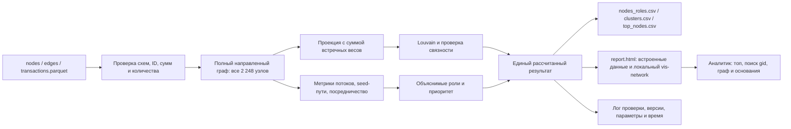

# HackAlem AI — исследование и архитектура «Графа денег»

Дата исследования: **23 сентября 2026 года**, время планирования — Астана / Алматы, UTC+5. Команда: **Jigas**. Статус: **проектный blueprint, реализация не начата**. Проверены документы, исходный starter и фактические Parquet-файлы; выполнены исследовательские расчёты характеристик графа. Готовность продукта, качество ролей и время полного пайплайна пока не измерены.

**Рекомендация:** построить локальный инструмент приоритизации проверки: Python считает объяснимые структурные роли и сообщества, выпускает три обязательных CSV и интерактивный HTML-отчёт. Аналитик выбирает узел из топ-листа или вводит любой `gid`, видит потоки, основания гипотезы и ограничения наблюдения. Главное преимущество — проверяемые основания решения с учётом неполноты графа; обучение модели и внешний LLM для MVP не нужны.

Обозначения: **Факт** — документ или непосредственное измерение; **Рекомендация** — выбранное проектное решение; **Гипотеза** — требует проверки; **Неизвестно** — сведений недостаточно. Все предлагаемые пороги и веса ниже — начальная версия для прототипа, а не правила организаторов и не валидированная AML-модель.

## Основания и границы исследования

Полностью прочитаны:

- [Положение](Положение_HackAlem_AI.md), далее **[П]**; ссылки на него ниже даны по номерам пунктов.
- [Техническое задание трека](<track_data/HackAlem AI_ Граф денег_ восстановление финансовой структуры организованной группы по транзакционной сети.md>), далее **[Т]**; ссылки даны по разделам.
- [Описание датасета](<track_data/README (1).md>), далее **[Д]**.
- [Архив starter](<track_data/starter (1).zip>): `starter.py`, `README.md`, `requirements.txt`, далее **[С]**.
- [Архив данных](<track_data/data (1).zip>): все три Parquet-файла, далее **[А]**.
- [README репозитория](README.md) и [исходное задание на исследование](HackAlem_AI_Research_Architecture_Prompt.md).

В репозитории пока только материалы задания; собственного приложения нет. Дополнительных `AGENTS.md` не обнаружено. Внешние источники исследовались для выбора подхода; данные трека в них не передавались. Публикации, репозитории и документация связаны ссылками непосредственно с соответствующими выводами.

## 1. Что нужно сдать и как будут оценивать

### 1.1. Обязательный результат

**Факт [Т, §4–7, 9–10]:** нужен аналитический пайплайн **и** экран просмотра. Граф, красивый интерфейс, чат или один файл с метриками по отдельности задачу не закрывают.

| Артефакт / поведение | Точное требование | Как подтвердить |
|---|---|---|
| Воспроизводимый запуск | От трёх сырых `.parquet` до трёх CSV одной командой, без ручной обработки | Запуск по README в чистом окружении |
| Производительность | Локально на обычном ноутбуке, ≤5 минут; в must-have написано `<5 минут` | Принять более строгий предел: **менее 300 секунд** |
| `nodes_roles.csv` | Все **2 248** узлов, включая изолированные | Совпадение множества `gid` с `nodes.parquet` |
| Роли | `consolidator`, `transit`, `distributor`, `terminal`, `coordinator`, `peripheral` | Для каждой роли есть формальное правило; не требуется искусственно заполнять все классы |
| Объяснения | Роль, `role_score`, `priority_score`, кластер и непустое числовое обоснование | Три произвольных `gid` объясняются по метрикам за минуту |
| `clusters.csv` | Размер, число seed, внутренний оборот, ключевые узлы, гипотеза каждого кластера | Покрытие всех узлов и сверка агрегатов |
| `top_nodes.csv` | Ранжированный список **не менее 20** узлов с обоснованиями | Сортировка, уникальность, связь с основным CSV |
| Интерфейс | Направления переводов, роли, кластеры, поиск по `gid` | Найти произвольный узел и показать связи |
| README | Установка, зависимости, окружение, одна команда запуска, проверка сценария, критерии и пороги, ограничения, масштабирование до ~1 млн узлов | Другой участник воспроизводит без устных подсказок |
| Схема | Данные → метрики → роли → интерфейс | Один слайд или диаграмма |
| Демо | **5 минут**, живой прогон и разбор 2–3 узлов | Репетиция на зафиксированной версии |
| Репозиторий | Исходники пайплайна и интерфейса в выданном организатором GitHub-репозитории | Проверяемая история разработки |

Точные обязательные схемы:

| Файл | Колонки |
|---|---|
| `nodes_roles.csv` | `gid:int64`, `role:str`, `role_score:float[0,1]`, `cluster_id:int`, `priority_score:float[0,1]`, `evidence:str` **до 200 символов** |
| `clusters.csv` | `cluster_id`, `n_nodes`, `n_seed`, `sum_kzt_internal`, `top_gids`, `hypothesis` |
| `top_nodes.csv` | `rank`, `gid`, `role`, `priority_score`, `why` |

**Факт [С]:** дополнительные колонки допустимы, обязательные удалять нельзя. Основные CSV сохраняем совместимыми; подробные метрики и ограничения можно добавить в них и в HTML. Сериализацию `top_gids` ТЗ не определяет: рекомендация — корректно экранированный JSON-массив **строковых** идентификаторов внутри CSV-ячейки, описанный в README.

### 1.2. Ограничения и основания потери допуска

| Область | Что следует из документов | Решение команды |
|---|---|---|
| Время разработки | Основная функциональность создаётся в соревновательную часть; готовый прежний продукт запрещён [П, 5.4.4.2–5.4.5] | Использовать выданный starter; сохранить историю создания основной логики |
| Прогресс | Подтверждённый результат **каждого часа** обязателен; пропуск — основание дисквалификации [П, 5.4.8, 5.9.2] | Осмысленные коммиты и push каждый час, а не единственная финальная загрузка |
| Рабочий репозиторий | Основная разработка только в репозитории организатора [П, 5.4.9–5.4.11] | Проверить назначение текущего remote; не заводить отдельный основной проект |
| Присутствие | Все участники проходят check-in и работают на площадке; выход по разрешению, обычно суммарно ≤60 минут [П, 5.1.7] | Не планировать удалённого четвёртого разработчика |
| Состав | Команда из 1–3 человек; один участник — одна команда и один проект; проект сдаётся по одной задаче [П, 1.4, 5.1.6, 5.4.1.1] | План ниже рассчитан максимум на троих |
| AI-инструменты разработки | Разрешены любые AI-инструменты и агенты; по Положению Codex сам по себе не обязателен [П, 5.4.12] | Прозрачно раскрыть использованные инструменты; см. противоречие ниже |
| AI внутри продукта | Трек не требует LLM, GNN, обучения или agentic runtime [Т, §7–9] | Графовые методы и интерпретируемые правила достаточны для обязательного сценария |
| Инфраструктура | Всё локально; нельзя требовать облачный кластер, GPU-обучение, платные сервисы; интернет предусмотрен только для необязательного LLM API [Т, §9] | Полностью автономный пересчёт и просмотр, без ключей и CDN |
| Доступ экспертов | Основной сценарий нельзя привязывать к личным аккаунтам, подпискам, закрытым доступам [П, 5.6.6] | Не использовать персональную облачную демоверсию как единственный вариант |
| Данные | Только выданная обезличенная выборка, использование в рамках хакатона [Т, §6, 9] | Не обогащать данные и не публиковать их отдельно в сторонних сервисах |
| Интерпретация | Роли и приоритеты объяснимы; выводы — гипотезы проверки, без утверждения виновности [Т, §9] | Никаких «доказанный организатор», «чистый клиент» и автоматических блокировок |
| Подмена результата | Запрещены списки `gid` с зашитыми ответами и непрозрачные роли [Т, §9] | Все роли, топ и объяснения вычисляются из входа |
| Воспроизводимость | Если финал не запускается по README, команда не проходит отбор; последующие пояснения и исправления не принимаются [П, 5.4.16, 5.6.5] | Проверка чистой установки важнее последней дополнительной функции |
| Сторонние компоненты | Раскрывать библиотеки, модели, код, шаблоны, датасеты; соблюдать лицензии [П, 5.4.4–5.4.6] | Указать starter и зависимости, сохранить лицензии включённых JS-файлов |
| Права на результаты | Организатору предоставляется широкое безвозмездное право использования результатов [П, 6.1] | Учесть при использовании чужих компонентов; не обещать команде исключительность результатов |

Остальные организационные основания дисквалификации включают ложные регистрационные данные, нарушение учёта присутствия, вмешательство в чужие проекты, несанкционированный доступ, нарушение правил площадки и неправомерное влияние на оценку [П, 5.9]. Численные критерии не отменяют обязательные условия допуска.

### 1.3. Сроки и оценка

| Когда, Астана | Что означает |
|---|---|
| 19.09.2026, 23:59 | Регистрация закрыта |
| 20.09.2026, 23:59 | Закрыто формирование команд |
| 23.09, 09:00–12:00 | Check-in |
| 23.09, 12:00–13:00 | Открытие |
| **23.09, 13:00–18:00** | **Пять часов разработки** |
| **23.09, 18:00** | **Фиксация итогового содержимого**, независимо от фактической блокировки платформы |
| 24–28.09 | Техническая проверка |
| 29.09 | Demo Day; оценивается версия, зафиксированная 23.09 |
| 01.10 | Награждение |

Основание: [П, 3.5, 3.8, 5.3, 5.4.13–5.4.14]. Даты проверки, Demo Day и награждения совпадают с [официальным лендингом](https://hackalem.ai/). Доработки после 18:00 не становятся оцениваемой версией. Точный способ отправки заявки/ссылок и место Demo Day в локальных материалах не определены — капитану нужно сверить официальные инструкции.

| Технический отбор по треку [Т] | Баллы | Практическое следствие |
|---|---:|---|
| Соответствие задаче и работоспособность | 25 | Сначала все пять must-have |
| Техническая реализация | 25 | Защитить логику, корректность данных и ограничения |
| README и воспроизводимость | 25 | Документация — четверть баллов и отдельный фильтр допуска |
| Ценность и применимость | 15 | Показать, как выбирается следующий узел для проверки |
| Развитие и оригинальность | 10 | Учет неполноты и измеримая полезность предпочтительнее лишней инфраструктуры |

Demo Day имеет отдельную шкалу: ценность 25, результат 20, инновационность 15, развитие 20, презентация и ответы 20 [П, 5.7.2]. Итоговое коллективное решение жюри имеет приоритет перед арифметическим рейтингом [П, 5.7.3]. Зачёт общий по десяти задачам, квоты победителей по трекам нет [П, 5.8.1].

### 1.4. Расхождения источников

1. **Размер команды:** в примечании трека упомянуты 3–4 человека, но Положение допускает 1–3; лендинг также указывает максимум троих. Планировать троих, не считать примечание разрешением четвёртого участника.
2. **Codex:** [П, 5.4.12] не делает его обязательным, а [лендинг, раздел требований](https://hackalem.ai/) требует использования в разработке. Это реальное противоречие, которое нельзя молча разрешить пересказом одного источника. Текущий анализ уже выполнен с Codex; раскрыть его использование и уточнить применимую редакцию у организатора. Требование к инструменту разработки не означает требование встроить LLM в продукт.
3. **Обрыв графа:** отдельное улучшение указано в optional, но ограничения данных заранее объявлены и их учёт оценивается [Т, §6, 8]. Защиту от неверного `terminal` включить в наш MVP как условие корректности; расширенную оценку полноты оставить дополнительной функцией.
4. **16 компонент и 352 узла вне крупнейшей:** это верно для графа рёбер без 19 изолятов. Для всех обязательных 2 248 узлов — 35 компонент и 371 узел вне крупнейшей. Подробности ниже.

### 1.5. Чеклист перед сдачей

- [ ] Check-in, допустимый состав, работа на площадке и выбран ровно один трек.
- [ ] Основной репозиторий выдан организатором; в нём есть прогресс каждого часа.
- [ ] Зафиксированная до 18:00 версия самостоятельно запускается по README.
- [ ] Пересчёт из сырых Parquet создаёт три CSV за <300 секунд без сети и личных ключей.
- [ ] Все 2 248 уникальных `gid`, включая 19 изолятов, присутствуют в результате.
- [ ] Роли из словаря, оба скора конечны и в [0,1], `evidence` непустой и ≤200 символов.
- [ ] Все узлы имеют кластер; агрегаты кластеров проверены.
- [ ] Топ содержит ≥20 уникальных узлов, ранги и обоснования согласованы с основным CSV.
- [ ] Поиск любого `gid` показывает точный идентификатор, связи, направления и основание роли.
- [ ] Обрыв четвёртого колена и неполные входящие seed явно учтены.
- [ ] Нет внешнего обогащения, жёстко заданных ответов, утверждений о виновности.
- [ ] Есть README с порогами, ограничениями, масштабированием, зависимостями и источниками.
- [ ] Есть диаграмма и отрепетированное пятиминутное демо зафиксированной версии.
- [ ] Проверены официальные форма подачи, дедлайн и доступ экспертов к данным/артефактам.

## 2. Разбор задачи и фактических данных

### 2.1. Проблема и границы продукта

**Явная задача [Т, §2–4]:** помочь AML-аналитику банка определить, **кого проверять первым и на каких основаниях**, по ограниченному графу переводов вокруг 81 исходного клиента. Пользователь — аналитик финансового мониторинга; заинтересованные стороны — его руководитель, подразделение комплаенса, получатель материалов проверки и технические эксперты хакатона.

**Предполагаемый текущий процесс:** аналитик последовательно открывает выгрузки, восстанавливает направления и цепочки, сравнивает суммы и контрагентов, затем вручную составляет приоритеты. Это рабочая гипотеза для UX. Упомянутые в ТЗ часы и недели ручной работы — описание проблемы организатором, а не измеренная нами экономия.

На входе — один месячный batch из `nodes`, `edges`, `transactions`. На выходе — структурная гипотеза, три машиночитаемые таблицы и экран её проверки. Установление личности, юридическая квалификация, поиск всех участников за пределами выборки и решение о блокировке в задачу не входят.

| Статус | Требование / утверждение |
|---|---|
| Явное | Роль каждому узлу, кластеры, приоритеты, объяснения, направленная визуализация, локальный запуск |
| Неявно необходимое | Сохранить изоляты, точные ID, согласовать три файла, обработать отсутствие знаменателя и границы наблюдения |
| Неявно необходимое | Результаты CSV и UI должны происходить из одного расчёта; поиск не ограничивается топом или крупнейшей компонентой |
| Наше допущение | Один локальный аналитик, один фиксированный набор данных; CLI-загрузка приемлема, поскольку веб-upload не требуется |
| Наше допущение | Есть до трёх разработчиков и CPU-ноутбук; компетенции команды не известны |
| Неизвестно | Эталонные роли, истинные организаторы, полный баланс, переводы вне банка, операции <5 000 KZT |
| Неизвестно | ОС и точная конфигурация машины экспертов; возможность скачивания зависимостей при установке |
| Неизвестно | Обязателен ли отдельный видеофайл/слайд-дек в форме подачи; локальные документы этого не требуют |

**Запрещённые допущения:** seed — это обучающая метка роли; не-seed — легитимный клиент; высокий оборот — преступление; кластер — одна организованная группа; большое посредничество — руководство; `out=0` — деньги остались; существующий путь — доказанная передача тех же денег по цепочке.

### 2.2. Аудит архива [А]: что измерено

Parquet прочитан непосредственно из ZIP. Проверены схемы, пропуски, уникальность узлов/пар, согласование транзакций с рёбрами по сумме и количеству, степени, компоненты, глубины и точность идентификаторов. Граф для аудита сначала получил **все узлы из nodes**, затем рёбра.

| Проверка | Непосредственный результат | Следствие |
|---|---|---|
| Размер | 2 248 узлов / 3 119 рёбер / 4 840 транзакций | Заявленный объём подтверждён |
| Seed и глубина | 81; по глубине 0/1/2/3/4: 81/472/462/789/444 | Признаки обхода согласованы |
| Минимальный путь от seed | Совпадает с `nodes.depth` для всех узлов | `depth` — расстояние обхода, не организационный ранг |
| Сумма переводов | **365 890 012,01 KZT** и в рёбрах, и в транзакциях | В ТЗ сумма округлена до целого; не терять тиыны |
| Согласование пар и `n_tx` | Все пары совпали; сумма `n_tx` = 4 840 | Можно рассчитывать агрегаты по рёбрам, время — по транзакциям |
| Расхождение сумм по паре | Максимум ≈5,82×10⁻¹¹ KZT | Это float-погрешность; сравнивать в тиынах либо с явным допуском |
| Пропуски / неизвестные endpoints | 0 / 0 | Не отменяет проверок границы ввода |
| Повторяющиеся `gid` / пары рёбер | 0 / 0 | `DiGraph` подходит для агрегированных пар |
| Петли `src=dst` | 0 | Для текущего входа специальная трактовка петель не нужна |
| Полностью совпадающие строки транзакций | **97 повторов сверх первых строк** | Без `transaction_id` нельзя доказать, что это ошибочные дубли; не делать `drop_duplicates()` |
| Даты | 01–31.07.2026; точность — календарный день | Внутридневная последовательность неизвестна |
| Суммы одной транзакции | От 5 000 до 3 000 000 KZT | Невидимы операции ниже порога, а не отсутствуют в реальности |
| Изоляты | **19**, все seed | Отдельные singleton-кластеры и доступность в поиске |
| Seed без исходящих | **31** = 19 изолятов + 12 только получателей | Нельзя запускать обход лишь с активных seed и терять остальных |
| Компоненты | **35** со всеми узлами; **16** без изолятов | Две цифры описывают разные множества |
| Крупные компоненты | 1 877 узлов / 46 seed; 270 / 1 seed | Не ограничивать обработку крупнейшей компонентой |
| Вне крупнейшей | **371** узел, из них 352 с рёбрами | Объясняет расхождение формулировки ТЗ |
| Узлы с `out_kzt > in_kzt` | **377** всего; **354** при положительном наблюдаемом входе; ещё 23 с нулевым входом | Число 354 из ТЗ относится к более узкому условию; баланс неполон не только у seed |
| Узлы без исходящих | **1 554**, из них **444** на depth=4 | Наивная роль `terminal` будет сильно зависеть от способа выгрузки |
| Наблюдаемый пропуск 0,8–1,2 | 72 узла, из них 70 не-seed до глубины 4 | Это кандидаты на проверку транзитного поведения, не разметка |
| Входящие от ≥3 контрагентов | 200 узлов | Есть материал для объяснимой консолидации |
| Исходящие к ≥10 контрагентам | 64 узла; максимум 116 | Есть выраженные веерные структуры |
| Точность ID | **Все 2 248 `gid` >2⁵³−1; все меняются при int→float→int** | В браузере и JSON — строки; в Python/CSV — точные int64/десятичные строки |

**Критический контракт ID:** `gid`, `src`, `dst`, ссылки в `top_gids` и ключи поиска превращаются в строки **до** сериализации в JSON. Нельзя сначала округлить число в браузере, а затем вызвать `String()`. CSV хранит полную десятичную запись; при открытии в Excel колонку нужно импортировать как текст. Ограничение межсистемной точности чисел описано в [RFC 8259, §6](https://www.rfc-editor.org/rfc/rfc8259#section-6).

### 2.3. Что дал просмотр starter

**Переиспользовать:** загрузку, CLI-параметры `--data/--out`, направленный граф, входящие/исходящие степени, суммы, количества, признаки seed/depth и схемы CSV [С].

**Исправить при реализации:**

1. `build_graph(edges)` создаёт только узлы с рёбрами. Основной граф должен сначала получить `nodes.gid`; иначе изоляты пропадут из кластеризации и UI, хотя текущий `basic_features` возвращает их строками через исходный `nodes`.
2. `sanity_check` сравнивает наличие пар, но **не проверяет вычисленные суммы и количества**, несмотря на сообщение `edges == transactions: OK`. Добавить обе сверки и проверки типов/уникальности.
3. `pass_through` — отношение наблюдаемых агрегатов, не полный финансовый баланс и не доказательство происхождения исходящих денег. `NaN` при отсутствии входа — неизвестность, а не ноль.
4. `nx.pagerank` в этом пути использует SciPy, который не перечислен в starter `requirements.txt`. В выбранном MVP PageRank не участвует в решении: убрать обязательный вызов и зависимые поля либо, если команда сознательно оставит эту метрику, явно добавить и проверить SciPy. Не сохранять скрытую зависимость. [Реализация NetworkX PageRank](https://networkx.org/documentation/stable/_modules/networkx/algorithms/link_analysis/pagerank_alg.html).
5. `transactions` загружается, но не используется для временных выводов. Это готовая основа для следующего улучшения; граф нельзя превращать в `DiGraph` из транзакций с перезаписью многократных переводов.
6. Роли, кластеры и топ в starter — пустые каркасы. Его успешный запуск не подтверждает выполнение задачи.

### 2.4. Функциональные и нефункциональные требования

| ID | Требование | Приёмка |
|---|---|---|
| F1 | Прочитать и проверить три согласованных файла | При неверной схеме — понятная ошибка и ненулевой exit code, без частичного результата |
| F2 | Построить полный направленный граф и наблюдаемые метрики | Все `gid` и рёбра сохранены, суммы сверены |
| F3 | Назначить каждому узлу основную роль, скор и объяснение | Шесть ролей описаны; признаки и пороги доступны |
| F4 | Выделить сообщества и агрегировать их | Полное покрытие, singleton для изолятов, гипотезы с числами |
| F5 | Рассчитать приоритет и топ | ≥20 узлов; правило сортировки и вклады прозрачны |
| F6 | Показать сеть и карточку произвольного узла | Поиск, стрелки, контрагенты, роль, кластер, ограничения |
| F7 | Выпустить обязательные артефакты одним запуском | Нет ручного редактирования CSV или выбора ответов |
| N1 | Работа без внешней инфраструктуры | Сеть выключена, ключей нет, пересчёт и UI работают |
| N2 | Время <300 секунд | Измеряется от чтения raw-файлов до готовых CSV; наш тест дополнительно включает генерацию HTML |
| N3 | Воспроизводимость | Фиксированные версии, порядок обхода, random seed, стабильные cluster ID и tie-break |
| N4 | Корректность неопределённости | Обрыв, неполный вход, неизвестная хронология и отсутствие ground truth отражены явно |
| N5 | Приватность | Нет внешнего обогащения, телеметрии и автоматической отправки данных |
| N6 | Пригодность UI | Табличный эквивалент графа, легенда, клавиатурный поиск, подписи помимо цвета |

## 3. Что показало интернет-исследование

Сравнение ниже отделяет возможности продуктов, заявленные их авторами, от нашей оценки применимости. Коммерческие показатели точности и экономии не использовались как доказательство качества нашего решения.

| Источник / решение | Что делает и как | Что взять | Ограничение относительно нашего трека |
|---|---|---|---|
| [Quantexa AML](https://www.quantexa.com/solutions/aml/) — коммерческий продукт | Объединяет контекст клиента, разрешение сущностей и сеть связей для расследований | Работа от сетевого контекста к объяснимой карточке и приоритету | Рассчитан на более богатые данные; нам запрещено внешнее обогащение, уже даны уникальные `gid` |
| [Neo4j Fraud Demo](https://neo4j.com/developer/demos/fraud-demo/) — официальный пример | Моделирует клиентов, счета и переводы как граф; запросами находит связи и подозрительные шаблоны | Показывать конкретные пути и контрагентов, а не только единый risk score | В примере больше типов сущностей и атрибутов; серверная БД для 2 248 узлов не даёт необходимого преимущества |
| [IBM AMLSim](https://github.com/IBM/AMLSim) — open source | Генерирует синтетические банковские транзакции с заданными AML-шаблонами | Небольшие синтетические мотивы для проверки поведения алгоритма | Симулятор и его зависимости не нужны в runtime; синтетический шаблон не подтверждает реальные роли трека |
| [IBM AML-Data](https://github.com/IBM/AML-Data) — публичные данные | Многоагентная симуляция финансовых операций с меткой laundering на транзакциях | Будущая оценка алгоритмов на отдельном наборе, понимание типологий | Другие метки и распределение; нельзя выдавать это за разметку наших шести ролей. Лицензия данных CDLA-Sharing-1.0 отличается от Apache-2.0 репозитория |
| [Elliptic, Weber et al., 2019](https://arxiv.org/abs/1908.02591) — исследование и датасет | Сравнивает классические модели и GCN на размеченных Bitcoin-транзакциях; RF оказался сильнее в описанном эксперименте | Выбирать модель по измеренному результату, а не по сложности | Узлы — транзакции, домен — Bitcoin, есть признаки и метки; прямой перенос на клиентов нашего графа не обоснован |
| [Elliptic2, Bellei et al., 2024](https://arxiv.org/abs/2404.19109) — исследование | Учится на размеченных подграфах, чтобы распознавать формы взаимодействия | Объяснять локальные структуры: сбор, веер, цепочка, возврат | Требует соответствующих данных и валидации; не решает отсутствие разметки ролей в нашем кейсе |
| [BIS Project Aurora, 2023](https://www.bis.org/publications/project-aurora-power-data-technology-and-collaboration-combat-money-laundering-across-institutions-and-borders) — официальный PoC | Исследует сетевую аналитику, ML и защищённое сотрудничество между организациями | Неполная наблюдаемость — существенная граница выводов, сетевой контекст важен | Межбанковские данные и совместное обучение недоступны в треке; результат PoC нельзя переносить как нашу эффективность |
| [OpenAML, DTCC AI Hackathon](https://github.com/finos-labs/dtcch-2025-OpenAML) — публичный проект хакатона | Репозиторий описывает происхождение на хакатоне, модели по признакам кошельков и развитие в blockchain analytics | Связный сценарий от признаков к просмотру и проверке | On-chain данные, другая разметка и live-интеграции; не копировать готовый продукт и его «risk labels» |
| [BIS Analytics Challenge / Hertha](https://www.bis.org/speeches/20250327-working-together-ensure-financial-integrity) — смежное соревнование | Участникам давали синтетические платежи для решений по финансовой преступности; акцент на минимально достаточных данных | Оценивать пользу на ограниченном, воспроизводимом сценарии | Не является эталоном результата HackAlem и не даёт размеченных ответов на наш набор |

### 3.1. Выбор методов

- **Сообщества:** Louvain уже доступен в NetworkX и подходит для первой версии. Направленный Louvain тоже существует; выбор ненаправленной проекции для группировки — наша осознанная гипотеза, а не ограничение библиотеки. Направление сохраняем для всех потоков, ролей и путей. [Документация Louvain](https://networkx.org/documentation/stable/reference/algorithms/generated/networkx.algorithms.community.louvain.louvain_communities.html).
- **Качество сообществ:** Louvain может возвращать несвязные сообщества; Leiden разработан для улучшения этих свойств. Для MVP достаточно проверки связности и разделения несвязного результата на компоненты; это не делает Louvain эквивалентом Leiden. [Traag et al., 2019](https://www.nature.com/articles/s41598-019-41695-z).
- **Посредничество:** betweenness описывает участие в кратчайших путях. Вес в соответствующей функции трактуется как **расстояние**, поэтому подставлять `sum_kzt` как длину пути нельзя без специальной модели. Для первого варианта взять направленную невзвешенную метрику. [NetworkX betweenness](https://networkx.org/documentation/stable/reference/algorithms/generated/networkx.algorithms.centrality.betweenness_centrality.html).
- **Аномалии:** Isolation Forest может дать относительную необычность профиля, но не назначает содержательные финансовые роли. Без внешней оценки его добавление не улучшает обязательный ответ автоматически. [Документация IsolationForest](https://scikit-learn.org/stable/modules/generated/sklearn.ensemble.IsolationForest.html).
- **Практика AML:** FATF рассматривает новые технологии как средство повышения эффективности при сохранении внимания к качеству данных и ответственному применению. Для нашего продукта это основание сохранять проверяемость и человеческое решение, а не объявлять соответствие регуляторным требованиям по одному прототипу. [FATF, Digital Transformation of AML/CFT](https://www.fatf-gafi.org/en/publications/Digitaltransformation/Digital-transformation.html).

### 3.2. Стандарты, форматы и внешние сервисы

Нужны обычные файловые контракты: Parquet со схемой организаторов, CSV с заголовками и корректным quoting, UTF-8 и точная передача идентификаторов. [Apache Arrow / Parquet](https://arrow.apache.org/docs/python/parquet.html), [RFC 4180](https://www.rfc-editor.org/rfc/rfc4180), [RFC 8259](https://www.rfc-editor.org/rfc/rfc8259).

ISO 20022, API банка, санкционные базы, entity resolution и интеграция SAR/STR не требуются для выданной файловой задачи. Доступ к таким системам не предоставлен. Внешние датасеты полезны как исследовательские ориентиры, **в финальный вход их не добавляем**. Ни один внешний API не нужен для воспроизведения MVP.

**Вывод исследования:** оптимальный первый продукт — интерпретируемая графовая аналитика с явным указанием границ наблюдения. Новизну стоит строить на качестве приоритизации и объяснения неполноты, а не на обязательном использовании генеративной модели.

## 4. Продуктовый подход и границы MVP

### 4.1. Идея и пользовательский путь

Рабочее название: **Jigas — Граф денег**. Это локальный отчёт для первичного разбора сети: кого проверить, какие связи подтверждают структурную гипотезу и каких данных не хватает для более сильного вывода.

1. Аналитик располагает выданные три Parquet в папке и запускает команду из README.
2. Пайплайн проверяет данные; при несогласованности объясняет проблему, а не выдаёт правдоподобный частичный отчёт.
3. За один проход формируются метрики, сообщества, роли, приоритеты и объяснения.
4. Аналитик открывает локальный `report.html`: период, охват, ограничения выборки, топ-20 и граф.
5. Выбор строки топа либо ввод `gid` открывает карточку и окрестность узла; изолированный узел также находится.
6. Карточка показывает вход/выход, числа контрагентов, применившееся правило, уверенность, вклад в приоритет и предупреждения о полноте.
7. Аналитик проверяет связанные узлы/кластер и получает CSV для дальнейшего рассмотрения. Решение о проверке принимает человек.

### 4.2. Приоритеты

| Уровень | Что входит | Почему |
|---|---|---|
| **MUST HAVE** | Валидация трёх файлов; полный граф; шесть объяснимых правил; два скора; кластеры; три CSV; поиск и направленный граф; README и диаграмма | Закрывает все обязательные условия трека |
| **MUST HAVE — наш инженерный минимум** | Точные ID, изоляты, защита от `terminal` на depth=4, корректная трактовка seed, автономный UI | Без этого результаты могут быть технически или содержательно неверны |
| **SHOULD HAVE** | Дневные профили входа/выхода; осторожное подтверждение близкого по времени транзита; путь от seed; панель полноты данных; сохранённый отчёт проверки | Использует имеющиеся данные и усиливает объяснения |
| **SHOULD HAVE** | Сравнение с простой сортировкой по обороту, устойчивость топа и кластеров | Даёт доказательство пользы сверх визуализации |
| **NICE TO HAVE** | Возвратные потоки, повторяемые цепочки ограниченной длины, влияние удаления топ-N | Полезно после полной сдаваемости |
| **NICE TO HAVE** | Вопросы на естественном языке, ML-анома́лии, дополнительные сценарии расследования | Добавлять только при подтверждённой пользовательской пользе и оставшемся времени |

Минимальная версия интерфейса — таблица, карточка, поиск и граф в одном HTML. Загрузка файлов через веб-форму, личные кабинеты, история кейсов и полноценная система case management для пятичасового этапа не нужны.

### 4.3. Что показать на экране

Слева — топ и фильтры по роли/кластеру, справа — направленная окрестность выбранного узла, рядом — карточка оснований. Фильтр «исходные seed / остальные клиенты» помогает перейти к новым кандидатам, сохраняя общий рассчитанный приоритет. Цвет обозначает роль, подпись/форма — seed и обрыв; режим окраски по кластеру переключается отдельно. Легенда обязательна, цвет не должен быть единственным носителем смысла.

По умолчанию показывать один шаг связей. Два шага и общий граф доступны по запросу; при ограничении отображения явно указывать число скрытых узлов/рёбер. **Фильтр влияет только на вид, не на рассчитанные суммы или топ.** Поиск проходит по всему индексу 2 248 узлов, включая отсутствующих на текущем экране. Это важнее сложной анимации общего «клубка».

## 5. AI/ML и аналитическая модель

### 5.1. Где AI нужен, а где достаточно алгоритма

| Компонент | Вход → выход | Выбор и альтернативы | Обучение, стоимость, ресурсы | Ошибка и проверка |
|---|---|---|---|---|
| Валидация и метрики | Три таблицы → проверенный граф и признаки | pandas, арифметика, обходы графа; AI не нужен | Без обучения/API; CPU | Потеря ID, узлов, сумм; проверяется инвариантами |
| Основная роль | Наблюдаемые признаки → роль, поддержка, evidence | Интерпретируемые правила; RF/GCN не выбраны из-за отсутствия целевой разметки | Нет обучения или fine-tuning; локально | Ошибка трактовки неполноты; ручной разбор и сценарные проверки |
| Сообщества | Взвешенная проекция → разбиение узлов | Louvain; Leiden — альтернатива при проблемах устойчивости | Оптимизация на текущем графе, без обучающей выборки; CPU | Нестабильные/несвязные группы; проверка связности и нескольких запусков |
| Приоритет | Метрики и поддержка ролей → объяснимая сортировка | Детерминированная формула; learning-to-rank отложен до появления оценок аналитиков | Без модели/API | Слишком сильное влияние суммы или seed; сравнение с baseline и анализ весов |
| Карточки и гипотезы | Структурированные факты → короткий текст | Шаблоны; LLM не нужен для перечисления чисел | Без токенов и GPU | Текст расходится с данными; генерация из тех же полей, что CSV |
| Временной сигнал, SHOULD | Даты и суммы → дневной профиль/совместимость потоков | Детерминированное сопоставление по дням | CPU, без обучения | Двойной учёт объёма и ложная хронология; малые ручные примеры |
| Аномалии, отложено | Нормированные графовые признаки → относительная необычность | Кандидат: Isolation Forest; альтернатива — прозрачные квантили по глубине | Обучается без меток на текущей выборке; ориентир — секунды на CPU, не замерено | Находит артефакты сбора вместо интересных узлов; нужен review полезности |
| NL-ассистент, отложено | Вопрос → выбор операции и фактический ответ | Модель не выбрана: в MVP конкретной пользы сверх фильтров нет | Нет зависимости, расходов и обещаний задержки | Галлюцинации чисел/ролей и доступность API; основание не включать сейчас |

Embeddings, RAG и векторное хранилище не решают задачу точного обхода уже заданного графа. OCR, VLM и speech не имеют входных данных. Автономные агенты не нужны для фиксированного batch-процесса. Называть правила «обученной AI-моделью» или уверенность «вероятностью преступления» нельзя.

**Бюджет:** обязательный runtime — **0 платных API-вызовов, 0 токенов, без GPU**; нужны существующий ноутбук и локальные зависимости. Целевой ресурсный ориентир — CPU, 8 GB RAM; пиковая память приложения пока не измерена. Это рекомендация для разработки, не системное требование организаторов и не проверенный benchmark.

### 5.2. Минимальный набор признаков

Для узла `v`:

| Обозначение | Определение | Ограничение смысла |
|---|---|---|
| `k_in`, `k_out` | Числа различных плательщиков и получателей | Это контрагенты в выборке |
| `I`, `O` | Суммы входящих и исходящих рёбер | Не полный баланс и не доход клиента |
| `n_in`, `n_out` | Суммы `n_tx` по входу/выходу | Позволяют отличить один крупный перевод от повторяющихся |
| `V=I+O` | Наблюдаемая активность узла | Одна сумма, прошедшая через узел, учитывается с двух сторон; это не уникальный объём средств |
| `r=O/I` | Наблюдаемое отношение выхода к входу, только при `I>0` | При `I=0` значение неизвестно; для seed не использовать как доказательство удержания/транзита |
| `boundary` | `depth==4` и отсутствует выход | Выход не наблюдался из-за дизайна выгрузки |
| `isolated` | Нет ни одного ребра | Роль не восстанавливается из данных |
| `S` | Число различных seed, достигающих узла направленным путём длиной 1–4; сам узел исключён | Структурная достижимость, не число независимых источников денег и не доказательство происхождения средств |
| `B` | Направленная невзвешенная betweenness без endpoints | Структурное посредничество, не власть/управление |
| `last_in`, `days_after_last_in` | Последняя дата входа; количество последующих календарных дней до конца июля | Позволяет явно заметить недостаток времени наблюдения |

Для `S` достаточно 81 BFS с ограничением длины и множествами посещённых узлов; считать уникальные seed, а не количество путей. Путь для объяснения хранить как один свидетельствующий маршрут, не перечислять все возможные пути. Цикл не должен многократно увеличивать поддержку.

Общий `365 890 012,01 KZT` — оборот наблюдаемых рёбер. Складывание переводов по цепочке многократно учитывает перемещение средств, поэтому это не оценка «суммы незаконных доходов».

### 5.3. Начальные правила всех шести ролей

**Рекомендация для первого прототипа, а не результат классификации архива.** Пороги выбраны для понятного baseline: ≥3 входящих — несколько различных контрагентов; ≥10 исходящих — выраженный веер; 0,8–1,2 — стартовый диапазон из задания. Пороговые решения нужно проверить на распределениях и примерах до фиксации версии. Различие `gid` не доказывает независимость владельцев или источников средств.

| Роль | Условие-кандидат | Что допустимо сказать | Что нельзя утверждать |
|---|---|---|---|
| `coordinator` | `S≥2`, `k_in≥2`, `k_out≥2`, `B>0` и `B≥Q90(B>0)` | Узел соединяет маршруты от нескольких seed и занимает заметное структурное положение; гипотеза координационной роли | Что клиент руководит группой; что все пути независимы и содержат одни и те же деньги |
| `distributor` | `k_out≥10` | Наблюдается веер переводов на указанное число получателей | Что деньги распределяются между соучастниками |
| `consolidator` | `k_in≥3` | Наблюдается сбор переводов от нескольких плательщиков | Что вся сумма удержана или имеет единый незаконный источник |
| `transit` | Не seed, `depth<4`, `I>0`, `O>0`, `0,8≤r≤1,2` | Объёмы входа и выхода сопоставимы; есть признаки транзита в месячной выборке | Что эти конкретные поступления были перечислены далее или вывод произошёл быстро |
| `terminal` | Не seed, `depth<4`, `I>0`, `k_out=0`, после `last_in` наблюдалось ≥2 календарных дней | Кандидат в конечные получатели **в наблюдаемом фрагменте и периоде** | Что средства действительно остались на счёте или не ушли в другой банк |
| `peripheral` | Ни одно из условий выше не выполнено | Специальная структурная роль по выбранным правилам не установлена | Что клиент безопасен, неинтересен или не связан с расследованием |

`Q90(B>0)` вычислять по положительным значениям текущего полного графа, с зафиксированным методом квантиля. Если положительных значений нет, кандидатов `coordinator` нет. Не подбирать исключения по `gid`, чтобы получить желаемое число ролей.

**Пересечение ролей:** первичная роль выбирается в порядке `coordinator → distributor → consolidator → transit → terminal → peripheral`. Это договорённость отображения, не иерархия виновности. Совпавшие вторичные правила показывать в карточке: например, сборщик может одновременно пропускать сопоставимый объём дальше. Порядок, пороги и вторичные признаки документировать.

**Граничные случаи:**

- Узел depth=4 с тремя и более плательщиками может иметь наблюдаемые признаки `consolidator`; его нельзя лишать всей информации из-за обрыва. При этом `terminal` и вывод об удержании запрещены.
- Узел depth=4 без признаков другой роли получает `peripheral` и флаг «роль не установлена: выход за границей наблюдения». Не вводить седьмую роль до необходимости.
- Изолированный seed получает `peripheral`, нулевую поддержку роли, собственный кластер и объяснение отсутствия наблюдаемых переводов. Его seed-статус сохраняется.
- `O>I` у не-seed тоже возможно из-за неполного входа, прежнего остатка или ненаблюдаемых операций. Это не самостоятельный сигнал нарушения.
- Если поступления пришлись на 30–31 июля, нулевого выхода недостаточно для выбранного terminal-правила: горизонт наблюдения слишком короткий.

### 5.4. `role_score`: что означает уверенность без разметки

ТЗ требует число 0–1, но ground truth отсутствует. Поэтому `role_score` трактуем как **эвристическую степень поддержки структурной гипотезы**, а не статистически калиброванную вероятность. Отдельно показываем признаки неполноты. Высокая уверенность в веерной структуре не означает высокий риск преступления.

Для воспроизводимого первого варианта предлагается единая форма: **`role_score = cap(role) × (0,5 + 0,5 × u_role)`** для совпавшего правила, а для `peripheral` — **0** («роль не установлена»).

| Роль | Поддержка `u_role`, от 0 до 1 | Верхняя граница `cap` |
|---|---|---:|
| `coordinator` | `min(1, S/4)` | 0,60 |
| `distributor` | `min(1, k_out/20)` | 0,90 |
| `consolidator` | `min(1, k_in/6)` | 0,90 |
| `transit` | `max(0, 1-abs(r-1)/0,2)` | 0,65 |
| `terminal` | `min(1, days_after_last_in/7)` | 0,50 |

Эти потолки — **наши консервативные настройки**, а не эмпирические оценки точности. Смысл: наблюдаемый веер подтверждается непосредственно, а координация, транзит одних и тех же денег и конечное удержание требуют более сильных данных. Условия правила проверяются до расчёта; нельзя получить «уверенность в роли», правило которой не сработало. Одинаковая формула используется в CSV и UI.

До демо проверить, что шкала понятна аналитику. Если нет — сохранить число для контракта ТЗ, а в UI подписывать его «поддержка гипотезы» и раскрывать правило. Не показывать «вероятность организатора 60%».

### 5.5. `priority_score`: отдельная задача выбора следующей проверки

Не использовать автоматически высокий `role_score`, seed-статус или одну большую сумму как весь приоритет. Начальная прозрачная формула:

**`P = 0,35 × M + 0,30 × A + 0,20 × C + 0,15 × H`**, где:

- `M` — максимальная поддержка среди всех совпавших структурных ролей; для отсутствующих ролей 0. Это позволяет не терять вторичную роль из-за порядка отображения.
- `A = min(1, log1p(V) / log1p(Q95(V>0)))` — наблюдаемая активность с ограничением влияния самых крупных сумм.
- `C = min(1, S/5)` — охват исходных seed по направленным путям.
- `H = min(1, B/Q95(B>0))` — структурное посредничество; при отсутствии положительных `B` равно 0.

При пустом множестве или нулевом знаменателе соответствующая компонента равна 0; значения проверяются на конечность и диапазон. Порядок: `priority_score` по убыванию, затем точный числовой `gid` по возрастанию. Округление — только для отображения, не перед сортировкой.

Веса и нормировочные значения сохраняются с результатом. В `why` — два главных наблюдаемых основания и значимое ограничение; в карточке — вклады всех четырёх компонентов. Например: «13 плательщиков; вход 1 095 690 KZT; выход 66 000 KZT. Гипотеза сбора; полный баланс неизвестен».

**Ограничение формулы:** связи между seed могут делать `S` коррелированным, а глобальные обороты — смещать топ к крупной компоненте. Это известный потолок baseline. Не трактовать охват как независимые доказательства; проверить чувствительность веса `C`, дать фильтр по компоненте и показывать локальные кандидаты, не подменяя основной общий топ. Окончательную формулу выбирать по проверке полезности, описанной в разделе 8.

### 5.6. Кластеры и их гипотезы

1. Создать ненаправленную проекцию только для группировки: **`w{u,v}=sum(u→v)+sum(v→u)`**. Простое преобразование в `Graph` без явного суммирования может потерять вес одного из встречных рёбер.
2. Добавить все узлы; изоляты сразу выделить отдельно. На остальном графе использовать Louvain с `weight=sum_kzt`, `resolution=1`, `seed=42`; порядок узлов и рёбер предварительно стабилизировать.
3. Проверить связность каждого сообщества в проекции. Несвязное сообщество разделить на его связные компоненты; метрики пересчитать. Это даёт понятную группу связей, но не гарантию единственной правильной структуры.
4. Упорядочить группы по минимальному числовому `gid` и назначить `cluster_id` последовательно. При фиксированном входе IDs воспроизводимы; после изменения данных стабильность номера между версиями не обещается.
5. `sum_kzt_internal` считать по **исходным направленным рёбрам**, у которых оба конца внутри группы. Межкластерный оборот хранить отдельно; сумма внутренних оборотов не обязана равняться общему обороту.
6. `top_gids` — до пяти узлов кластера по общему приоритету. Для singleton допустим один. Гипотеза формируется шаблоном из размера, seed, ролей и направлений; группа без seed не называется автоматически неинтересной.

Пример формы гипотезы: «В группе N узлов и S seed; преобладают исходящие связи от нескольких распределителей. Возможна связанная структура переводов; общность контроля не установлена». Конкретные `N`, `S`, суммы и узлы подставляются из расчёта.

**Исследовательский замер [А]:** на полном графе, суммированной проекции и NetworkX 3.6.1:

| Random seed Louvain | Кластеров до разделения | Из них с >1 seed | Несвязных кластеров | Modularity | Время алгоритма |
|---:|---:|---:|---:|---:|---:|
| 0 | 91 | 8 | 0 | 0,859099 | 0,042 с |
| 42 | 91 | 8 | 0 | 0,859508 | 0,041 с |
| 123 | 90 | 8 | 1 | 0,860593 | 0,039 с |

В число кластеров включены 19 изолятов. Восемь сообществ с несколькими seed из примечания ТЗ — **не восемь кластеров всего**. Одинаковое число таких групп ещё не означает стабильности их состава. Этот замер подтверждает необходимость проверки связности и фиксирования случайности; modularity не измеряет правильность AML-гипотез.

### 5.7. Временные паттерны: первое расширение после MVP

Начать с дневного графика входа и выхода, числа плательщиков в день и списка конкретных переводов. Это уже помогает отличить месячное совпадение сумм от близости по времени.

Если останется время, считать **потенциально совместимый объём транзита за 1–2 следующих календарных дня**: хронологически сопоставлять наблюдаемые входящие и более поздние исходящие суммы, расходуя каждый тиын и входа, и выхода не более одного раза. Детерминированное FIFO — модель сопоставления, не восстановление реального происхождения денег. Поступления 30–31 июля исключить из знаменателя полного двухдневного окна и явно показать как цензурированные.

Переводы в тот же день показывать отдельным сигналом: порядок внутри дня неизвестен. Нельзя независимо складывать `min(вход дня, выход следующих двух дней)` для каждого дня — один выход тогда будет использован несколько раз. Не обещать точность до часов, которой нет в исходных данных.

Временной сигнал добавлять как вторичное обоснование, пока не проверено, что он улучшает роль/топ. Возврат A→B→A в месячном графе означает только встречные переводы; для утверждения о последовательном возврате нужны совместимые даты. Не запускать неограниченный перебор всех путей и циклов.

### 5.8. Задержка, стоимость и что измерено

Измерения выполнены на macOS 26.2 arm64, Python 3.13.3, pandas 2.2.3, NumPy 2.2.6, PyArrow 25.0.1, NetworkX 3.6.1. PyArrow установлен во временный исследовательский каталог; зависимости проекта не изменялись.

| Операция | Статус | Время / бюджет |
|---|---|---|
| Чтение и расширенный аудит с обходами | Один исследовательский замер | ~3,00 с после импортов |
| Louvain | Три замера выше | ~0,04 с каждый |
| Точная направленная невзвешенная betweenness | Один исследовательский замер | **0,752 с**; положительна у 599 узлов |
| Правила, ранжирование, CSV | Ещё не реализованы | Проектный бюджет <5 с |
| Формирование HTML | Ещё не реализовано | Проектный бюджет <5 с |
| Весь продукт из raw, включая HTML | **Не измерен** | Цель <30 с, приёмочный предел <300 с |
| Открытие отчёта / поиск | **Не измерены** | Цели <5 с / <1 с на демо-ноутбуке |

Одиночные замеры алгоритмов подтверждают запас по масштабу, но не являются доказательством полного SLA. Инициализация Python, файловый ввод, версия среды, генерация и браузер учитываются в финальной проверке отдельно.

## 6. Системная архитектура

### 6.1. Один локальный процесс и статический просмотр



Это диаграмма предлагаемой архитектуры, не описание готового приложения. Временные метрики при добавлении поступают из `transactions` в тот же слой признаков; интерфейс не становится вторым независимым аналитическим движком.

| Компонент | Конкретное решение | Почему здесь | Альтернатива и условие её выбора |
|---|---|---|---|
| Язык / запуск | Python 3.13, один CLI на основе `starter.py` | Уже есть starter и проверенная локальная среда | Python 3.12 допустим после отдельного чистого прогона; новый язык не даёт выигрыша |
| Табличные данные | pandas + PyArrow; NumPy из starter | Прямое чтение формата и простые агрегации | DuckDB/Polars при существенно больших объёмах и измеренной проблеме памяти |
| Граф | NetworkX `DiGraph` и отдельная `Graph`-проекция | Уже предусмотрен starter, текущий объём мал | igraph/другой компактный backend при росте графа, не второй параллельный движок в MVP |
| Frontend | HTML/CSS + небольшой обычный JavaScript + **vis-network** | Нужны таблица, фильтры, выбор узла и стрелки; нет необходимости в SPA-сборке | Streamlit, если команда значительно быстрее работает в нём; тогда отдельно проверить граф-компонент и offline-ресурсы |
| Генерация отчёта | Один HTML-шаблон и встроенный JSON из результата Python | Одинаковые показатели в CSV и UI; `file://` без API | Локальный HTTP-сервер только если появится ограничение браузера, не как обязательный сервис |
| Backend / API | Отдельного сервера нет | Пересчёт batch, результат неизменяемый | FastAPI после появления интерактивного пересчёта, нескольких пользователей или внешнего клиента |
| AI service | Отдельного сервиса нет | Все выбранные алгоритмы исполняются в том же процессе | Только при появлении обоснованного дополнительного сценария |
| База данных | Нет; DataFrame и граф в памяти | 2 248 узлов не требуют постоянного сервера | SQLite для истории локальных кейсов; серверная БД — при реальной совместной работе |
| Файловое хранилище | Локальные `data/` и `out/` | Достаточно для одного набора и артефактов | Object storage не нужен |
| Векторное хранилище | Нет | Нет задачи семантического поиска по документам | Добавлять только под появившийся корпус и измеримую retrieval-задачу |
| Аутентификация | Нет сетевого доступа; файл на локальном устройстве | В MVP нет сервиса или многопользовательского кабинета | Доступ по ролям и аудит действий потребуются перед общей банковской эксплуатацией |
| Async / очередь | Нет, синхронный CLI с понятными этапами | Весь пересчёт укладывается в локальный batch | Фоновая задача потребуется при длительных заданиях в будущем UI |
| Развёртывание | Репозиторий + виртуальное окружение + фиксированные зависимости | Эксперт повторяет команду без аккаунтов | Docker только дополнительно, если команда успеет проверить; обязательным его не делать |
| Наблюдаемость | Консольный лог этапов + небольшой JSON результатов проверки | Достаточно для воспроизводимости и разбора ошибки | Prometheus, tracing и облачная телеметрия избыточны |

Первичные технические основания: [pandas.read_parquet](https://pandas.pydata.org/docs/reference/api/pandas.read_parquet.html), [Apache Arrow](https://arrow.apache.org/docs/python/parquet.html), [vis-network: исходники](https://github.com/visjs/vis-network), [API выбора, фокусировки и связей](https://visjs.github.io/vis-network/docs/network/).

### 6.2. Важные детали, от которых зависит воспроизводимость

**Минимум зависимостей.** Для стартовой проверки зафиксировать версии, исследованные выше: pandas 2.2.3, NumPy 2.2.6, NetworkX 3.6.1, PyArrow 25.0.1. Это подтверждённая среда аудита, **не готовый lock всего приложения**. После первого полного прогона зафиксировать окончательные версии и транзитивные зависимости. Версию vis-network выбрать, локально включить и проверить при реализации; не использовать `latest` во время запуска.

**Локальные ресурсы.** JavaScript и необходимые стили vis-network хранить в репозитории с лицензией и включать в итоговый HTML. Стандартный PyVis кажется коротким путём, но его [шаблон](https://raw.githubusercontent.com/WestHealth/pyvis/master/pyvis/templates/template.html) содержит внешние Bootstrap-ресурсы даже при `cdn_resources="in_line"`; параметр сам по себе не доказывает автономность. Наш выбор — простой собственный шаблон вокруг готовой библиотеки визуализации, без Bootstrap/CDN и собственной реализации раскладки графа.

**Данные и безопасность вывода.** Перед JSON все ID — строки; неопределённые значения — `null`, не `NaN`/`Infinity`. Встраиваемые данные сериализовать с корректным экранированием, включая `<` внутри script-контекста; тексты вставлять как текст, не как произвольный HTML. Для поиска использовать текстовый input, не числовое поле, меняющее 18-значный ID. Числа денежных величин проверять на конечность и допустимый диапазон.

**Деньги.** В текущем архиве суммы соответствуют точности до тиына. После валидации переводить в целое количество тиынов для сверок и агрегирования, а выводить в KZT с двумя знаками. Не использовать округлённые экранные суммы для принятия решений. `n_tx` неотрицателен и целочислен, на имеющихся рёбрах положителен. Пустые/повреждённые входы должны завершать запуск понятной ошибкой, а не «успехом» с нулями.

**Детерминизм.** Сортировать вход по точным ID; зафиксировать `seed=42`, `resolution=1`, метод квантиля `linear`, порядок приоритетов ролей и сортировку строк. Источник CSV/HTML общий. Метаданные времени запуска не включать в сравнение семантических результатов двух прогонов.

**Целостность выпуска.** Сначала рассчитать и проверить результат в памяти, записать во временную папку и после успешной проверки объявить полный новый набор готовым. Старый отчёт не должен выглядеть как результат упавшего текущего запуска. В логе — путь входа, хеши файлов, версии, пороги, число узлов/ролей/кластеров, проверочные суммы и длительность этапов; не нужен полный дамп транзакций.

**Установка и отсутствие интернета.** Документы не уточняют, разрешена ли сеть для первоначального скачивания Python-зависимостей. Не считать это разрешённым по умолчанию. Зафиксировать вопрос капитану; предусмотреть локальный wheelhouse под согласованную ОС/архитектуру экспертов, если установка должна быть полностью автономной. Не обещать, что колёса для arm64 macOS установятся на Linux/Windows. После установки runtime в любом случае работает без сети.

### 6.3. Предлагаемая структура и команда

Следующая структура — **план**, перечисленные файлы приложения ещё не созданы:

```text
starter.py             # расширенный выданный CLI: данные, метрики, роли, CSV
report_template.html   # один шаблон таблицы, карточки и графа
vendor/                # фиксированный vis-network и его лицензия
requirements.txt       # проверенные зависимости
test_contract.py       # одна небольшая запускаемая проверка
README.md              # установка, критерии, проверка, ограничения
data/                  # исходные файлы организатора в согласованном порядке доступа
out/                   # три CSV, report.html и результат проверок
```

Проектный контракт запуска после установки зависимостей: **`python starter.py --data ./data --out ./out`**. Он должен создать три CSV и HTML; никаких отдельных ручных шагов назначения ролей. Открытие HTML — действие просмотра, а не часть расчёта. При необходимости отделить функцию рендера в один небольшой Python-файл, когда это реально упростит работу двух разработчиков; не создавать пакет сервисов заранее.

### 6.4. Что изменится на графе ~1 млн узлов

Это обязательный **текстовый раздел будущего README**, не объём реализации хакатона [Т, §9].

- Хранить таблицы по частям/периодам, читать нужные столбцы и агрегировать вне Python-объектов, например Arrow/DuckDB/Polars. Объём определяется и количеством рёбер, не только узлов.
- Перейти от объектного NetworkX-графа к компактным массивам/CSR либо подходящему графовому backend. Перед выбором измерить память и нужные алгоритмы; GPU не является обязательным решением.
- Точную betweenness с общей трудоёмкостью порядка `O(VE)` для невзвешенного графа заменить оценкой по выборке источников или расчётом по кандидатным подграфам. Показать, что метрика приблизительная.
- Степени, суммы и количества оставить линейными агрегациями; seed-достижимость ограничивать глубиной и числом источников. При изменении семантики `S` заново проверить пороги.
- Кластеры считать batch-процессом; оценить Louvain/Leiden и устойчивость уже на новом масштабе. Отдельно учитывать границы выгрузки и периода.
- Браузеру отдавать только выбранный кластер/окрестность и агрегированный обзор. Миллион узлов не встраивать в HTML и не раскладывать целиком в canvas.
- Добавить хранение результатов и локальный/серверный API только для реального многопользовательского сценария. Перед банковским внедрением отдельно спроектировать контроль доступа, аудит и управление данными.

Основание для приближённой betweenness — [API с выборкой источников](https://networkx.org/documentation/stable/reference/algorithms/generated/networkx.algorithms.centrality.betweenness_centrality.html); конкретную производительность при миллионе узлов эта рекомендация не гарантирует.

## 7. Pre-mortem: почему проект может не убедить жюри

| Риск | Как проявится на защите | Предупреждение / ограничение ущерба |
|---|---|---|
| Решили другую задачу | Показываем чат или общий fraud-score, а для всех узлов нет ролей и CSV | Сначала пять must-have; каждую функцию связать с вопросом «кого смотреть и почему» |
| Объявили артефакты конечными получателями | В топе красивые «стоки» depth=4 | Блокировать terminal-правило на границе; отдельная карточка неполноты |
| Потеряли точность `gid` | Названный жюри ID не находится, связи ведут на другой номер | Сквозная проверка строковых ID в JSON/JS и точного CSV |
| Потеряли малые компоненты/изоляты | Только 2 229 строк либо отсутствует один из seed | Граф начинается с `nodes`, контракт проверяет точное множество ID |
| «Координатор» не защищается | Посредник назван организатором без доказательств | Консервативная структурная гипотеза, ограниченная поддержка, конкретные пути и оговорки |
| Нет ground truth, но заявлена accuracy | Жюри спрашивает, откуда 95% | Не обучать на seed как метках ролей; разделить контрактную корректность и экспертную полезность |
| Топ повторяет сортировку по сумме | Нет преимущества перед Excel | Baseline, вклады в скор, структурные примеры, ручная оценка полезности |
| Сообщество названо преступной группой | Ошибочная интерпретация оптимизации modularity | Гипотезы описывают наблюдаемые структуры; показывать состав и внешние связи |
| Кластеры нестабильны или несвязны | Другой запуск меняет объяснение | Фиксировать версии/порядок/seed; разделять несвязные группы; показывать чувствительность |
| Временные выводы выдуманы | Переводы одного дня представлены как установленная последовательность | Ограничиться датами; не повторно расходовать один выход при сопоставлении |
| Задержка/зависание | Полный перебор путей или физика большого графа блокирует демо | Ограниченные BFS, измеренные алгоритмы, окрестность по умолчанию, остановка раскладки |
| Не работает без сети | CDN или API недоступны | Локальные assets, отключённая сеть при репетиции, отсутствие обязательного API |
| Слишком большой объём | Ничего целиком не готово к 17:00 | Вертикальный сценарий к 15:00; запрет новых функций после 16:30 |
| Пайплайн не запускается у эксперта | Неучтённая зависимость, путь или личный ключ | Чистая среда, другой участник повторяет README, лог условий запуска |
| Нет доказательства ценности | Обещаем «недели → минуты», измерили только скорость функции | Небольшой замер задач аналитика; указывать размер выборки и отсутствие экспертной разметки |
| Нарушена процедура соревнования | Нет часовой истории, поздний push, неверный способ подачи | Капитан отвечает за checkpoints и сдачу; финальный запас времени |
| Неправомерное раскрытие | Данные ушли в сторонний сервис или смешаны с внешними атрибутами | Локальная обработка; использовать только разрешённые входы и заданный контур передачи |

Наибольшая **содержательная** неопределённость — полезность правил `coordinator` и ранжирования при неполном графе. Наибольшие уже обнаруженные **технические** ловушки — ID, изоляты, несвязность кластеров и внешние UI-ресурсы. Скорость графовых методов на данном объёме выглядит существенно менее рискованной.

## 8. Как доказать работоспособность и полезность

### 8.1. Что можно измерить честно

Accuracy, precision/recall/F1 финансовых ролей на данном архиве **не определены без независимой разметки**. Seed-метки не заменяют её; совпадение алгоритма с собственными правилами — контрактная корректность, не качество выявления преступной группы. Retrieval-метрики не нужны: RAG в системе нет.

| Метрика | Как измерить | Приёмка / цель |
|---|---|---|
| Полнота узлов | Равенство множеств входных и выходных `gid`; уникальность | **2 248/2 248**, включая 19 изолятов |
| Валидность CSV | Типы, обязательные поля, допустимые роли, конечные скоры, длина evidence | **100%** строк проходят контракт |
| Согласованность артефактов | Топ ссылается на основной CSV, роли/скоры совпадают; кластеры согласованы | **0** расхождений |
| Покрытие кластеров | Каждый узел входит ровно в один кластер | Сумма `n_nodes` = 2 248; сумма `n_seed` = 81 |
| Согласование оборота | Внутренний + межкластерный оборот исходных рёбер | **365 890 012,01 KZT** |
| Сохранность ID в браузере | Сравнить строки JSON с исходными int64 и выполнить поиск | **0** изменений; находятся все категории узлов |
| Ошибочная трактовка границы | Число depth=4, получивших `terminal` по нулевому выходу | Цель **0/444**; это проверка ограничения, не известный false-positive rate |
| Воспроизводимость | Два прогона с одинаковыми входами/версиями; сравнить семантические CSV | Совпадение, включая топ и cluster ID |
| Полный runtime | Пять независимых запусков из raw в пустой output; wall-clock | Каждый <300 с; показать median и maximum, не называть максимум надёжной p95 |
| UI | Время до первого полезного вида; поиск/выбор узла | Цели <5 с и <1 с; измерить на демо-ноутбуке |
| Объяснимость | Три случайных `gid`, числа и правило из карточки | По требованию трека — объяснить за минуту |
| Польза топа | Слепой review кандидатов против baseline по обороту | Доля кандидатов с полезным и проверяемым основанием, а не «точность преступников» |
| Время задачи аналитика | Одинаковые по сложности задания по таблицам и в UI | Median до/после и число завершённых задач; без обещания заранее выбранного ускорения |
| Устойчивость | Вариация порогов/весов и состава сообществ | Показать диапазон изменений, не только лучший запуск |

### 8.2. Один небольшой проверочный сценарий

При реализации оставить **один запускаемый `test_contract.py`** без нового тестового фреймворка. Он проверяет полный выпуск и несколько содержательных граничных случаев, а не дублирует каждую функцию:

1. На полном входе: три CSV, полное множество ID, типы/диапазоны, ≤200 символов evidence, топ ≥20 с уникальными непрерывными рангами и правильной сортировкой.
2. Агрегации: суммы и количества транзакций совпадают с рёбрами; внутренний и межкластерный оборот разделены без двойного счёта.
3. Малый искусственный граф: изолят, узел depth=4 с нулевым выходом, seed с отсутствующим входом, встречные рёбра, одновременные признаки сбора и распределения. Ожидаемые ограничения задаются вручную, без вызова проверяемой функции для получения «эталона».
4. Точный ID больше 2⁵³−1 проходит Python → сериализованный отчёт → строковое сравнение без изменения. Повторяющиеся строки транзакций сохраняют оборот.
5. Неверный endpoint/нечисловая сумма/несогласованный `n_tx` должны приводить к отказу с объяснением, а не к тихому исправлению данных.
6. Если добавлена временная эвристика: два входа и один выход не могут дать сопоставленный объём больше выхода; same-day не считается установленным порядком; конец месяца цензурируется.

Синтетические примеры используются только для проверки алгоритма. Они не смешиваются с официальным входом, не увеличивают число строк финальных CSV и не заменяют отсутствующий ground truth.

### 8.3. Малое содержательное исследование для демо

**Baseline A:** сортировка по наблюдаемой активности `I+O`, tie-break по `gid`. **Baseline B:** наивное объявление всех узлов без исходящих конечными получателями — только как демонстрация ошибки неполной выборки, не как допустимый финал.

Из аудита уже известно: Baseline B захватил бы 1 554 узла, включая все 444 узла на границе. Это **444 необоснованных утверждения на границе**, а не доказанные 444 ложные роли относительно неизвестной реальности. Для нашего ещё не реализованного решения целевой показатель таких утверждений — ноль.

Для оценки приоритетов взять объединение top-20 предлагаемого метода и top-20 Baseline A, добавить небольшой контроль из остальных узлов с фиксированной случайностью. Показать карточки без названия метода и позиции в рейтинге. Желательно привлечь AML-ментора; если это невозможно, честно назвать результат техническим review команды. Отдельно посчитать долю новых, не-seed кандидатов: если топ лишь повторяет исходный список, заявленное расширение фокуса проверки не продемонстрировано. При этом квота на не-seed не должна незаметно подменять опубликованную формулу.

Для каждого кандидата рецензент отмечает: есть ли проверяемое основание; корректно ли направление; не переоценена ли полнота; даёт ли карточка осмысленную следующую проверку. Метрики — **usefulness@20** по заранее согласованному критерию, число неподдержанных утверждений, время объяснения. Зафиксировать размер выборки, кто оценивал, спорные случаи и пересечение списков. Увеличение `S` или оборота топа само по себе не доказывает превосходства — эти признаки уже входят в формулу.

Для UX достаточно 2–3 участников и трёх заданий на каждого: найти заданный узел и его главных контрагентов; объяснить структурную роль; заметить ограничение на узле границы. Сравнить работу по сырым таблицам и по UI, меняя порядок условий и узлы, чтобы снизить эффект запоминания. Это пилот удобства, не промышленное исследование эффективности AML.

### 8.4. Устойчивость без подгонки

- Сохранить заранее выбранные пороги baseline, затем изменить численные пороги/веса на ±20%; веса при необходимости перенормировать до суммы 1. Показать overlap top-20 и долю сменившихся ролей. Пограничные случаи ожидаемы, их не скрывать.
- Для Louvain повторить `seed=0/42/123` и `resolution=0,8/1/1,2`; сравнить состав важных сообществ, связность и число групп. Не выбирать seed только потому, что получилась наиболее убедительная история.
- Для топа ориентир устойчивости — пересечение не менее 16 из 20 при умеренных изменениях весов, **это наш диагностический ориентир, не критерий жюри**. При меньшем пересечении сообщить чувствительность и пересмотреть избыточно влияющие признаки.
- Стабильность кластеров оценивать по членству, а не номеру `cluster_id`; высокий modularity не заменяет экспертную проверку. В текущей формуле топ не зависит от кластеров, поэтому стабильный топ при смене Louvain ничего не говорит о стабильности сообществ.
- Не заявлять устойчивость к неполной выгрузке на основании одного random seed. Дополнительное удаление рёбер моделирует иной механизм пропусков, чем известный четырёхшаговый обход, и требует отдельной интерпретации.

### 8.5. Проверенные примеры для ручного разбора

Это наблюдения аудита, **не предписанные ответы классификатора и не список для хардкода**:

| `gid` как текст | Измеренные свойства [А] | Что полезно продемонстрировать |
|---|---|---|
| `100000002398779100` | depth=2; 13 плательщиков, 1 получатель; I=1 095 690, O=66 000 KZT | Основания гипотезы сбора; наблюдаемый выход ≈6,02% входа с оговоркой о неполноте |
| `100000002578405100` | depth=2; 2 плательщика, **116 получателей**; I=1 200 351, O=3 108 352 KZT | Выраженный веер; O>I не превращать в доказательство незаконного источника |
| `100000004135268100` | depth=1; 2 плательщика, 3 получателя; I=1 239 000, O=1 000 200 KZT | r≈0,807; месячный кандидат транзита, временное подтверждение ещё нужно проверить |
| `100000005075949100` | depth=4; 1 плательщик, нет выхода; I=2 226 000 KZT | Большая сумма и нулевой выход не доказывают terminal |
| `100000000456947100` | Изолированный seed | Узел сохранён, находится поиском; данных для роли нет |

На защите хотя бы один `gid` выбирает жюри. Подготовленные примеры служат репетиции, не ограничивают рабочий сценарий.

## 9. План реализации на пять часов

### 9.1. Сначала проверить самое неопределённое

**Первый прототип — слой признаков → правила ролей → top-20 с объяснениями**, до оформления интерфейса. На имеющихся данных особенно проверить `coordinator`, пересечение ролей и качество оснований приоритета. Исследовательский аудит уже снял часть вопросов о формате и скорости; он не доказал полезность проектных правил.

За первые 30–45 минут реализации получить таблицу распределения ролей и минимум 10 разборов: сбор, веер, транзит, граница, изолят, малые компоненты, конфликт правил. Для каждого ответа можно показать конкретные исходные строки/рёбра. Если объяснение не защищается, исправить общее правило или понизить заявленный смысл; не добавлять исключение для конкретного `gid` и не «лечить» проблему LLM.

Параллельный ранний технический smoke-check: передать несколько настоящих длинных ID в выбранный графовый UI, выполнить поиск и открыть отчёт без сети. Это короткая проверка до инвестиций в оформление.

### 9.2. Рабочие потоки и зависимости

| Поток | Цель и задачи | Зависимости | Результат | Приоритет / владелец |
|---|---|---|---|---|
| W1. Данные и граф | Распаковать выданный starter, усилить проверки, сохранить все узлы, нормализовать деньги/ID | Только входные материалы | Корректные признаки и полный граф | P0, разработчик A |
| W2. Роли и приоритет | Правила, поддержки, evidence, S/B, общий top | Схема признаков W1 | Заполненные `nodes_roles`, `top_nodes` | P0, A; критерии проверяет C |
| W3. Сообщества | Суммированная проекция, Louvain, связность, сводки | Граф W1; финальные top_gids после W2 | `clusters.csv`, кластер у каждого узла | P0, A; C проверяет агрегаты |
| W4. Просмотр | Шаблон, таблица, карточка, стрелки, фильтры, точный поиск, offline-assets | Согласованный JSON-контракт; оформление можно начать раньше расчёта | Рабочий локальный HTML | P0, разработчик B |
| W5. Проверка и упаковка | Контрактный тест, чистое окружение, baseline, README, лицензии, схема, подача | Контракты с начала; финальная проверка после W1–W4 | Воспроизводимый выпуск и свидетельства проверки | P0, разработчик C / капитан |
| W6. Дополнительный сигнал | Дневная динамика, затем ограниченное сопоставление | Успешный полный MVP, исходные транзакции | Дополнительное основание в карточке | P1, только после P0 |
| W7. Демо | Сценарий, 2–3 примера и случайный gid, замеры | Работающий выпуск | Репетиция в 5 минут | P0, вся команда, отвечает капитан |

Разделение по файлам: A владеет аналитическим CLI, B — HTML и assets, C — проверкой и README. Контракт UI фиксируется в первые 20 минут: точный строковый `gid`, метрики, роль, поддержка, кластер, приоритет, evidence и ограничения. C не редактирует одновременно тот же участок аналитического файла; изменения критериев передаются A. Дополнительная архитектура ради параллельности не требуется.

### 9.3. Расписание и подтверждение прогресса

| Время 23.09, Астана | A: аналитика | B: интерфейс | C: проверка / капитан | Контрольная точка |
|---|---|---|---|---|
| 13:00–13:20 | Вход, проверки и признаки | JSON/ID и локальная библиотека | Официальная подача, README-каркас, контракты | Единые схемы, нет блокирующих зависимостей |
| 13:20–14:00 | Первый полный расчёт правил и кластеров | Таблица, поиск, граф одного узла | Ручной разбор критериев и границ | **К 14:00** зафиксирован первый проверяемый результат |
| 14:00–15:00 | Все CSV, evidence, сортировка, инварианты | Подключение реального результата, карточка и кластеры | Контрактный тест, установка в отдельной среде | **К 15:00 полный вертикальный сценарий** |
| 15:00–16:00 | Исправление критериев по review; затем дневные профили | Полировка читаемости и автономности | Baseline, пилот объяснимости, замеры | **К 16:00 сдаваемый MVP** |
| 16:00–16:30 | Только одно полезное расширение при зелёных P0 | Финальные правки основного сценария | Проверка документов/лицензий/артефактов | **16:30 — заморозка новых функций** |
| 16:30–17:00 | Исправления найденных ошибок | Проверка случайных ID и offline | Чистый прогон и пятиминутная репетиция | **К 17:00 проверяемый release candidate** |
| 17:00–17:40 | Повторить только затронутые проверки | Устранить блокеры демо | README с фактическими метриками, архив/форма подачи | Готовые итоговые материалы |
| 17:40–17:55 | Финальный commit/push | Проверка полученных файлов | Отправка по официальным инструкциям, фиксация SHA | Запас до **18:00** |

Коммитить и отправлять осмысленный прогресс внутри каждого отчётного часа, не ждать самой границы. Полезный ориентир — checkpoints около 13:55, 14:55, 15:55, 16:55 и финальный до 17:55. Это механизм подтверждения, не предложение подделывать историю или считать пустой commit результатом.

**Если разработчиков двое:** A объединяет аналитику и её тест, B — UI, README и подачу; убрать временное сопоставление и исследование дополнительных метрик. **Если один:** минимальный HTML с графом, таблицей и поиском; все обязательные CSV, корректность и чистый запуск сохраняются, optional откладываются. План не предполагает внешнего четвёртого участника.

### 9.4. Что уточнить, не останавливая независимую работу

| Вопрос капитану / организатору | Когда ответ действительно нужен | Рабочее решение до ответа |
|---|---|---|
| Какая редакция требований к Codex применяется? | Для корректного раскрытия соблюдения правил | Использовать и раскрыть Codex; не менять из-за этого runtime |
| Как подать финальную версию и дополнительные материалы? Нужен ли видеофайл? | До финального часа | Готовить репозиторий, три CSV, README, диаграмму и живое демо, которые явно требуются |
| Какая ОС/архитектура у проверяющего и доступна ли сеть при установке? | До упаковки зависимостей | Минимум зависимостей; полностью offline runtime; проверить текущую среду и подготовить инструкцию |
| Как организатор предоставляет эксперту данные; допустимо ли хранение архива в выданном репозитории? | До публикации данных/готового отчёта во внешнем доступе | Работать локально и в разрешённом контуре; не переносить датасет на публичный хостинг |
| Доступен ли AML-ментор для review ролей и приоритетов? | Желательно до фиксации порогов | Технический review команды с честным указанием его ограничений |

Сообщения организаторам в рамках этого исследования не отправлялись. Текущий remote — `BAITC-Hacks/hack-e3bf6094-jigas`; он соответствует названию команды и выданному пространству, но сам по себе не заменяет проверку капитаном доступа и порядка подачи.

## 10. Консолидированная рекомендация

| Пункт | Решение |
|---|---|
| **1. Проблема** | Аналитику нужно выбрать следующие проверки из 2 248 клиентов, опираясь на структуру переводов и проверяемые основания |
| **2. Продукт** | Локальный «Граф денег»: batch-аналитика, три CSV и интерактивный отчёт |
| **3. Соответствие треку** | Покрывает роли всех узлов, сообщества, топ, визуализацию, объяснимость и воспроизводимость |
| **4. Основной поток** | Parquet → проверка → граф → признаки/кластеры → роли/приоритеты → CSV/HTML → проверка аналитиком |
| **5. MVP** | Шесть правил, поддержка и приоритет, Louvain с проверкой связности, топ-20, поиск, карточка и направленный граф |
| **6. AI/ML** | Интерпретируемые правила и графовые алгоритмы; без обучения на несуществующих метках, LLM и агентов в runtime |
| **7. Архитектура** | Один локальный Python-процесс, данные в памяти, статический отчёт, без отдельного API/БД |
| **8. Стек** | Python, pandas, PyArrow, NumPy, NetworkX, обычный HTML/JS и локальный vis-network |
| **9. Ресурсы** | Только выданные `nodes/edges/transactions`; моделей и внешних API для MVP нет |
| **10. Риски** | Неполный граф, смысл coordinator/terminal, точные ID, изоляты, неустойчивость групп, автономность и дедлайн |
| **11. Оценка** | Полный контракт, <300 с, offline-проверка, случайные gid, review против baseline, небольшое измерение времени задач |
| **12. Порядок** | Сначала правила/топ на реальном входе и smoke-check ID; затем весь выпуск и UI; потом одно временное улучшение |
| **13. Демо** | Живой пересчёт, содержательный узел, ошибочный наивный «сток» на границе, произвольный gid, готовые выгрузки |
| **14. Акцент pitch** | Приоритизация с воспроизводимыми основаниями; инструмент показывает и наблюдаемую структуру, и предел достоверного вывода |

### 10.1. Что не строить

Не строить нейросетевую классификацию без подходящей разметки, GraphRAG, векторную БД, multi-agent workflow, облачный кластер, обязательный Neo4j-сервер, онлайн-стриминг, банковские интеграции, entity resolution по выдуманным атрибутам, авторизацию для локального файла и отдельную систему расследований. Не пытаться восстановить истинные остатки, скрытые переводы и личность организатора из отсутствующих данных. Не реализовывать миллионный граф — описать план масштабирования.

### 10.2. Что допустимо имитировать на демо

Можно имитировать **внешний рабочий контекст**: получение выгрузки от банка, номер учебного кейса, дальнейшую передачу материалов на проверку. Такие элементы явно подписать как демонстрационные. Если потребуется показать будущую интеграцию, использовать отдельно обозначенный макет, не выдавая её за функцию MVP.

Нельзя имитировать расчёт ролей/приоритетов, кластеры, основание `why`, три CSV, поиск и отображение реальных связей. Сохранённый результат того же пайплайна и видеозапись полезны как резерв демонстрации, но не заменяют рабочий пересчёт и самостоятельный запуск экспертом.

### 10.3. Что обязано работать сквозным сценарием

**Сырые файлы → проверенный полный граф → рассчитанные роли/кластеры/топ → три CSV → точный поиск любого узла в UI → обоснование по тем же данным.** В этой цепочке должны работать изоляты, малые компоненты, длинные ID и узлы depth=4. Обязательная часть не зависит от внешних аккаунтов или доступности сети.

Самым первым прототипировать **содержательную часть правил и приоритета**, особенно структурную гипотезу `coordinator`. Если она не выдерживает ручной проверки, уменьшать силу вывода и пересматривать общее правило; красивые карточки и генеративный текст этого не исправят.

### 10.4. Пятиминутное демо

| Время | Действие | Доказательство |
|---|---|---|
| 0:00–0:30 | Вопрос аналитика, объём и ограничения входа | Понятная задача и честная граница продукта |
| 0:30–1:10 | Один запуск из raw в новый output, фактический таймер и проверки | Воспроизводимость; время не подменено заранее подготовленным числом |
| 1:10–2:15 | Выбор сборщика/распределителя из рассчитанного топа | Конкретные суммы, контрагенты, направления и основания |
| 2:15–3:05 | Узел depth=4 с крупным входом | Почему инструмент не делает необоснованный вывод о конечном получателе |
| 3:05–4:00 | `gid` называет жюри; поиск, карточка и связи | Работает общий сценарий, а не три зашитых примера |
| 4:00–4:35 | Кластер, три CSV и результаты проверки | Полнота поставки и пригодность для дальнейшего анализа |
| 4:35–5:00 | Фактическая польза, ограничения и следующий шаг | Измеренный эффект без заявлений о несуществующей accuracy |

Этот тайминг предполагает достижение проектной цели быстрого пересчёта. Если финальный замер медленнее, сократить рассказ и запускать расчёт сразу в начале; не обещать живой пятиминутный сценарий, который команда не успела отрепетировать.

В pitch подчеркнуть: все 2 248 клиентов учтены; каждое решение можно проследить до признаков; ограничения выборки влияют на трактовку; результат воспроизводится локально. Приводить только реально измеренное ускорение и результаты review. Не обещать «найденного главаря», доказанную преступную группу или банковскую production-готовность.

## Приложение. Происхождение измерений и оставшаяся проверка

Хеши SHA-256 **содержимого Parquet внутри архива**, а не ZIP целиком:

| Файл | SHA-256 |
|---|---|
| `nodes.parquet` | `d2a45b0df6e9352832d5fb09839d10b9e23f898156c3bab263b051b31cc0296d` |
| `edges.parquet` | `4e71dde5cd3115bcb26e91202665532ee6581cf8233a9fc8059ea59fb7358a38` |
| `transactions.parquet` | `c30c5317b5439591dde86f2058dc47a3d19b2900c055ded994fe547f6fb7e7da` |

Метод аудита: чтение через PyArrow/pandas, группировка транзакций по `(src,dst)` с суммой и количеством, внешний join к рёбрам, полный `DiGraph`, степени/компоненты и кратчайшие расстояния от всех seed. Для эксперимента с сообществами узлы и рёбра сортировались, встречные суммы складывались, `resolution=1`; для betweenness использован точный направленный невзвешенный расчёт. Среда и времена приведены в §5.8. Это исследовательские операции, готового пайплайна сдачи они не создают.

**Уже подтверждено:** состав и согласованность архива, важные свойства данных, измерения базовых графовых алгоритмов, ограничения starter, наличие релевантных первичных источников.

**Ещё требуется реализация и проверка:** распределение финальных ролей, полезность top-20, корректность итоговых CSV и HTML, чистая установка, отсутствие сетевых запросов UI, полный runtime, память, человеческая оценка и демо. Числа качества и готовность этих компонентов в настоящем blueprint не заявляются.
