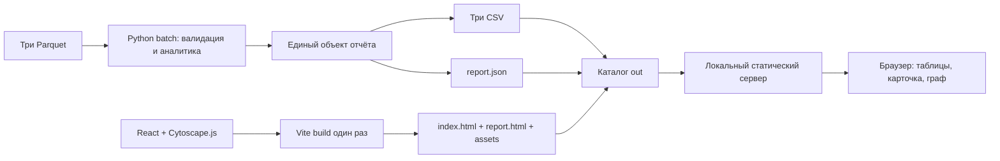

# Архитектура

React-интерфейс использует Vite и Cytoscape.js; Python выпускает отдельный `report.json`, три CSV и локальные assets. Аналитические формулы и JSON `schema_version=1.0` сохранены. Контракт — [SPEC 1.4](SPEC.md), исполнители и зависимости — [PLAN 1.3](PLAN.md). Фактические прогоны и оставшиеся проверки записаны в [validation.md](validation.md).

Расчёт остаётся конечным Python CLI: `python starter.py --data ./data --out ./out` (также `python -m hackalem`). Модули `hackalem/` валидируют вход, вычисляют признаки/роли/приоритет/сообщества и формируют общий объект; из него выпускаются CSV и JSON. `gid` — точные целые в расчёте и строки в JSON/JS, деньги считаются в тиынах. React отображает вычисленные значения, Cytoscape.js рисует граф; выбранный узел и фильтры хранятся в React. Позиции односвязной окрестности и полного графа задаются детерминированно, без браузерного пересчёта ролей или метрик.

Node/npm нужны для сборки UI. Готовые `index.html`, `report.html`, JS/CSS и лицензии копируются в выпуск вместе с данными; оба HTML открывают один отчёт. Node не запускается на каждый расчёт. Просмотр — `python -m http.server 8000 --bind 127.0.0.1 --directory ./out`, затем `http://127.0.0.1:8000/`. Сервер раздаёт только каталог выпуска, без API, БД и внешних сервисов. После установки/сборки расчёт и просмотр работают без интернета.

Docker сохраняет `prepare` и `pipeline`: входной mount read-only, выпуск в `/app/out`, staging внутри того же mount. Node-стадия собирает UI, Python-сервис `viewer` раздаёт out read-only; сервер слушает внутри контейнера `0.0.0.0`, порт на хосте опубликован только на `127.0.0.1`. Образ и frontend build не содержат исходный датасет. `validation.json` подтверждает весь выпуск и публикуется последним.

Раздельные worktree: B редактирует `frontend/`, интегратор — выпуск/контейнер, C — существующие проверки и README. Материалы второй волны `docs/SECOND_WAVE_RESEARCH.md`, `research/second_wave*` и аналитические модули остаются у исследовательского контура. Их результаты принимаются отдельным изменением контракта; frontend не переопределяет поля или формулы. До правки общего файла требуется handoff его владельца.

## Вторая волна и проверенный baseline

Текущий общий контракт — PRODUCT_SPEC 1.3 / SPEC 1.4 / PLAN 1.3. Реализованная HA-17 добавила объяснения в `hackalem/scoring.py`/report, а React показывает причины, общую шкалу рёбер, вторичные роли и равные P. HA-16 и HA-14 остаются P1-заделом: датированные counts/свидетели и модуль `hackalem/requests.py` запланированы, но файла requests.py и этих функций нет в текущем React-выпуске. Основные роли/P/CSV-схемы сохранены. Очередь P1: HA-11 → HA-14 → HA-16 → HA-13; общий viewer и одно состояние selectedGid.

Исторический baseline aed8e63 прошёл пять Docker-контрактов (median 4,327 с, maximum 4,642 с) и headless Chrome/file:// smoke с блокировкой HTTP(S). Отдельно React-кандидат прошёл пять выпусков и localhost Playwright smoke; факты и ограничения записаны в [validation.md](validation.md). Headed review и Linux clean-clone остаются отдельными проверками. Временный выпуск остаётся внутри out-mount, успешный manifest публикуется последним.

Текущие владельцы файлов, изоляция Docker-образов и передача веток — [PARALLEL_WORK](PARALLEL_WORK.md). Наличие принятых модулей в этой схеме не означает их реализации; финальная приёмка относится к фактическому SHA.
