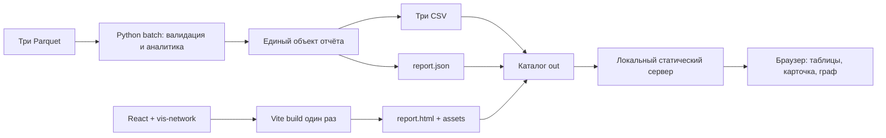

# Архитектура

Принято: React + Vite + существующий vis-network. Ниже целевая архитектура HA-15; текущий standalone HTML сохраняется до приёмки миграции. Аналитические формулы и JSON `schema_version=1.0` не меняются. Контракт — [SPEC 1.3](SPEC.md), исполнители и зависимости — [PLAN 1.2](PLAN.md).

Расчёт остаётся конечным Python CLI: `python starter.py --data ./data --out ./out` (также `python -m hackalem`). Модули `hackalem/` валидируют вход, вычисляют признаки/роли/приоритет/сообщества и формируют общий объект; из него выпускаются CSV и JSON. `gid` — точные целые в расчёте и строки в JSON/JS, деньги считаются в тиынах. React отображает вычисленные значения, vis-network рисует граф; выбранный узел и фильтры хранятся в React.

Node/npm нужны для сборки UI. Готовые `report.html`, JS/CSS и лицензии копируются в выпуск вместе с данными; Node не запускается на каждый расчёт. Просмотр — `python -m http.server 8000 --bind 127.0.0.1 --directory ./out`, затем `http://127.0.0.1:8000/report.html`. Сервер раздаёт только каталог выпуска, без API, БД и внешних сервисов. После установки/сборки расчёт и просмотр работают без интернета.

Docker сохраняет `prepare` и `pipeline`: входной mount read-only, выпуск в `/app/out`, staging внутри того же mount. HA-15.3 добавляет Node-стадию сборки и Python-сервис `viewer`: out read-only, сервер слушает внутри контейнера `0.0.0.0`, порт на хосте опубликован только на `127.0.0.1`. Образ и frontend build не содержат исходный датасет. `validation.json` подтверждает весь выпуск и публикуется последним.

Раздельные worktree: B редактирует `frontend/`, интегратор — выпуск/контейнер, C — существующие проверки и README. Материалы второй волны `docs/SECOND_WAVE_RESEARCH.md`, `research/second_wave*` и аналитические модули остаются у исследовательского контура. Их результаты принимаются отдельным изменением контракта; frontend не переопределяет поля или формулы. До правки общего файла требуется handoff его владельца.
