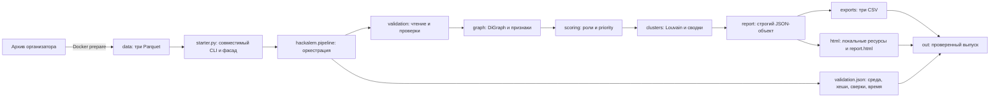

# Архитектурный фундамент

На проверенном коде `aed8e63` Python-расчёт разнесён по внутреннему пакету `hackalem/`. Корневой `starter.py` сохраняет прежние публичные функции и CLI, а модули разделяют загрузку, графовые признаки, оценку, сводки и выпуск. Это внутреннее разбиение кода: новые сторонние Python-зависимости, API-сервер и база данных не добавлены.

## Модули

| Файл | Ответственность |
|---|---|
| `starter.py` | Тонкий совместимый фасад: реэкспорт функций и CLI `--data/--out`. |
| `hackalem/pipeline.py` | Связывает этапы, готовит временный выпуск и публикует `validation.json` последним. |
| `hackalem/validation.py` | Загружает три Parquet и проверяет типы, суммы и согласованность входа. |
| `hackalem/graph.py` | Строит направленный NetworkX `DiGraph`, базовые признаки, BFS-достижимость и betweenness. |
| `hackalem/scoring.py` | Назначает роли и вычисляет компоненты приоритета и числовые объяснения. |
| `hackalem/clusters.py` | Строит проекцию Louvain, выделяет изоляты и считает сводки кластеров. |
| `hackalem/report.py` | Собирает один JSON-совместимый объект, проверяет точные ID, деньги и согласование сводок. |
| `hackalem/exports.py` | Проверяет общий объект отчёта и детерминированно пишет три CSV. |
| `hackalem/html.py` | Подставляет JSON, локальные JS/CSS в шаблон автономного HTML. |

## Запуск и выпуск

Docker Compose предоставляет два сервиса. `prepare` извлекает три Parquet из архивов организатора в локальную `data/`. `pipeline` выполняет тот же `starter.py --data --out`, что и native-запуск, с лимитом до 12 CPU; вход монтируется только для чтения, а результаты попадают в `out/`. Native-путь использует Python 3.13 и точные версии из `requirements.txt`.

Основной выпуск содержит `nodes_roles.csv`, `clusters.csv`, `top_nodes.csv`, `report.html` и `validation.json`. Временные результаты проверяются до публикации; manifest `validation.json` записывается последним. Денежные величины хранятся и сверяются в целых тиынах. Клиентские `gid/src/dst` сериализуются строками, поэтому большие идентификаторы не округляются браузером. `report.html` встраивает локальные JS/CSS ресурсы vis-network 10.1.2 без CDN; рядом с исходными ресурсами сохранён файл двойной лицензии Apache-2.0 OR MIT.

В P0-базе нет внешней БД, API-сервера, GPU или runtime-загрузки JS/CSS. Включённые P1-функции не заявлены: дневные профили, SCC и межкластерный обзор, coverage и запросы недостающих данных остаются задачами из SPEC §10. Для HA-14.1 планируется внутренний модуль `hackalem/requests.py`; он ещё не создан. Проверенный размер входа — 2 248 узлов, 3 119 направленных рёбер и 4 840 транзакций; масштабирование на миллион узлов этим прогоном не подтверждено.

На `aed8e63` Docker pipeline и `test_contract.py` прошли на пяти раздельных выпусках. Headless system Chrome проверил `file://`-отчёт с блокировкой HTTP(S): настоящий canvas vis-network отрисовался, интерактивный smoke прошёл без ошибок и внешних запросов, мобильный viewport не имеет горизонтальной прокрутки. Headed просмотр пользователем и Linux clean-clone путь остаются открытыми. Подробные команды и измерения — в [протоколе проверки](validation.md), пользовательский показ — в [демо-сценарии](DEMO.md).

## Совместимость и владение

SPEC §11 описывает функции как публичные вызовы `starter.py`; таблица там дополнительно показывает их текущие модули реализации. Фасад сохранён для совместимости, а PLAN §9 распределяет владельцев по этим модулям. Формулировка об отсутствии нового пакета уточнена: `hackalem/` — внутренний Python-пакет без новой внешней зависимости. Дальнейшая интеграция выполняется в `hackalem/pipeline.py`, публичная совместимость — в `starter.py`, интерфейс — в `report_template.html`, `report.example.json`, `assets/` и `hackalem/html.py`.

Точные формулы и сериализационный контракт находятся в [SPEC.md](SPEC.md); продуктовые состояния — в [PRODUCT_SPEC.md](PRODUCT_SPEC.md). План этапов и карточек — в [PLAN.md](PLAN.md).
