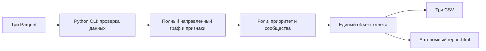

# Архитектурный фундамент

Текущий статус: подготовлены starter, данные для локальной проверки, Docker-среда и контракт стыков; роли, сообщества, три итоговых CSV и интерфейс ещё реализуются по [плану](PLAN.md).

Рабочий процесс — один batch без сервера, БД, аккаунта и внешнего API. `starter.py` владеет расчётом; HTML только отображает данные и не назначает роли. Точные `gid` остаются `int64` в Python/CSV и превращаются в строки до JSON/JavaScript. Денежные расчёты выполняются в целых тиынах. Ограничения наблюдения и отсутствие разметки явно показаны в отчёте.

Контейнер `pipeline` собирается из `Dockerfile` через `compose.yaml`. Три Parquet монтируются в `/app/data` только для чтения, результат — в `/app/out`. Образ не содержит исходный датасет; папки `data/` и `out/` исключены из Git и build context. Скрипт `scripts/prepare_data.py` извлекает ровно три нужных файла из предоставленного архива. Та же команда `starter.py --data --out` работает вне контейнера для самостоятельной проверки экспертами.

Раздельные Git worktree используют один опубликованный фундамент: аналитика владеет `starter.py`, интерфейс — `report_template.html` и `assets/`, независимая проверка — `test_contract.py` и README. Интегратор переносит проверенные коммиты в `main`; каждая принятая часть сопровождается командой проверки и SHA. Точный контракт функций, CSV и JSON — в [SPEC.md](SPEC.md).
