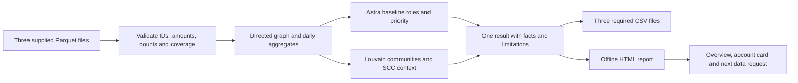

# HackAlem: blueprint comparison and proposed merge

Reviewed 23 September 2026. Inputs: [Astra blueprint](../HackAlem_AI_Research_Architecture_Blueprint.md), [Vlad blueprint](../HackAlem_AI_Blueprint_v2_Vlad.md), the supplied track requirements and dataset, `research/eda.py`, `research/eda2.py`, and the current [implementation contract](SPEC.md).

**Recommendation: use Astra as the implementation foundation and merge selected analytical and product ideas from Vlad.** Astra provides the more defensible interpretation of incomplete data and a more precise, smaller delivery plan. Vlad contributes valuable exploration, especially the strongly connected component, daily activity features, and an overview of flows between communities. Several of Vlad's strongest proposed selling points require corrections before becoming product behavior.

**Adopted for planning:** the user approved this merge. The implementation contracts are now [PRODUCT_SPEC 1.1](PRODUCT_SPEC.md), [SPEC 1.2](SPEC.md), and [PLAN 1.1](PLAN.md). This report remains the research record; the specifications define the accepted scope, optional fields, and acceptance criteria.

This is a comparison of these documents and their evidence. Neither provides validated financial-role accuracy on this dataset. The dataset has no independent role labels, and neither complete application was available for a product benchmark in the reviewed checkout.

## Decision by area

| Area | Better starting point | Reason and merge decision |
|---|---|---|
| Input correctness and reproducibility | Astra | Explicit integer money, exact IDs, isolates, aggregation checks, deterministic ordering, and coherent output publication. Keep these requirements. |
| Breadth of dataset exploration | Vlad | Supplies runnable EDA and useful SCC, temporal, and community observations. Reuse the correct measurements with the corrections below. |
| Missing-data interpretation | Astra | Does not infer a terminal account from unobserved outgoing edges. Vlad's estimated probability does not justify relaxing this safeguard. |
| Role specification | Astra, with richer supporting features | Astra's rules can be implemented directly. Vlad's score scales, bonus handling, and several priority terms need further definition. Add observed features before changing the classifier. |
| Research relevance | Both, with different strengths | Astra emphasizes limits and applicability; Vlad adds relevant flow and motif literature. Publications motivate features but do not validate either document's thresholds. |
| Analyst experience | Merge | Astra's search, card, and ego graph are the core. Add Vlad's community overview, daily activity, and explicit next data request. |
| Frontend choice for this repository | Astra | The current product and technical contracts already choose static HTML/vis-network. Switching to Streamlit would create integration work; its advantage depends on team experience. |
| Evaluation | Astra, plus corrected Vlad probes | Keep blind review against a simple baseline. Add exploratory temporal and structural comparisons. Treat synthetic motifs as behavioral checks and node deletion as topology sensitivity. |
| Five-hour delivery feasibility | Astra | Fewer mandatory dependencies and runtime components. Vlad's frontier model, LLM, extra centralities, GPU experiment, and second viewer compete for the same implementation time. |

## What was independently reproduced

[The audit script](../research/compare_blueprints.py) reads the actual ZIP, preserves exact IDs, aggregates money in tiyn, checks edge totals against transactions, and reproduces the measurements below. Its [JSON output](../research/blueprint_comparison_evidence.json) records the environment and SHA-256 of every input Parquet. All three hashes match Astra's appendix.

The common data foundation is sound: **2,248 nodes, 3,119 edges, 4,840 transactions, 81 seeds, 19 isolates, 35 weak components, and 365,890,012.01 KZT of observed edge turnover**. There are 97 repeated transaction rows; their inclusion is necessary for reconciliation. All IDs exceed JavaScript's safe integer range. Both documents correctly flag the important ID and isolate risks.

| Claim or proposed interpretation | Independent result | Consequence |
|---|---|---|
| Vlad: largest SCC contains 85 accounts | Confirmed, including 2 seeds | Keep this structural finding. |
| Vlad: SCC accounts originate about 30% of turnover | Confirmed: 109,683,343.13 KZT, or 29.98% | Specify that this includes transfers within the SCC. |
| Vlad's opening: SCC sends to 875 recipients | **875 edges reach 642 distinct external recipients** | Correct the recipient count in the pitch. |
| Vlad: 23.5% of turnover reaches frontier accounts | **15.49%**, or 56,672,164.68 KZT, reaches nodes with `nodes.depth=4` | The 23.46% figure describes edges discovered at hop 4, including edges returning to earlier layers. |
| Vlad: 193 accounts show at least 80% rapid forwarding under FIFO | 193 reproduces the original timing co-occurrence measure; amount-conserving matching gives **116** when same-day ordering is assumed, or **47** using only 1–2 later calendar days | Rename the original measure or replace it before calling it FIFO. |
| Vlad: seed hub `100000003684369100` receives from 6 seeds | It receives from **1** seed; `100000005382566100` receives from **6** | Correct the example. Six payer communities and six seed payers are different properties. |
| Vlad: degree buckets provide usable frontier probabilities | The quoted pooled rates reproduce; the degree-only estimator fails to beat a constant predictor on the depth-3 holdout below | Keep it as an experiment, outside role assignment. |

These results establish facts about the supplied observation and inconsistencies in its interpretation. They do not establish criminal participation, real account balances, or the true source of particular outgoing funds.

## Findings that determine the architecture

### 1. Preserve Astra's frontier restriction

Vlad §5.3 permits `terminal` on the fourth layer when `p_outflow_est <= 0.35`. The quoted probability is the frequency of outgoing activity among interior nodes grouped by incoming degree. Outgoing activity is unobserved for every fourth-layer account, so there is no fourth-layer target against which to validate that probability.

The assumption is already strained inside the observed layers. For accounts with one observed payer, outgoing-activity frequencies are **19.9%, 27.3%, and 33.5%** at depths 1, 2, and 3. Pooling them gives 28.66%. That pooled number passes Vlad's threshold for **434 of the 444 frontier accounts**; 86 also pass the terminal materiality gate. Those counts are eligibility checks, not a measurement of false positives.

I evaluated the degree-only bucket method behind the quoted probabilities using Vlad's proposed training/holdout split. There are 934 training nodes at depths 1–2 and 789 holdout nodes at depth 3:

| Predictor of observed outgoing activity at depth 3 | Brier loss, lower is better |
|---|---:|
| Constant training-set frequency | **0.23104** |
| Incoming-degree buckets using features from the full observation | 0.24105 |
| Incoming-degree buckets after replaying a crawl stopped at depth 3 | 0.23446 |

The replay hides all edges whose source has depth 3 before constructing input features, then uses those held-out edges to evaluate outgoing activity. Both comparisons favor the constant baseline on this split. This is a descriptive diagnostic with dependent graph observations, not a significance test; it does not evaluate Vlad's unimplemented logistic regression or every possible boundary model. Brier loss evaluates overall probabilistic prediction and cannot isolate calibration by itself. [Scikit-learn calibration documentation](https://scikit-learn.org/stable/modules/calibration.html).

A concrete contradiction makes the product risk visible. The demo account `100000005075949100` has depth 4, one payer, seven incoming transactions, and 2,226,000 KZT received. Vlad's written terminal formula gives **0.7134**, with both ramps saturated and the frontier multiplier applied. Its other role gates fail, so the written rules select `terminal`, while the demo narrative proposes showing why this account should not be called terminal.

**Merge decision:** retain `terminal` exclusion at the frontier, while preserving observable roles such as fan-in consolidation. Show an explicit unknown-outflow flag and a next-data request. A useful request queue can rank frontier accounts by observed incoming amount and expose their counterparties without claiming a probability of retention. Thirteen frontier accounts have incoming amounts of at least 1 million KZT.

The broader concern is supported by research on the degree bias of incomplete graph traversal. That research motivates caution about transferring interior statistics; it does not prove a particular probability for these accounts. [Kurant et al., On the bias of BFS](https://arxiv.org/abs/1004.1729).

### 2. Keep temporal analysis, correct what it measures

In `research/eda2.py`, the block labelled “FIFO approx” checks whether any incoming transfer occurred zero to two days before each outgoing transfer. If so, it counts the entire outgoing amount. It never consumes the incoming amount or matches it to outgoing amounts.

For example, one incoming transfer of 5,000 KZT followed by outgoing transfers totaling 1 million KZT can yield 100% “fast forwarding.” Same-day events also count despite the absence of intraday timestamps. On the real data, the counted fast outgoing amount exceeds the entire observed incoming amount at **155 accounts**.

The audit checks all 671 accounts with both incoming and outgoing transactions:

| Definition | Accounts with at least 80% of outgoing amount covered |
|---|---:|
| Existing timing co-occurrence, no amount matching | 193 |
| FIFO consuming amounts once; incoming assumed first within each day; 0–2 days | 116 |
| FIFO consuming amounts once; only 1–2 later calendar days | 47 |

The 47 and 116 are results of explicit matching conventions. They are not ground truth or bounds on actual laundering. Different definitions must not be compared as classification accuracies. The original 193 remains a valid count for a timing co-occurrence feature if named and explained accordingly.

**Merge decision:** add daily inflow/outflow, distinct payers per day, and distinct recipients per day first. Add amount-conserving temporal matching as a separate supporting feature after its checks pass. Preserve Astra's rules about unknown same-day ordering and incomplete observation windows at month end. If reporting the fraction of incoming funds forwarded, exclude or separately expose inflows without a complete follow-up window.

Flow-based research supports studying amounts and timing jointly: FlowScope explicitly models flows across accounts, while MonLAD tracks residuals in transaction streams. Their findings motivate these features; they do not validate this EDA shortcut or transfer performance to HackAlem. [FlowScope, AAAI 2020](https://ojs.aaai.org/index.php/AAAI/article/view/5906), [MonLAD](https://arxiv.org/abs/2201.10051).

### 3. Keep the 85-account discovery and narrow its narrative

Vlad's SCC analysis is the most valuable new structural observation. The measured amounts are:

| SCC relation | Edges | Observed KZT |
|---|---:|---:|
| Within the 85 accounts | 242 | 19,453,337.04 |
| From the SCC to accounts outside it | 875 | 90,230,006.09 |
| From observed outside accounts into the SCC | 7 | 705,193.00 |

All outgoing transfers originating in SCC accounts total 109,683,343.13 KZT. This is the basis of the 29.98% share. The 875 external links reach 642 different accounts.

An SCC means mutual reachability in the directed aggregate graph. It does not establish chronological circulation of the same money, shared control, or a self-financing organization. The difference between incoming and outgoing observed amounts could reflect missing sources, opening balances, and transactions outside the period or dataset. The data cannot select among those explanations. [NetworkX SCC documentation](https://networkx.org/documentation/stable/reference/algorithms/generated/networkx.algorithms.components.strongly_connected_components.html).

**Merge decision:** calculate SCC membership and summarize its internal, incoming, and outgoing observed transfers. Present it as a “mutually reachable group in the monthly transfer graph.” Use it to navigate and inspect accounts; initially give it no independent coordinator bonus. Compute membership dynamically and avoid hardcoding a group of 85.

A defensible demo sentence is: “An 85-account strongly connected group originates 29.98% of recorded edge turnover; its external transfers reach 642 accounts. The tool exposes the transfers and missing information needed to investigate this structure.”

### 4. Keep Astra's role contract; borrow Vlad's additional evidence

Vlad's `argmax` looks more flexible, but the role scores combine different, uncalibrated scales. A score of 0.7 for fan-out has no established comparability with 0.7 for coordination. Bonus placement and final clipping are also unspecified: adding 0.15 after averaging three saturated components produces 1.15, outside the required range.

Other concrete specification problems:

- `priority` contains unresolved choices such as `P(betweenness | pagerank)` and `P(n_seed_payers, ppr_from_seeds)`, plus a terminal ramp without its arguments. These are alternatives to decide, not executable formulas.
- Vlad's transit gate requires at most five recipients, but its showcased “transit hub” has 17. The example cannot receive that role under the written gate.
- Vlad's seed caveat says retention should not be used for seeds, but the consolidator score includes retention without stating how that component is masked for seeds.
- `peripheral_score = 1 - max(other_scores)` assigns a value of 1 to an isolated node with no evidence. That confuses absence of evidence with strong support for a financial role. Astra uses 0 for an unestablished role.
- Vlad §11 overstates the difference on multiple roles: Astra already preserves secondary matches in §5.3 and uses their maximum support in priority §5.5. This capability does not require replacing precedence with argmax.

**Merge decision:** use Astra's primary-role precedence and preserve all matching secondary roles. Add `n_seed_payers`, daily payer/recipient counts, SCC membership, and incoming payer-community count to the evidence card. Keep direct seed payers distinct from multi-hop seed reach. Treat an SCC and incoming community diversity as contextual evidence until an evaluation supports a change to coordinator rules.

Astra also needs scrutiny. Three incoming counterparties is a broad consolidation rule; two days after last receipt is an initial terminal heuristic; score caps are design choices. Its priority combines correlated seed reach, role support, and betweenness. Its logarithmic activity component is compressed: among positive-activity accounts, its 10th percentile is **0.664**, median **0.787**, and 90th percentile **0.953**. Vlad's percentile normalization is a reasonable alternative to test. None of these observations alone identifies the better ranking formula.

Before promoting a ranking change, compare it with the fixed baseline and the same analyst-review criteria. Do not fit weights to reproduce attractive demo accounts or preselected role counts.

### 5. Treat the 5,000 KZT threshold as a data filter

Vlad associates transfers in `[5,000, 6,000)` with structuring and an AFM code. The supplied README establishes **5,000 KZT as the extraction floor**. It does not identify that number as a statutory reporting threshold. Transfers below the floor are missing, and operations immediately above a data filter do not by themselves demonstrate avoidance of a legal threshold.

**Merge decision:** such a count may be labelled “observed transfers close to the extraction floor,” with its denominator shown. Exclude it from suspicion scoring and automatic regulatory-code assignment without an applicable rule and supporting evidence. The supplied fields also cannot establish cash withdrawal, nominee ownership, or professional laundering status.

The Russian regulator reference is real: the official document contains examples involving counterparty counts, intraday timing, balances, and other behavior. Those examples concern its stated Russian banking context and include information absent from our input. They provide background, not a direct calibration for these Kazakhstani records. [Bank of Russia, 6 September 2021 guidance](https://cbr.ru/StaticHtml/File/117540/20210906_16-mr.pdf).

The current [AFM Order No. 13 page](https://adilet.zan.kz/rus/docs/V2200026924) returned a JavaScript-only shell in this review. I could not independently establish the current exact mapping of codes 12/17/24/27 from that official text. This report does not certify that mapping or assert that the codes are fabricated. Keep Kazakhstan-specific vocabulary in the product, and verify any legal mapping before presenting it as an account-level finding.

### 6. Choose the viewer for the actual workflow

Streamlit is a reasonable choice for a team that can build and maintain its complete workflow faster in Python. Tabs, tables, and text inputs are useful conveniences. Neither blueprint supplies a measured development-time comparison that establishes a universal winner.

There are two integration costs in Vlad's exact proposal:

- The PyVis template contains unconditional external Bootstrap links after its `in_line` branch. `cdn_resources='in_line'` alone does not establish full offline operation. This is visible in the [upstream template](https://raw.githubusercontent.com/WestHealth/pyvis/master/pyvis/templates/template.html).
- Embedding HTML does not automatically connect graph-node selection to a Streamlit card. Returning a selection to Python needs a component with that communication path, or the card must be implemented inside the same HTML. Streamlit documents the extra frontend/Python interface for [bidirectional components](https://docs.streamlit.io/develop/concepts/custom-components/components-v1/intro). Current documentation also marks [`st.components.v1.html` deprecated since 1.56.0](https://docs.streamlit.io/develop/api-reference/custom-components/st.components.v1.html); a tested pinned version can still be viable.

**Merge decision:** keep the repository's static HTML/vis-network contract. Incorporate Vlad's useful views into that viewer. Select a single delivery path; a second full viewer adds another behavior to reconcile and test. Reconsider Streamlit if the actual team can demonstrate a faster complete offline scenario, including graph selection, exact-ID search, and card updates.

### 7. Tighten the evaluation and optional AI plans

Astra's blind comparison with a turnover baseline provides the better path to evidence of usefulness. A different top-20 is not automatically a better top-20. A high share of non-seed accounts is useful coverage information, but not a measure of accuracy.

Vlad's proposed “oracle” should be split into input facts and algorithm outputs. The input count of 72 accounts with a particular monthly ratio is reproducible. The number of selected transit roles depends on additional gates and precedence. Likewise, eight communities with multiple seeds is an observation from a particular clustering, not an invariant that every valid implementation must reproduce. The track explicitly permits more than one defensible answer.

Synthetic AMLSim motifs are useful checks for fan-in, fan-out, and forwarding behavior. They cannot establish real-world recall from four inserted patterns. The [AMLSim documentation](https://github.com/IBM/AMLSim/wiki/Alerts-and-SARs) supplies a useful vocabulary; the track's financial-role labels still need their own interpretation.

Retain node-removal analysis as a later topology experiment. Compare the same number of removed nodes against repeated random selections and a degree/amount baseline, then state the denominator for remaining component size and incident turnover. Do not equate disappearance of recorded edges with money laundering prevented or predict the network's adaptation.

LLM-generated text is optional in both approaches. Vlad's proposed validator, “every generated number appears in the input,” does not check meaning. Input “13 payers, 1 recipient” and output “1 payer, 13 recipients” use the same numbers and describe opposite facts. Template facts and deterministic graph operations are the appropriate foundation. A later assistant needs supported relations and source references, not merely number membership.

The track's technical criterion mentions AI/agentic AI among the technologies assessed, while the assistant itself is explicitly optional. It does not establish an automatic points bonus for an LLM. Model availability, latency, and price estimates in a plan should be checked before using that optional service.

Similarly, a GPU benchmark of selected algorithms on a synthetic million-node graph would demonstrate those algorithms on that graph. It would not establish the speed or output equivalence of the complete HackAlem pipeline. Keep the required scaling discussion; undertake the GPU experiment only when it answers a remaining engineering question after the core submission works.

## Proposed merged product

**Product promise:** given a limited transaction extract, identify accounts worth examining, show the observed structure and timing behind that suggestion, and identify the next data request needed to resolve uncertainty.

Keep one local Python calculation and one coherent set of outputs. Roles, ranks, explanations, and views must use the same computed facts.



| Decision | Adopt in the merge | Source and reason |
|---|---|---|
| Core pipeline | Existing CLI/CSV contract, exact IDs, integer money, all nodes, validation and deterministic release | Astra; foundational correctness |
| Primary roles | Astra's documented gates and precedence, with `role_score` labelled heuristic support | Astra; directly implementable baseline |
| Multiple patterns | Preserve all matching secondary roles and expose their reasons | Already in Astra; retain Vlad's emphasis on mixed profiles |
| Boundary handling | Unknown outgoing activity at depth 4; no terminal inference from zero recorded output | Astra; supported by collection design |
| Coordinator evidence | Show direct seed payers, multi-hop seed reach, payer-community count, and SCC membership separately | Merge; do not silently treat correlated features as independent evidence |
| Temporal evidence | Daily incoming/outgoing amounts and payer/recipient counts; later add checked amount matching | Vlad's feature breadth with Astra's temporal safeguards |
| Overview | Directed graph of communities, with node count/seed count/internal turnover and aggregated inter-community flows | Vlad; makes large-scale structure easier to navigate |
| SCC view | Highlight computed SCC membership and its measured incoming/internal/outgoing activity | Vlad's discovery, with corrected interpretation |
| Next data request | An explicit reason/action in the existing account card, plus a frontier filter sorted by observed incoming amount | Merge; turns missingness into a useful analyst action |
| New versus known accounts | A visible seed/non-seed filter with the original global rank retained | Astra; avoids an unexplained blanket penalty on known seed hubs |
| Cluster IDs | Stable ordering by minimum exact numeric ID for a fixed input; display ordering can use turnover | Astra; presentation order need not redefine identity |
| Community algorithm | Weighted Louvain plus connectedness check and splitting of disconnected results | Shared decision; no extra algorithm dependency needed for the first delivery |
| Text | Deterministic facts with source fields, limitations, and review suggestions | Shared core; no LLM dependency |
| Optional work | Ranking ablation, topology sensitivity, then an assistant if it measurably helps | Sequenced behind the complete required workflow |

Checking connectedness is justified: Louvain can produce disconnected communities, and Leiden was designed with stronger guarantees. Splitting a disconnected Louvain result is a practical fix to that particular defect; it does not reproduce Leiden's guarantees. [Traag et al., From Louvain to Leiden](https://arxiv.org/abs/1810.08473).

The interface can make the merged approach concrete with four linked views:

1. **Overview:** communities and flows, total observed turnover, number of frontier accounts, and the largest SCC summary. Clearly distinguish a community from a strongly connected component.
2. **Review list:** the existing top-20, global rank, matched patterns, and the two strongest factual reasons.
3. **Account card:** exact ID, one-step directed neighborhood, counterparties, daily activity, rules, and limits. Graph selection and text search open the same card.
4. **Missing-data filter:** the existing table filtered to relevant accounts, with a suggested request. For depth 4, request the next outgoing layer; for incomplete balance interpretation, request incoming coverage and opening/closing balances; for temporal uncertainty, request timestamps or the next observation period. These are proposed analyst actions, not external integrations.

A card should distinguish three things in plain language: **what was observed, which structural pattern matched, and what remains unknown**. For the frontier demo account, show 2,226,000 KZT received in seven transfers from one observed payer, outgoing coverage unavailable, and a request for the next layer. For the SCC, show measured connectivity and flow counts before any investigative hypothesis.

## Order of implementation and proof

This sequence uses the current [SPEC](SPEC.md) and [product contract](PRODUCT_SPEC.md). It avoids importing either blueprint's old clock time as a claim about the time currently available.

| Stage | Concrete change | Evidence required before expanding scope |
|---|---|---|
| 1. Required workflow | Complete the existing Parquet → roles/clusters/top → CSV/HTML scenario | All input IDs, valid outputs, exact search, coherent evidence, offline operation and measured full runtime below 300 seconds |
| 2. Low-cost observed features | Direct seed payers, daily payer/recipient counts and daily amounts | Reconcile with original edges/transactions; exercise mixed-role, frontier and isolated examples |
| 3. Structural overview | Community flow aggregation and SCC highlight | Internal + inter-community turnover reconciles; SCC counts match calculated membership; all summary values drill down to underlying links |
| 4. Next-data actions | Frontier filter and explicit requests in cards | Every suggested request follows from a recorded coverage limitation |
| 5. Analytical comparison | Correct temporal matching and a proposed ranking variant | Amounts consumed once, same-day assumption visible, end-of-period limits handled; blind review against fixed baselines |
| 6. Optional interaction | Topology experiment or narrowly scoped graph assistant | Core delivery already complete; added function demonstrates useful behavior on arbitrary inputs |

For ranking, use the union of the baseline and candidate top-20 lists plus a small fixed random control. Hide method and rank from reviewers. Review whether the explanation is supported, directions are correct, uncertainty is represented, and the suggested next check is useful. Record who reviewed the cards and whether they have AML expertise. Report usefulness, unsupported-claim counts, task time, and sample size.

Test each proposed addition separately: baseline; baseline with improved temporal evidence; baseline with extra structural evidence; combined variant. Keep weights and review criteria fixed before inspecting results. A change that merely alters the top list has not yet demonstrated improvement.

For probabilities, use suitable held-out outcomes and reliability diagnostics. For community stability, compare memberships across runs and resolution settings; matching cluster counts or numeric IDs is insufficient. For the end-to-end system, measure actual runtime including input loading and artifact generation. Research-script runtime and graph-algorithm timings are not product SLA measurements.

## External research: what supports the merge

The following primary sources were accessed during this review. Their scope matters as much as their existence.

| Source | Supported takeaway | Limit on its use here |
|---|---|---|
| [FlowScope, AAAI 2020](https://ojs.aaai.org/index.php/AAAI/article/view/5906) | Analyze connected flows across accounts, including amounts | Does not validate the supplied shortcut, thresholds, or six role classes |
| [MonLAD](https://arxiv.org/abs/2201.10051) | Residuals and temporal transaction behavior are relevant features | Stream-oriented method and different validation data |
| [GARG-AML](https://arxiv.org/abs/2506.04292) | Interpretable local graph structure can support AML analysis | Its experiments do not establish the accuracy of either HackAlem score |
| [Pass-through templates, September 2026 preprint](https://arxiv.org/abs/2609.20737) | Formal transaction matching is a relevant research direction | An Ethereum case study; no validation of our monthly bank extract or roles |
| [On the bias of BFS](https://arxiv.org/abs/1004.1729) | Incomplete traversal changes the observed degree distribution | Not a calibrated missing-outflow model for this dataset |
| [Centrality under partially missing communities](https://arxiv.org/abs/1709.06863) | Centrality reliability depends on network structure and missingness | Does not justify a universal “betweenness is best” or “degree is always most reliable” rule |
| [Elliptic](https://arxiv.org/abs/1908.02591), [Elliptic2](https://arxiv.org/abs/2404.19109) | Graph-based AML research benefits from explicit targets and labelled data | Different entities, labels, and domain; no direct accuracy transfer |
| [BIS Project Aurora](https://www.bis.org/publications/project-aurora-power-data-technology-and-collaboration-combat-money-laundering-across-institutions-and-borders) | Network context and additional coverage can improve investigation in a controlled PoC | Synthetic data and collaborative monitoring; the prohibited external enrichment is unavailable here |
| [NetworkX betweenness](https://networkx.org/documentation/stable/reference/algorithms/generated/networkx.algorithms.centrality.betweenness_centrality.html) | Weights are interpreted as distances | Supports both documents' warning against using transfer amount directly as path length |

Vlad's expanded bibliography contains relevant, verifiable work. The weakness is the transfer from those ideas to stronger dataset-specific claims, particularly retention, circulation, regulatory classification, and calibrated frontier probabilities. Astra's smaller research scope makes fewer such leaps.

## Reproducing and interpreting this review

From the repository root, in an environment containing the recorded pandas/NumPy/NetworkX/PyArrow dependencies:

```sh
python research/compare_blueprints.py
```

The script writes `research/blueprint_comparison_evidence.json`. On the review machine, PyArrow was already available in a temporary research dependency directory, so the actual command was:

```sh
PYTHONPATH=/private/tmp/hackalem-research-deps python3 research/compare_blueprints.py
```

The temporal helper includes five small runnable checks for same-day treatment, expiration, and amount conservation. The full probe also checks edge/transaction sums and counts, endpoint membership, and matched-volume bounds. The reported run completed successfully using Python 3.13.3, pandas 2.2.3, NumPy 2.2.6, NetworkX 3.6.1, and PyArrow 25.0.1 on macOS arm64.

The script tests a degree-only boundary estimator and deterministic temporal conventions. It does not implement both complete scoring systems, train the suggested logistic model, measure analyst performance, or establish role accuracy. Vlad's unresolved formula choices would have to be fixed before a fair end-to-end ranking comparison. External research was used to check methods and references; the supplied transaction data was processed locally.

**The recommended merge is therefore Astra's executable contract and treatment of uncertainty, enriched with Vlad's corrected structural exploration, temporal evidence, and analyst workflow.** The next evidence needed is an end-to-end working release and a blind comparison of candidate rankings, with the additional features introduced one at a time.
