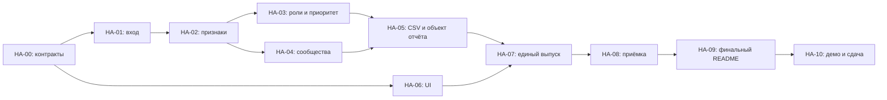

# План реализации и Trello

23.09.2026 · команда Jigas · реализация ещё не начата. План конкретизирует [blueprint](../HackAlem_AI_Research_Architecture_Blueprint.md) и использует [спецификацию продукта](PRODUCT_SPEC.md) и [технические контракты](SPEC.md).

Доска: https://trello.com/b/6tCEnwZQ/hackathon

## 1. Что уже сделано

- Blueprint опубликован в `main`, коммит `dab19cf`.
- Через Trello MCP изучены все восемь открытых списков, 11 существующих методологических карточек, метки и участники. Реальный рабочий бэклог до этой сессии был пуст.
- Создана [HA-00 — подготовка спецификаций и плана](https://trello.com/c/C6bqOm6e); документы готовы к независимому review. Подготовка документов не означает готовность приложения.
- Спецификации продукта, технические контракты и план опубликованы коммитом `a324086`. В Trello созданы 12 рабочих карточек: 10 P0 и 2 P1, с критериями приёмки, зависимостями и плановыми сроками; реестр — в §8.
- Технические контракты фиксируют шесть ролей, расчёт скоринга, CSV/JSON, точные ID, автономный UI и проверку полного результата.

## 2. Как использовать существующую доску

Используем текущие списки: «Бэклог» → «В работе» → «На проверке» → «Готово». «Заблокировано» — только реальный блокер. Контекст — в «Решения и контекст». Списки и методологические шаблоны не дублируем.

Основание: [короткий протокол](https://trello.com/c/Z7ssjw2c), [Definition of Done](https://trello.com/c/MDhJOZie), [правила пяти часов](https://trello.com/c/05ehqfIe).

Каждая рабочая карточка содержит цель, ссылки/зависимости, границы, критерии приёмки, контур ответственности, следующий шаг и короткий таймбокс до проверяемого результата. Номер `HA-xx` сохраняется при перемещении. P0 — обязательная сдача, P1 — усиление после P0. Приоритет указан в названии: безымянным цветным меткам не приписываем выдуманный смысл.

В Trello виден один участник, `nursultan`; состав реальной команды из этого не следует. A/B/C ниже — предлагаемые контуры ответственности, **не назначенные люди и не запущенные агенты**. Исполнитель выбирает одну карточку и фиксирует себя до начала. Никакие задачи реализации не отмечены начатыми или готовыми по наличию плана.

Результат сначала передаётся в «На проверке» с handoff. В «Готово» — после независимой проверки, согласно действующему протоколу доски. Документационная HA-00 также передаётся на review, без ожидания, блокирующего создание остальных задач.

## 3. Контекстные решения

| Решение | Почему / граница |
|---|---|
| Локальный Python + статический HTML с vis-network | Закрывает batch-сценарий, не требует сервера/API/аккаунта |
| Объяснимые правила и Louvain | Ground truth нет; обучение и LLM не входят в P0 |
| ID только точные int64 / строки | Все ID официального набора теряют точность в float/JS Number |
| Полный граф, включая изоляты | CSV и поиск должны покрывать все 2 248 узлов |
| Гипотезы с ограничениями | Нулевой выход depth=4 и неполный вход seed не дают финансового баланса |
| Демо **5 минут** | Специальное ТЗ трека приоритетнее общего шаблона доски с 2–3 минутами; старый шаблон не переписываем |
| Ранняя заморозка функций **16:30** | Консервативнее предела 17:15 из общего протокола; дальше интеграция, исправления, проверка и сдача |

Решения и ссылки сохранены в [HA-CTX — контекст MVP и правила сдачи](https://trello.com/c/jhV5X3jU) в существующем списке «Решения и контекст».

## 4. Рабочий бэклог

Оценки — рабочие таймбоксы до проверяемого результата, не story points и не обещание срока. Порядок карточек задаёт последовательность зависимостей; UI и проверки стартуют параллельно с аналитикой.

| ID | Приоритет / контур | Результат | Зависимости | Таймбокс | Целевой срок, Астана |
|---|---|---|---|---|---|
| HA-01 | P0 / A | Starter загружает и валидирует три файла без потерь | HA-00, SPEC §1–2 | 20–30 мин | 14:30 |
| HA-02 | P0 / A | Полный граф и признаки S/B/потоков/ограничений | HA-01, SPEC §3 | 25–35 мин | 15:00 |
| HA-03 | P0 / A | Все роли, support, приоритет и числовые объяснения | HA-02, SPEC §4–5 | 35–45 мин | 15:40 |
| HA-04 | P0 / A | Связные сообщества и корректные сводки | HA-02; top_gids после HA-03, SPEC §6 | 15–25 мин | 16:00 |
| HA-05 | P0 / A | Три CSV и общий объект отчёта из одного расчёта | HA-03, HA-04, SPEC §7–8 | 20–30 мин | 16:30 |
| HA-06 | P0 / B | Автономный интерфейс: топ, поиск, граф, карточка | HA-00; итоговый вход из HA-05, PRODUCT_SPEC §4 | 45–60 мин | 15:30 |
| HA-07 | P0 / B, стык с A | Один запуск из raw выпускает рабочий HTML и CSV | HA-05, HA-06 | 15–25 мин | 16:50 |
| HA-08 | P0 / C | Проверка контрактов, границ и чистого полного прогона | Готовить после HA-01; финал после HA-07 | 30–45 мин | 17:15 |
| HA-09 | P0 / C | README, зависимости, лицензии, схема, масштабирование | Начать сразу; финал после HA-08 | 25–40 мин | 17:30 |
| HA-10 | P0 / капитан | Демо и сдача проверенного commit до дедлайна | HA-08, HA-09 | 20–30 мин | 17:55 |
| HA-11 | P1 / B | Дневной профиль входа/выхода в карточке | Рабочий HA-07 и зелёный P0 | 20–30 мин | Только до 16:30; иначе отложить |
| HA-12 | P1 / C | Review top-20 против baseline и чувствительность весов | HA-03, HA-05; не мешает HA-08 | 30–45 мин | После доступности результата, без задержки сдачи |

HA-11 может не попасть в текущий спринт по целевым срокам критического пути: он намеренно остаётся дополнительным бэклогом, без обещания выполнения. HA-12 — оценка результата, а не новая функция после заморозки.

## 5. Зависимости и точки интеграции



Самая рискованная проверка — корректность смыслов ролей и полезность приоритета. В HA-03 разобрать сбор/веер/транзит/границу/изолят и конфликт правил до полировки. Неясную роль исправлять общим правилом и ограничением смысла, а не исключением по ID.

Первый стык A/B — строковые ID и схема объекта отчёта из SPEC §8. B может отладить шаблон на маленьком явно учебном объекте, затем обязан подключить реальный расчёт. Учебный объект не является итоговым демо или выгрузкой. A не дублирует аналитику в JS; B не меняет формулу для удобства отображения.

C пишет проверку и черновик README одновременно с первыми результатами; не ждёт готовности всего интерфейса. Один владелец аналитического файла устраняет конфликт параллельных правок; отдельные участники передают конкретные проверенные изменения, а не одновременно переписывают один участок.

## 6. Календарь и сокращение объёма

На момент проверки Trello было **13:45 23.09.2026** по Астане. Дедлайн остаётся **18:00**, новый пятичасовой отсчёт не начинается. Сроки ниже — обновлённый рабочий ориентир вместо идеального старта в 13:00 из исследовательского blueprint.

- До 14:30: вход/проверки и первый стык данных с черновиком UI; это промежуточный результат, не заявление о полном MVP.
- До 16:30: обязательная аналитика, CSV, интерфейсные компоненты; новые функции заморожены.
- До 16:50: единый реальный сценарий из raw до поиска узла.
- До 17:15: независимый полный прогон и исправление критичных ошибок.
- До 17:30: README/упаковка; дальше репетиция, финальный push и форма подачи.
- До 17:55: проверенный финальный commit отправлен; запас до официальных 18:00.

Результат фиксировать и отправлять в каждом отчётном часе. Уже опубликованный blueprint — документальный прогресс, но не заменяет последующие часовые результаты разработки.

Если людей двое: объединить A и проверку аналитики; B ведёт UI/документацию, оба делают независимый review результата друг друга. Если один: оставить один простой экран, отказаться от всех P1; заранее зарезервировать время на самостоятельный чистый прогон и отдельную проверку капитаном/ментором, если доступен. Пять must-have не сокращаются.

## 7. Общий Definition of Done

Карточка реализации готова к review, если её критерии выполнены, изменённые файлы/commit указаны, проверка записана, известные ограничения названы и нет скрытого P0-блокера. Дальше — независимый review и переход в «Готово».

Финальный выпуск: 2 248 точных ID; валидные роли/скоры/evidence; все группы; ≥20 приоритетов; автономный поиск и стрелки; <300 секунд; README позволяет запустить без устных пояснений; диаграмма и демо готовы. Все пять must-have — необходимое условие сдачи.

Краткий handoff:

```text
Статус:
Сделано:
Где искать: файлы / commit / артефакт
Как проверено: команда и фактический результат
Не сделано / риски:
Следующий исполнитель и действие:
```

Вопросы капитану: способ финальной подачи; ОС/архитектура эксперта и установка без сети; разрешённый способ предоставления датасета; актуальная редакция требований к Codex. Это не повод блокировать независимые работы с локальным входом. В Trello не переносить сырой датасет и клиентские списки; достаточно контрактов и агрегированных критериев.

## 8. Ссылки на созданные карточки

Создание всех карточек подтверждено повторным чтением доски через MCP. Рабочие HA-01–HA-12 созданы в «Бэклоге» без назначенных исполнителей; сроки P0 заданы на 23.09.2026, P1 — без обещания выполнения в текущем спринте. Источник текущих статусов выполнения — Trello, а не таблица плановых сроков выше.

| Карточка | Результат |
|---|---|
| [HA-00](https://trello.com/c/C6bqOm6e) | Спецификация MVP и план работ |
| [HA-01](https://trello.com/c/O1ExhJ65) | Загрузка и валидация исходных данных |
| [HA-02](https://trello.com/c/sQHdFD5E) | Полный граф и объяснимые признаки |
| [HA-03](https://trello.com/c/ZofyAcRB) | Роли, поддержка и приоритет проверки |
| [HA-04](https://trello.com/c/NA3W4nXc) | Кластеры и сводки сети |
| [HA-05](https://trello.com/c/lUW3MkSh) | CSV-выгрузки и объект отчёта |
| [HA-06](https://trello.com/c/5ibOKKaw) | Автономный интерфейс графа и поиска |
| [HA-07](https://trello.com/c/WQo37lGh) | Сквозной запуск из Parquet до HTML |
| [HA-08](https://trello.com/c/ntvzLqHy) | Контрактные проверки и чистый прогон |
| [HA-09](https://trello.com/c/QPGQH4tW) | README, зависимости и комплект сдачи |
| [HA-10](https://trello.com/c/gwZMQ0xg) | Пятиминутное демо и финальная сдача |
| [HA-11](https://trello.com/c/XhdPSK9Z) | Дневные профили переводов — P1 |
| [HA-12](https://trello.com/c/gQQx1nkD) | Полезность и устойчивость топа — P1 |
| [HA-CTX](https://trello.com/c/jhV5X3jU) | Контекст MVP и правила сдачи |

Начальные независимые действия команды: взять HA-01 и HA-06; подготовить проверку HA-08 по контракту и черновик HA-09. Финальная приёмка этих карточек следует зависимостям из §4.
