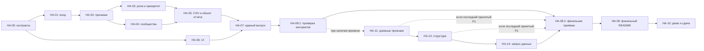

# План реализации и Trello

Версия 1.1 · 23.09.2026 · команда Jigas · план реализации. Принято объединение по [сравнению blueprint-ов](BLUEPRINT_COMPARISON.md): базовый контракт Astra и проверенные дополнения Влада. Рабочие основания — [PRODUCT_SPEC 1.1](PRODUCT_SPEC.md) и [SPEC 1.2](SPEC.md). Наличие задач и исследовательских результатов не означает готовность приложения.

Доска: https://trello.com/b/6tCEnwZQ/hackathon

## 1. Что уже сделано

- Blueprint опубликован в `main`, коммит `dab19cf`.
- При первой подготовке через Trello MCP изучены восемь открытых списков, 11 методологических карточек, метки и участники. Рабочий бэклог до этой подготовки был пуст; текущая доска содержит девять списков и результаты реализации команды.
- Создана [HA-00 — подготовка спецификаций и плана](https://trello.com/c/C6bqOm6e); документы готовы к независимому review. Подготовка документов не означает готовность приложения.
- Первая редакция спецификаций и плана опубликована коммитом `a324086`, первый реестр Trello — `009b159`. При предыдущей детализации 12 карточек превращены в родительские этапы и разложены на **24 подзадачи: 20 P0 и 4 P1**. Это исходный реестр доски; текущие изменения объёма перечислены ниже.
- Технические контракты фиксируют шесть ролей, расчёт скоринга, CSV/JSON, точные ID, автономный UI и проверку полного результата.
- Сравнение и локальный аудит сохранены в [BLUEPRINT_COMPARISON](BLUEPRINT_COMPARISON.md), [скрипте](../research/compare_blueprints.py) и [результатах](../research/blueprint_comparison_evidence.json). Подтверждены SCC/потоки, исправлены число внешних получателей и доля frontier, проверены ограничения временной эвристики и модели границы.
- Объединённые спецификации и исследование опубликованы в `main`: `838a372`. В Trello обновлены 17 существующих карточек, расширены HA-11/HA-12 и добавлены **HA-13/HA-14 с четырьмя дочерними задачами**. План и доска содержат 14 этапов и 28 подзадач (20 P0, 8 P1); реальные ссылки — §8–9, журнал синхронизации — §10.

## 2. Как использовать существующую доску

Исполнимые подзадачи идут по существующему пути: «Бэклог» → «В работе» → «На проверке» → «Готово». «Заблокировано» — только реальный блокер. Контекст — в «Решения и контекст». Обзорный список **«Этапы MVP»** содержит 14 родительских карточек с дочерними ссылками и чек-листами приёмки. Этап и его детей одновременно в работу не брать; методологические шаблоны сохранены.

Основание: [короткий протокол](https://trello.com/c/Z7ssjw2c), [Definition of Done](https://trello.com/c/MDhJOZie), [правила пяти часов](https://trello.com/c/05ehqfIe).

Каждая рабочая карточка `HA-xx.y` содержит конкретный вход/результат, целевые файлы и функции, шаги, проверку, стартовые зависимости, условия итоговой приёмки, контур ответственности и получателя handoff. Номер сохраняется при перемещении. P0 — обязательная сдача, P1 — усиление после P0. Приоритет указан в названии: безымянным цветным меткам не приписываем выдуманный смысл.

В Trello виден один участник, `nursultan`; состав реальной команды из этого не следует. A/B/C ниже — предлагаемые контуры ответственности, **не назначенные люди и не запущенные агенты**. Исполнитель выбирает одну карточку и фиксирует себя до начала. Никакие задачи реализации не отмечены начатыми или готовыми по наличию плана.

Результат сначала передаётся в «На проверке» с handoff. В «Готово» — после независимой проверки, согласно действующему протоколу доски. Документационная HA-00 также передаётся на review, без ожидания, блокирующего создание остальных задач.

## 3. Контекстные решения

| Решение | Почему / граница |
|---|---|
| Docker Compose + локальный Python + статический HTML с vis-network | Контейнер даёт основной проверяемый запуск на машине команды; та же CLI-команда доступна эксперту без Docker, сервер/API/аккаунт не требуются |
| Объяснимые правила и Louvain | Ground truth нет; обучение и LLM не входят в P0 |
| ID только точные int64 / строки | Все ID официального набора теряют точность в float/JS Number |
| Полный граф, включая изоляты | CSV и поиск должны покрывать все 2 248 узлов |
| Гипотезы с ограничениями | Нулевой выход depth=4 и неполный вход seed не дают финансового баланса |
| Наблюдаемые дополнения — P1 | Дневные суммы/контрагенты, прямые seed-плательщики, SCC и потоки между сообществами усиливают объяснения |
| Запрос данных вместо вероятностного terminal | Подсказки по ограничению и frontier-фильтр; вероятность скрытого выхода не меняет роль |
| Приоритет остаётся baseline до сравнения | P1-контекст не меняет ранги; новый скор требует отдельного review/сравнения вариантов |
| Один формат и один интерфейс | Дополнительные поля JSON по SPEC §10; общие CSV, HTML и вычисленные факты |
| Демо **5 минут** | Специальное ТЗ трека приоритетнее общего шаблона доски с 2–3 минутами; старый шаблон не переписываем |
| Ранняя заморозка функций **16:30** | Консервативнее предела 17:15 из общего протокола; дальше интеграция, исправления, проверка и сдача |

Актуальный контекст доски — [HA-CTX](https://trello.com/c/jhV5X3jU). Принятые изменения синхронизированы со спецификациями и карточками; журнал — §10.

## 4. Этапы и общий бюджет времени

Оценки — общий бюджет двух подзадач этапа, а не дополнительное время поверх них. Это рабочие таймбоксы, не обещание срока. Ниже крупные зависимости; точные стартовые и приёмочные зависимости детей — в §9. UI и проверки можно готовить одновременно с аналитикой. Старые due dates карточек не являются новым прогнозом после объединения; работа планируется по оставшемуся времени и готовым артефактам.

| ID | Приоритет / контур | Результат | Зависимости | Таймбокс |
|---|---|---|---|---|
| HA-01 | P0 / A | Starter загружает и валидирует три файла без потерь | HA-00, SPEC §1–2 | 20–30 мин |
| HA-02 | P0 / A | Полный граф и признаки S/B/потоков/ограничений | HA-01, SPEC §3 | 25–35 мин |
| HA-03 | P0 / A | Все роли, support, приоритет и числовые объяснения | HA-02, SPEC §4–5 | 35–45 мин |
| HA-04 | P0 / A | Связные сообщества и корректные сводки | HA-02; top_gids после HA-03, SPEC §6 | 15–25 мин |
| HA-05 | P0 / A | Три CSV и общий объект отчёта из одного расчёта | HA-03, HA-04, SPEC §7–8 | 20–30 мин |
| HA-06 | P0 / B | Автономный интерфейс: топ, поиск, граф, карточка | HA-00; итоговый вход из HA-05, PRODUCT_SPEC §4 | 45–60 мин |
| HA-07 | P0 / B, стык с A | Один запуск из raw выпускает рабочий HTML и CSV | HA-05, HA-06 | 15–25 мин |
| HA-08 | P0 / C | Проверка контрактов, границ и чистого полного прогона | Черновик после HA-00; финал после HA-07 и принятых P1 | 30–45 мин |
| HA-09 | P0 / C | README, зависимости, лицензии, схема, масштабирование | Начать сразу; финал после HA-08 | 25–40 мин |
| HA-10 | P0 / капитан | Демо и сдача проверенного commit до дедлайна | HA-08, HA-09 | 20–30 мин |
| HA-11 | P1 / A → B | Наблюдаемые признаки и дневной профиль в карточке | HA-07.2 + HA-08.1, SPEC §10.1 | 25–35 мин |
| HA-13 | P1 / A → B | Мета-граф сообществ, SCC и покрытие | HA-11.2, SPEC §10.2 | 40–60 мин |
| HA-14 | P1 / A → B | Следующий запрос данных и frontier-фильтр | HA-13.2, SPEC §10.3 | 20–30 мин |
| HA-12 | P1 / C | Review top-20, чувствительность и проверка полезности новых оснований | HA-05.2; варианты с P1 после их готовности, SPEC §10.4 | 30–45 мин |

HA-11/13/14 — принятый порядок развития, без обещания успеть все дополнения в соревновательный выпуск. Каждая пара «расчёт + просмотр» берётся только целиком с запасом на её проверку до 16:30. При нехватке времени оставшиеся пары остаются в бэклоге; готовый P0 сдаваем самостоятельно. HA-12 — оценка результата, которая не должна задерживать приёмку или незаметно менять production-формулу.

## 5. Зависимости и точки интеграции



Самая рискованная проверка — корректность смыслов ролей и полезность приоритета. В HA-03 разобрать сбор/веер/транзит/границу/изолят и конфликт правил до полировки. Неясную роль исправлять общим правилом и ограничением смысла, а не исключением по ID.

Первый стык A/B — строковые ID и схема объекта отчёта из SPEC §8. B может отладить шаблон на маленьком явно учебном объекте, затем обязан подключить реальный расчёт. Учебный объект не является итоговым демо или выгрузкой. A не дублирует аналитику в JS; B не меняет формулу для удобства отображения.

C пишет проверку и черновик README одновременно с первыми результатами; не ждёт готовности всего интерфейса. Один владелец аналитического файла устраняет конфликт параллельных правок; отдельные участники передают конкретные проверенные изменения, а не одновременно переписывают один участок.

P1 не ждёт финальной HA-08.2: стартовый барьер — работающий реальный сценарий HA-07.2 и прошедшая HA-08.1. Затем C проверяет каждое принятое дополнение, B передаёт starter.py обратно A для P1. HA-08.2 запускается после последней принятой пары и фиксации состава выпуска. Это устраняет прежнюю зависимость, при которой P1 мог стартовать только после финальной проверки и времени заморозки.

## 6. Календарь и сокращение объёма

Дедлайн — **18:00 23.09.2026 по Астане**. Указанные в старых blueprint-ах и карточках 13:45/14:00 относятся к времени их подготовки. Эта редакция не начинает новый пятичасовой отсчёт. До начала работы сверить фактические готовые артефакты и оставшееся время; ориентиры ниже — пределы для выпуска.

- Сначала вход/проверки и ранний стык JSON/UI; как можно раньше — единый реальный сценарий из raw до поиска узла.
- P1 брать только после HA-07.2/HA-08.1 и если полная пара с проверкой укладывается до 16:30. Если P0 ещё не готов, все P1-функции откладываются.
- В 16:30: заморозка новых функций и фиксация состава релиза; далее только интеграция, исправления и приёмка выбранного объёма.
- До 17:15: независимый полный прогон и исправление критичных ошибок.
- До 17:30: README/упаковка; дальше репетиция, финальный push и форма подачи.
- До 17:55: проверенный финальный commit отправлен; запас до официальных 18:00.

Результат фиксировать и отправлять в каждом отчётном часе. Уже опубликованный blueprint — документальный прогресс, но не заменяет последующие часовые результаты разработки.

Если людей двое: объединить A и проверку аналитики; B ведёт UI/документацию, оба делают независимый review результата друг друга. Если один: оставить один простой экран, отказаться от всех P1; заранее зарезервировать время на самостоятельный чистый прогон и отдельную проверку капитаном/ментором, если доступен. Пять must-have не сокращаются.

## 7. Общий Definition of Done

Карточка реализации готова к review, если её критерии выполнены, изменённые файлы/commit указаны, проверка записана, известные ограничения названы и нет скрытого P0-блокера. Дальше — независимый review и переход в «Готово».

Финальный выпуск: 2 248 точных ID; валидные роли/скоры/evidence; все группы; ≥20 приоритетов; автономный поиск и стрелки; <300 секунд; README позволяет запустить без устных пояснений; диаграмма и демо готовы. Все пять must-have — необходимое условие сдачи.

Для включённых P1 дополнительно: дневные суммы и контрагенты сверены; SCC/сообщества различимы; число внешних получателей считается по уникальным dst; frontier определяется по глубине получателя; запросы следуют из ограничений; фильтры сохраняют рассчитанный P. Не включённые блоки отсутствуют или явно недоступны, без фиктивных нулей и заглушек «готово». Приёмка и README отражают фактический состав релиза.

Краткий handoff:

```text
Статус:
Сделано:
Где искать: файлы / commit / артефакт
Как проверено: команда и фактический результат
Не сделано / риски:
Следующий исполнитель и действие:
```

Вопросы капитану: способ финальной подачи; ОС/архитектура эксперта и установка без сети; разрешённый способ предоставления датасета; актуальная редакция требований к Codex. Это не повод блокировать независимые работы с локальным входом. В Trello не переносить сырой датасет и клиентские списки; достаточно контрактов и агрегированных критериев.

## 8. Ссылки на созданные карточки

Первоначальные HA-01–HA-12 и новые HA-13/HA-14 находятся в «Этапы MVP», с двумя подзадачами и чек-листом у каждой. Сроки P0 были заданы на 23.09.2026 и наследуются детьми, P1 — без обещания выполнения в текущем спринте. Источник статусов карточек — Trello; этот документ задаёт актуальный объём и зависимости. Новые четыре подзадачи созданы в «Бэклоге» без due dates и назначений.

| Карточка | Результат |
|---|---|
| [HA-00](https://trello.com/c/C6bqOm6e) | Спецификация MVP и план работ |
| [HA-01](https://trello.com/c/O1ExhJ65) | Загрузка и валидация исходных данных |
| [HA-02](https://trello.com/c/sQHdFD5E) | Полный граф и объяснимые признаки |
| [HA-03](https://trello.com/c/ZofyAcRB) | Роли, поддержка и приоритет проверки |
| [HA-04](https://trello.com/c/NA3W4nXc) | Кластеры и сводки сети |
| [HA-05](https://trello.com/c/lUW3MkSh) | CSV-выгрузки и объект отчёта |
| [HA-06](https://trello.com/c/5ibOKKaw) | Автономный интерфейс графа и поиска |
| [HA-07](https://trello.com/c/WQo37lGh) | Сквозной запуск из Parquet до HTML |
| [HA-08](https://trello.com/c/ntvzLqHy) | Контрактные проверки и чистый прогон |
| [HA-09](https://trello.com/c/QPGQH4tW) | README, зависимости и комплект сдачи |
| [HA-10](https://trello.com/c/gwZMQ0xg) | Пятиминутное демо и финальная сдача |
| [HA-11](https://trello.com/c/XhdPSK9Z) | Наблюдаемые признаки и дневные профили — P1; расширение по SPEC §10.1 |
| [HA-12](https://trello.com/c/gQQx1nkD) | Полезность, устойчивость и сравнение вариантов — P1 |
| [HA-13](https://trello.com/c/VwVrwL8C) | Структурный обзор: сообщества, SCC и покрытие — P1 |
| [HA-14](https://trello.com/c/rVdViaaN) | Следующий запрос данных и frontier-фильтр — P1 |
| [HA-CTX](https://trello.com/c/jhV5X3jU) | Контекст MVP и правила сдачи |

Начальные независимые действия команды: взять HA-01.1, HA-06.1, подготовить HA-08.1 и черновик HA-09.1 по контракту. Исполнитель берёт дочернюю карточку, а не этап целиком. Финальная приёмка следует условиям §9.

## 9. Исполнимые подзадачи и вход для агента

Начни с PRODUCT_SPEC 1.1 и SPEC 1.2 в рабочем checkout, затем открой **одну доступную дочернюю карточку** из реестра. При работе в другом checkout сначала получить ту же редакцию документов; наличие старой ссылки на main не подтверждает актуальность контракта. Ссылка на HA-00 означает доступность контракта, а не ожидание готового backend. У тестов и README различаются начало подготовки и финальная проверка: черновик возможен сразу, закрытие — только после запуска на реальном результате.

1. Прочитай текущее описание/статус карточки, её зависимости и handoff предшественников. Получи их commits; одного слова «готово» без артефакта недостаточно.
2. Проверь, что файл не занят другим агентом. Укажи имя агента, ветку/base SHA, взятую область и ближайший результат; перемести карточку в «В работе». В общем рабочем каталоге не переключай ветку и не перезаписывай чужие незакоммиченные изменения.
3. Выполни шаги и проверку из карточки. Если контракт/функция ещё не реализованы, называй результат черновиком; не ставь «Готово» по наличию тестового кода или текста README.
4. Передай SHA/файлы, точную команду и фактический результат, ограничения и конкретного следующего получателя. Готовый результат — «На проверке», после независимого review — «Готово».
5. В родителе отмечается соответствующий пункт чек-листа **после review ребёнка**. Этап завершается после обоих детей и общей приёмки; он не является второй задачей на ту же реализацию.

Архивы организатора доступны в Git с коммита `233ffa3`: `track_data/starter (1).zip` и `track_data/data (1).zip`. В другом окружении сначала синхронизировать актуальный репозиторий и проверить эти пути. Распакованные `data/`, `.venv/` и `out/` повторно в Git не добавлять. Если доступ к входу отсутствует, получить его установленным организатором способом через капитана; отсутствие данных не заменять придуманным «официальным» набором. UI-пример и граничные тесты используют явно искусственные данные.

### Владение файлами

| Контур | Файлы / порядок | Граница |
|---|---|---|
| A — аналитика | `starter.py`: HA-01.1 → HA-01.2 → HA-02.1 → HA-02.2 → HA-03.1 → HA-03.2 → HA-04.1 → HA-04.2 → HA-05.1 → HA-05.2 | Один активный владелец файла; даже независимый математически Louvain идёт после скоринга, чтобы не столкнуться при правке |
| B — интерфейс | `report_template.html`, `report.example.json`, `assets/`: HA-06.1 → HA-06.2 | Работает по JSON-контракту и не меняет аналитику |
| B — интеграция | После HA-05.2 принимает `starter.py` для HA-07.1 | Исправления аналитики возвращает A; не меняет формулы на стыке |
| A/B — дополнения | После HA-07.2 и HA-08.1 A принимает `starter.py` для HA-11.1 → HA-13.1 → HA-14.1; B ведёт соответствующие .2 в существующем шаблоне/примере | Пары выполняются по порядку §4; один владелец файла, C проверяет принятые дополнения до финальной HA-08.2 |
| C — приёмка | `test_contract.py`, `docs/validation.md` | Проверка независима; чужой production-файл не исправляется молча |
| C — документы | `README.md`; `requirements.txt` только после передачи от A | Черновик готовится рано, окончательные команды/версии подтверждаются запуском |
| Капитан / демонстратор | `docs/DEMO.md`, подтверждение подачи | Сдача фиксируется по факту, не по отметке о готовности документации |

Точки изменения сверены с реальным starter в архиве. В [SPEC §11](SPEC.md#11-точки-реализации-для-агентов) указаны целевые сигнатуры, порядок таблиц, точные имена колонок, маркеры HTML и команда проверки. В `main` уже есть starter, Docker-окружение, HTML-шаблон и проверки; готовность каждой функции подтверждается отдельным handoff и приёмкой.

### Реестр подзадач

В столбце «Приёмка дополнительно» — результат, без которого подготовленную задачу нельзя закрыть. Это отличается от условия начала. Таймбоксы детей укладываются в общий бюджет соответствующего этапа.

| Карточка | Один результат | Можно начать после | Приёмка дополнительно | Мин |
|---|---|---|---|---:|
| [HA-01.1](https://trello.com/c/4fKHqT1O) · P0 | Распаковать starter и проверить чтение трёх Parquet | [HA-00](https://trello.com/c/C6bqOm6e) | Только стартовые зависимости | 10 |
| [HA-01.2](https://trello.com/c/PTR0RW5x) · P0 | Усилить sanity_check: типы, деньги и сверка агрегатов | [HA-01.1](https://trello.com/c/4fKHqT1O) | Только стартовые зависимости | 20 |
| [HA-02.1](https://trello.com/c/q4BYnaOV) · P0 | Добавить все узлы в DiGraph и исправить базовые признаки | [HA-01.2](https://trello.com/c/PTR0RW5x) | Только стартовые зависимости | 15 |
| [HA-02.2](https://trello.com/c/jH0qD5PJ) · P0 | Вычислить достижимость seed, betweenness и даты | [HA-02.1](https://trello.com/c/q4BYnaOV) | Только стартовые зависимости | 20 |
| [HA-03.1](https://trello.com/c/udNviu5l) · P0 | Реализовать шесть ролей, matched_roles и support | [HA-02.2](https://trello.com/c/jH0qD5PJ) | Только стартовые зависимости | 20 |
| [HA-03.2](https://trello.com/c/zTswRRSf) · P0 | Посчитать приоритет, компоненты и числовые объяснения | [HA-03.1](https://trello.com/c/udNviu5l) | Только стартовые зависимости | 20 |
| [HA-04.1](https://trello.com/c/56VERgRM) · P0 | Построить проекцию и получить связные кластеры | [HA-03.2](https://trello.com/c/zTswRRSf) | Только стартовые зависимости | 10 |
| [HA-04.2](https://trello.com/c/bRCN4h0c) · P0 | Собрать сводки кластеров и сверить оборот | [HA-04.1](https://trello.com/c/56VERgRM) | Только стартовые зависимости | 15 |
| [HA-05.1](https://trello.com/c/llr1vxgI) · P0 | Собрать единый объект отчёта и точный топ-20 | [HA-04.2](https://trello.com/c/bRCN4h0c) | Только стартовые зависимости | 15 |
| [HA-05.2](https://trello.com/c/SAoqJKhW) · P0 | Записать три CSV и проверить точность экспорта | [HA-05.1](https://trello.com/c/llr1vxgI) | Только стартовые зависимости | 15 |
| [HA-06.1](https://trello.com/c/gPnR47V1) · P0 | Сделать автономный HTML-шаблон, топ и карточку узла | [HA-00](https://trello.com/c/C6bqOm6e) | Только стартовые зависимости | 20 |
| [HA-06.2](https://trello.com/c/8YDHbI8G) · P0 | Добавить граф, точный поиск, фильтры и доступные состояния | [HA-06.1](https://trello.com/c/gPnR47V1) | Только стартовые зависимости | 30 |
| [HA-07.1](https://trello.com/c/xD7sff3L) · P0 | Связать pipeline, встраивание HTML и проверяемый выпуск | [HA-05.2](https://trello.com/c/SAoqJKhW), [HA-06.2](https://trello.com/c/8YDHbI8G) | Только стартовые зависимости | 15 |
| [HA-07.2](https://trello.com/c/iXA8JA7m) · P0 | Пройти реальный сценарий raw → поиск узла → CSV | [HA-07.1](https://trello.com/c/xD7sff3L) | Только стартовые зависимости | 10 |
| [HA-08.1](https://trello.com/c/VehOaQmX) · P0 | Написать один test_contract.py с граничными проверками | [HA-00](https://trello.com/c/C6bqOm6e) | [HA-07.1](https://trello.com/c/xD7sff3L) | 20 |
| [HA-08.2](https://trello.com/c/9OP9LTPB) · P0 | Проверить чистую установку, offline и пять полных запусков | [HA-07.2](https://trello.com/c/iXA8JA7m), [HA-08.1](https://trello.com/c/VehOaQmX), [HA-09.1](https://trello.com/c/KCsKqr27) | Зафиксирован состав релиза, приняты все включённые P1 | 25 |
| [HA-09.1](https://trello.com/c/KCsKqr27) · P0 | Написать README для самостоятельного запуска и чтения результата | [HA-00](https://trello.com/c/C6bqOm6e) | [HA-07.1](https://trello.com/c/xD7sff3L) | 15 |
| [HA-09.2](https://trello.com/c/OCpuEnws) · P0 | Сверить комплект сдачи, лицензии и архитектурную схему | [HA-09.1](https://trello.com/c/KCsKqr27) | [HA-08.2](https://trello.com/c/9OP9LTPB) | 20 |
| [HA-10.1](https://trello.com/c/hmdScBhP) · P0 | Подготовить и отрепетировать пятиминутное демо | [HA-07.2](https://trello.com/c/iXA8JA7m) | [HA-08.2](https://trello.com/c/9OP9LTPB) | 15 |
| [HA-10.2](https://trello.com/c/nQKrBYfS) · P0 | Зафиксировать финальный SHA и подтвердить подачу | [HA-09.2](https://trello.com/c/OCpuEnws), [HA-10.1](https://trello.com/c/hmdScBhP) | Только стартовые зависимости | 15 |
| [HA-11.1](https://trello.com/c/etDrIuJu) · P1 | Посчитать прямых seed-плательщиков, дневные суммы/counts и уникальных контрагентов по SPEC §10.1 | [HA-07.2](https://trello.com/c/iXA8JA7m), [HA-08.1](https://trello.com/c/VehOaQmX) | Сверка с узловыми агрегатами; передача starter.py от B к A | 20 |
| [HA-11.2](https://trello.com/c/FpIk7AHb) · P1 | Показать наблюдаемые признаки и дневной профиль в карточке | [HA-11.1](https://trello.com/c/etDrIuJu) | UI работает без P1-полей; same-day/frontier подписаны корректно | 15 |
| [HA-13.1](https://trello.com/c/5jhwhpOb) · P1 | Посчитать n_payer_comms, SCC, community_edges и coverage | [HA-11.2](https://trello.com/c/FpIk7AHb) | Сверки §10.2 SPEC; суммы/направления/уникальные получатели; сохранить базовые CSV | 25 |
| [HA-13.2](https://trello.com/c/PCtd6ADJ) · P1 | Добавить обзор межкластерных потоков и подсветку SCC | [HA-13.1](https://trello.com/c/5jhwhpOb) | Переходы к составу/исходным рёбрам; отдельные обозначения SCC/сообществ; offline | 25 |
| [HA-14.1](https://trello.com/c/T0I2r59I) · P1 | Рассчитать next_data_requests и boundary_gids_by_inflow | [HA-13.2](https://trello.com/c/PCtd6ADJ) | Каждая причина соответствует §10.3 SPEC; индекс из всех frontier; P и роли сохранены | 10 |
| [HA-14.2](https://trello.com/c/5GNJtLeZ) · P1 | Показать запросы в карточке и фильтр полной таблицы | [HA-14.1](https://trello.com/c/T0I2r59I) | Узлы вне top-20 доступны; сортировка входа не подменяет глобальный rank; поиск/возврат к топу | 15 |
| [HA-12.1](https://trello.com/c/IcImCYLe) · P1 | Провести слепой review top-20, baseline и контрольной выборки | [HA-05.2](https://trello.com/c/SAoqJKhW) | Записаны полезность оснований, ограничения, sample size/рецензент; при наличии UI — время задачи | 20 |
| [HA-12.2](https://trello.com/c/v0DHtmC1) · P1 | Проверить чувствительность и оформить сравнение предложенных вариантов по SPEC §10.4 | [HA-12.1](https://trello.com/c/IcImCYLe) | Изменения весов отделены от релизного baseline; новые варианты оценены только если реализованы | 20 |

Начальные точки: [вход HA-01.1](https://trello.com/c/4fKHqT1O), [UI HA-06.1](https://trello.com/c/gPnR47V1), [проверки HA-08.1](https://trello.com/c/VehOaQmX) и [README HA-09.1](https://trello.com/c/KCsKqr27). Один агент выбирает доступную часть по своему контуру. Подготовка теста/README не означает завершение их приёмки.

Сроки дочерних P0 на доске наследовали сроки этапов; календарь текущего выпуска — §6. HA-11/13/14 брать только целыми парами после стартового барьера и с запасом до 16:30. Финальную HA-08.2 не ставить в стартовые зависимости этих P1. HA-12 — оценка; новая формула не становится частью релиза после freeze.

### Вход и handoff новых задач

| Задача / владелец | Вход и целевые файлы | Конкретный результат и проверка |
|---|---|---|
| HA-13.1 / A | Валидированный G, df с cluster_id; `starter.py`: summarize_structure, build_report, main | Поля/сводки SPEC §10.2 в одном report. Сверить раздельные направления, internal + inter-community = total, SCC с unique external dst, frontier по nodes.depth[dst]. Передать объект и фактическую сверку B/C. |
| HA-13.2 / B | Объект HA-13.1; `report_template.html`, `report.example.json` | Обзор на существующем vis-network, клик по сообществу/стрелке раскрывает исходные узлы/рёбра, SCC — отдельная подсветка. Проверить singleton/no-SCC>1, точный gid и отсутствие блока на P0-примере. Передать готовый просмотр C и владельцу HA-14.1. |
| HA-14.1 / A | df и daily_profiles_by_gid; `starter.py`: build_data_requests, build_report, main | Список запросов с reason_code по условиям SPEC и отсортированный индекс frontier. Проверить boundary, короткий период, same-day и изолят; суммы/роли/priority совпадают с baseline. Передать B/C. |
| HA-14.2 / B | Объект HA-14.1; `report_template.html`, `report.example.json` | Причина + запрос в существующей карточке; фильтр по полному индексу, исходный priority, ранг только из top_nodes. Проверить узел вне топа, пустой фильтр, изолят, отсутствующий P1-блок и клавиатуру. Передать C для финального выпуска. |

C дополняет существующий `test_contract.py` и запись проверки по мере handoff; новые независимые фреймворки/наборы тестов не требуются. HA-11/13/14 не вводят автоматическую ML-классификацию, юридические коды или отдельный viewer. В README после реализации указывается только реально доступный состав функций и его ограничения.

## 10. Синхронизация с Trello

**Синхронизировано 23.09.2026 через Trello MCP:** обновлены 17 существующих карточек; созданы два этапа и четыре P1-подзадачи с двумя родительскими чек-листами. Ссылки §8–9 ведут на реальные карточки. Повторным чтением сверены описания, связи, 14 этапов и 28 подзадач (20 P0, 8 P1). Публикация спецификаций и аудита — `838a372`; наличие задач не подтверждает реализацию P1.

| Карточки | Выполненное изменение |
|---|---|
| HA-00, HA-CTX | Добавлены принятый merge, PRODUCT_SPEC 1.1/SPEC 1.2/PLAN 1.1, аудит, обязательное ядро и последовательность P1; история подготовки сохранена |
| HA-11, HA-11.1, HA-11.2 | Расширены дневные профили, прямые seed-плательщики и unique counts; стартовая зависимость заменена с HA-08.2 на HA-08.1; обновлены названия и пункты чек-листа |
| HA-08, HA-08.1, HA-08.2 | Добавлены проверки включённых P1 в существующем сценарии; HA-08.2 принимает фактический состав релиза после выбранных дополнений |
| HA-12, HA-12.1, HA-12.2 | Зафиксированы слепой review, контроль, ограничения метрик, чувствительность и отдельное сравнение вариантов; обновлены названия и чек-лист |
| HA-13, HA-13.1, HA-13.2 | Созданы этап структурного обзора и две P1-задачи по §9 с зависимостью от HA-11.2 |
| HA-14, HA-14.1, HA-14.2 | Созданы этап запросов данных и две P1-задачи по §9 с зависимостью от HA-13.2 |
| HA-09, HA-10 и их дети | Добавлена приёмка README/комплекта/демо по фактически включённым P1 и проверенному SHA; сценарий остаётся пятиминутным |

Существующие ID, исполнители, статусы, сроки и история сохранены; назначения и due dates новых P1 отсутствуют. Новые пункты приёмки не отмечены выполненными. Статусы текущей реализации команда продолжает вести на доске; синхронизация не закрывает HA-00 или задачи продукта.
